Costs and impacts of vaccine preparedness investments for SARS-X
pandemics: Daedalus code and model description
================

- [1 Societal losses](#1-societal-losses)
  - [1.1 Lost economic activity](#11-lost-economic-activity)
  - [1.2 Lost lives](#12-lost-lives)
  - [1.3 Lost education](#13-lost-education)
- [2 Compartmental epidemiological transmission
  model](#2-compartmental-epidemiological-transmission-model)
  - [2.1 Ordinary differential
    equations](#21-ordinary-differential-equations)
  - [2.2 Disease state transitions](#22-disease-state-transitions)
  - [2.3 Vaccination state
    transitions](#23-vaccination-state-transitions)
    - [2.3.1 Vaccine effects](#231-vaccine-effects)
  - [2.4 Contact rates](#24-contact-rates)
    - [2.4.1 Community contacts](#241-community-contacts)
    - [2.4.2 Community-to-worker
      contacts](#242-community-to-worker-contacts)
  - [2.5 Uncosted transmission
    reductions](#25-uncosted-transmission-reductions)
  - [2.6 Testing and self isolating](#26-testing-and-self-isolating)
- [3 Economic projections](#3-economic-projections)
  - [3.1 Impact of tourism](#31-impact-of-tourism)
    - [3.1.1 Food and accommodation services
      sector](#311-food-and-accommodation-services-sector)
    - [3.1.2 Sector shrinkage as a result of the
      pandemic](#312-sector-shrinkage-as-a-result-of-the-pandemic)
    - [3.1.3 Loss of international
      tourists](#313-loss-of-international-tourists)
    - [3.1.4 Dependence on international
      tourism](#314-dependence-on-international-tourism)
  - [3.2 Remote working](#32-remote-working)
- [4 Closure policies](#4-closure-policies)
  - [4.1 Policy specifications](#41-policy-specifications)
  - [4.2 Implementation](#42-implementation)
- [5 Daedalus model parameters](#5-daedalus-model-parameters)
  - [5.1 Sampling from empirical and uniform
    distributions](#51-sampling-from-empirical-and-uniform-distributions)
  - [5.2 Sampling from parametric distributions informed by
    data](#52-sampling-from-parametric-distributions-informed-by-data)
    - [5.2.1 Compliance with the requirement to self
      isolate](#521-compliance-with-the-requirement-to-self-isolate)
    - [5.2.2 Hospital capacity](#522-hospital-capacity)
    - [5.2.3 Labour share of GVA](#523-labour-share-of-gva)
    - [5.2.4 Contact rates](#524-contact-rates)
    - [5.2.5 Disease parameters](#525-disease-parameters)
- [6 Notation](#6-notation)

<!-- # Figures (temporary) {.unlisted .unnumbered} -->

This section details the simulation model used to generate epidemic
outcomes, which were combined to create pandemic outcomes. Section
<a href="#societal-losses">1</a> details how societal loss is defined
and how it is derived from the epidemiological model. Section
<a href="#compartmental-epidemiological-transmission-model">2</a>
details the epidemiological model itself, and Section
<a href="#economic-projections">3</a> how economic variables are
modelled. Section <a href="#closure-policies">4</a> describes how
mandated closures are implemented as an endogenous policy response in
the epidemiological model. Finally, Section
<a href="#daedalus-model-parameters">5</a> lists all the model
parameters and their provenance.

# 1 Societal losses

We assign monetary values to years of life lost (YLL) and to years of
education in order to add health and education costs of sector-closure
policies to the costs of economic closures. We define the total
socio-economic loss (TSL) of an epidemic as the sum of the three types
of loss:

$$\begin{equation}
\text{TSL} = K_1\text{VLY} + K_2 + K_3\text{VSY},
\label{eq:swf}
\end{equation}$$

where $K_1$ is the number of life years lost and VLY the value of a life
year; $K_2$ is the sum of lost GDP over the period due to reduced
economic activity of sectors; and $K_3$ is the number of school years
lost and VSY the value of one school year.

## 1.1 Lost economic activity

We measure the cost of economic closures in terms of lost gross value
added (GVA): the GDP generated by an economic configuration is the
maximum GVA (denoted $y_j$ for each sector $j$) multiplied by the
respective sector openings, summed over the period ($\tau$ days). The
maximum possible GDP (which is with no closures) is

$$Y_0=\frac{\tau}{365}\sum_{j=1}^{m_S}y_j$$

for $m_S$ sectors, and we use pre-pandemic GVA to define the maximum
possible values.

All economic sectors contribute GVA according to the level they are open
for production, except for the education sector which contributes its
maximum possible GVA, $y_{\text{ed}}$. $x_{j}(t)$ is the proportion of
the workforce contributing to economic production in sector $j$ out of
the total workforce $N_j$ on day $t$. The workforce can be additionally
depleted due to self isolation, sickness, hospitalisation and death,
leaving a smaller fraction ($`\hat{x}_{j}(t)`$) to contribute to
production.

``` math
\hat{x}_{j}(t)=x_{j}(t)\left(1 - \left(p_j^{23}(t)  + (1-q_j)p_j^{22}(t)\right)/N_j\right)
```

where $q_j$ is the fraction of the sector working from home.
$p_j^{23}(t)$ represents worker sickness and death:

$$p_j^{23}(t)=\sum_{v=0}^{m_V}\left(\left(1-p^H_{j,v}\right)p^1p^{19}I_{j,v}^{s}+p^H_{j,v}p^1I_{j,v}^{s}+H_{j,v}+D_{j,v}\right),$$

with $m_V=2$ vaccines and $p_j^{22}(t)$ represents lost output from
asymptomatic self-isolating workers:

$$p_j^{22}(t)=p^2(t)p^{18}I_{j}^{a}.$$

$p^{18}$ is the number of days spent in self isolation per day of
infectiousness (e.g. suppose the average infectious period is four days
and mandatory self-isolation time is ten days, then $p^{19}=2.5$ and
$p^{18}=p^{19}T^{I^s}/T^{I^a:R}$, where $T^{I^s}$ and $T^{I^a:R}$ are
expected infectious periods for symptomatic and asymptomatic,
respectively). $p^1$ is compliance with the requirement to self isolate
and $p^2(t)$ is the fraction of cases identified. Other notations are
vaccine status $v$, infectious and asymptomatic $I_{j,v}^{a}$,
infectious and symptomatic $I_{j,v}^{s}$, hospitalised $H$, deceased
$D$, and probability to be hospitalised $p^H$.

Then the total GDP is

``` math
Y =  \frac{1 }{365} \sum_{j\neq\text{ed}}^{m_S}y_j\int_{t=0}^{  au}\hat{x}_{j}(t)dt + \frac{\tau }{365}{y_\text{ed}},
```

and the GDP loss compared to the maximum is

$$K_2=Y_0-Y.$$

## 1.2 Lost lives

To value lives lost, we make use of the expected remaining life years
per age group estimated by the Global Burden of Disease Network (Global
Burden of Disease Collaborative Network 2021). These are used to
estimate the expected number of years of life lost per death, and to
estimate the value of a life year. We map the remaining life expectancy
$\tilde{l}_a$ for the GBD age groups $a$ to $l_g$ for the (different)
age groups $g$ of our model as a population-weighted average, taking
into account the size of each age group, $`\tilde{N}_a`$:

``` math
l_g^{\text{(life)}} = \frac{\sum_{a\in g}N_a\tilde{l}_a}{\sum_{a\in g}\tilde{N}_a}; 
```

To estimate the expected number of life years lost per SARS-X death, we
take into account the probability to die given infection, $P(D|I,a)$:

``` math
l_g^{\text{(death)}} = \frac{\sum_{a\in g}N_a\tilde{l}_aP(D|I,a)}{\sum_{a\in g}N_aP(D|I,a)}; 
```

The total number of years lost given $D_g$ deaths due to COVID-19 for
each age group is

``` math
K_1 = \sum_g D_g l_g^{\text{(death)}}.
```

The value of a statistical life (VSL) reflects individuals’ willingness
to trade wealth for reductions in risk of mortality. We rely on the
intrinsic rather than instrumental interpretation of the valuation of
life (Cutler and Summers 2020), and we use an existing estimate of the
VSL to estimate the value of a life year (VLY). We interpret the VSL as
a population-weighted average (Ananthapavan et al. 2021; Robinson et al.
2021), where each age group has a VSL defined by the number of expected
life years remaining, and where each year has the same value:

$$\begin{equation}
\text{VSL}=\frac{\sum_gN_gl_g^{\text{(life)}}}{\sum_gN_g}\text{VLY}.
\end{equation}$$

Following The Global Fund (2022), “In this way, we made a choice to
value deaths proportionally to the remaining life expectancy associated
with the counterfactual of that death (how long they would live if they
had not died)”.

We estimate a country’s VSL using the VSL of the USA, adjusting for the
difference in income. We also adjust for the elasticity of willingness
to pay for reductions in mortality risk relative to income. The income
elasticity is likely larger in lower-income countries than in
higher-income countries because the opportunity cost of spending on
basic necessities becomes large if incomes are at or below subsistence
levels (Hammitt 2020).

We estimate VSL as a function of GDP, relative to values for the USA:

``` math
\text{VSL}=\text{VSL}_{\text{USA}}\left(r_p\frac{\text{GDP}}{\text{GDP}_{\text{USA}}}\right)^{r_e} 
```

with $$\text{GDP}=\sum_{j=1}^{m_S}y_j.$$

Here, $`\text{VSL}_{\text{USA}}`$ is a 2019 estimate of VSL for the USA
(10.9 million \$) and $`\text{GDP}_{\text{USA}}`$ is its GDP. We choose
randomly between two alternative methods, OECD/IHME/World Bank and
Viscusi & Masterman, to map from USA’s VSL to the VSL of our country, as
discussed in Robinson et al. (2021). We implement the methods using
approximations to the presentations therein, which we summarise in see
Table <a href="#tab:ruleselimination">4.2</a>.

Parameter $r_p$ is a conversion rate from GDP based on market exchange
rates (MER) to GDP based on purchasing power parity (PPP). We specify
that the conversion is 1, i.e. equivalence and effective valuation at
MER, for the Viscusi & Masterman method, and an income-level–specific
random conversion variable sampled from World Bank Data for the
OECD/IHME/World Bank method.

Parameter $r_e$ is the income elasticity. For an HIC we set it to 0.8,
and otherwise we draw it from a uniform distribution between 0.9 and 1.2
with the OECD/IHME/World Bank method. For the Viscusi & Masterman
method, we set it to 1 if the GDP per capita (GDPpc) is less than
\$8,809, and sample from a uniform distribution between 0.85 and 1
otherwise. We use this approach in order to represent our uncertainty
about the appropriate method to calculate the VSL for one country using
the VSL from another.

| Method | Probability | $r_p$ | $r_e$ (LLMIC) | $r_e$ (UMIC, GDPpc \< \$8,809) | $r_e$ (UMIC, GDPpc \> \$8,809) | $r_e$ (HIC) |
|:---|:---|:---|:---|:---|:---|:---|
| OECD/IHME/ World Bank | 0.5 | Sampled from WB data | Uniform(0.9, 1.2) | Uniform(0.9, 1.2) | Uniform(0.9, 1.2) | 0.8 |
| Viscusi/ Masterman | 0.5 | 1 | 1 | 1 | Uniform(0.85, 1) | Uniform(0.85, 1) |

<span id="tab:vslrules"></span>Table 1.1: values for elasticities,
adapted from Robinson et al. (2021), Table 2 (page 25)

We note that in the methods presented in Table
<a href="#tab:vslrules">1.1</a> there is a relationship between exchange
rate and elasticity, in that the flatter elasticities of
Viscusi/Masterman are matched with GDP based on MER, whereas the more
graduated elasticities of the OECD/IHME/World Bank method are matched
with GDP based on PPP. This might be because these choices enact inverse
transformations of low VSL values for GDP (Figure
<a href="#fig:pppelasticity">1.1</a>).

<div class="figure">

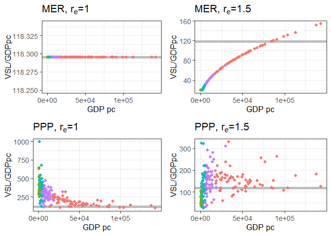
<p class="caption">

<span id="fig:pppelasticity"></span>Figure 1.1: Exposition of different
methods to estimate VSL from GDP per capita relative to the USA. On the
y axis is VSL expressed as a percentage of GDP per capita. The grey line
indicates the VSL of the USA. We compare GDP per capita expressed using
market exchange rates (MER) vs. purchasing power parity (PPP), and an
income elasticity of 1 vs. 1.5. Data source: World Bank.
</p>

</div>

## 1.3 Lost education

The loss due to school closure is

<!-- $$K3 =  \frac{p^{14} }{365}\left( Tp^{16}N_{j_{\text{school}}}+p^{24} + (1-p^{16})p^{25} \right)\text{VSY}$$ -->

$$K_3 =  \frac{1 }{365} \int_{t=0}^{\tau}\left(p^{14}(t)N_{j_{\text{school}}} + (1-p^{14}(t))p^{25}(t)  +(1-2p^{14}(t))p^{24}(t)\right)dt,$$

where $p^{14}(t)$ is the effective amount of education lost per student
at time $t$ due to school closure:
$$p^{14}(t) = (1-p^{16})(1-x_{\text{ed}}(t)),$$ $N_{j_{\text{school}}}$
is the total number of students, $p^{16}$ is relative effectiveness of
remote education and $x_{\text{ed}}(t)$ is the openness of schools,
$p^{25}(t)$ represents education lost due to student sickness with
COVID-19:

$$p^{25}(t)=\sum_{v=0}^{m_V}\left((1-p^H_{j_{\text{school}},v})p^1p^{19}I_{j_{\text{school}},v}^{s}+p^H_{j_{\text{school}},v}p^1I_{j_{\text{school}},v}^{s}+H_{j_{\text{school}},v}\right),$$

$p^{18}$ is the number of days spent in self isolation per day of
infectiousness (e.g. suppose the average infectious period is four days
and mandatory self-isolation time is ten days, then $p^{19}=2.5$ and
$p^{18}=p^{19}T^{I^s}/T^{I^a:R}$, where $T^{I^s}$ and $T^{I^a:R}$ are
expected infectious periods for symptomatic and asymptomatic,
respectively), and $p^{24}(t)$ represents education lost due to
asymptomatic self isolation (which comes at a cost only when schools are
open):

$$p^{24}(t)=p^2(t)p^{18}I_{j_{\text{school}}}^{a}.$$

For the value of a year of education, we use the method of
(Psacharopoulos et al. 2021).

$$\text{VSY} =  p^{12}\cdot p^{13}\cdot p^{15}.$$

$p^{12}$ is the present value of lost earnings:

$$p^{12} = \frac{1}{N_{j_{\text{school}}}}\sum_{a\in j_{\text{school}}}\tilde{N}_a\left( \frac{1-(1+r)^{-(m_Y+20-a)}}{r} -  \frac{1-(1+r)^{-(20-a)}}{r}\right)$$

for discount rate $r=0.03$, number $\tilde{N}_a$ students currently age
$a$, and expected number of years of work $m_Y=45$ (see
e.g. <https://en.wikipedia.org/wiki/Annuity>). $p^{13}$ is mean annual
earnings (estimated using GDP multiplied by labour share of income
(Feenstra et al. 2015)), and $p^{15}=0.08$ is the rate of return for one
year of education.

The value $p^{16}$ represents the effectiveness of remote teaching,
which we sample as a standard uniform random variable. We note that no
strong predictors of effectiveness of remote teaching have been
identified (Patrinos 2023). We assume that losses are linear in duration
of school closure, although there is not consensus even on this
(Betthäuser et al. 2023). Important factors to include in future work
might be those relating to parental circumstances including education
level, engagement and socio-economic status (Moscoviz and Evans 2022).
These factors might be more pertinent to intra- rather than
international modelling.

# 2 Compartmental epidemiological transmission model

The epidemiological component of the Daedalus model is a deterministic
compartmental model that consists of seven disease states (susceptible,
exposed, asymptomatic infectious, symptomatic infectious, hospitalised,
recovered, and deceased), in triplicate to represent vaccination states
unvaccinated, vaccinated with the BPSV, and vaccinated with the SSV. The
population is stratified by age (into four age groups: pre-school
children, school-age children, working-age adults, and retirement-age
adults). The working-age adults are further stratified into 46 groups:
45 economic sectors, plus one non-working group. Population count data
were assembled in Doohan et al. (2026).

## 2.1 Ordinary differential equations

$$\begin{align}
\frac{dS_{j,v}}{dt} & = \sum_{u=0}^{v-1}k^9S_{j,u}^{c_v} - \left( k_{j,v}^{1}(t) + \sum_{u=v+1}^{{m_V}}k_{j,v}^{10,c_u}(t) \right)S_{j,v} \\
\frac{dS_{j,u}^{c_v}}{dt} & = k_{j,u}^{10,c_v}(t)S_{j,u} -\left( k_{j,u}^{1}(t) + k^9 \right)S_{j,u}^{c_v}  \\
\frac{dE_{j,v}}{dt} & = k_{j,v}^{1}(t)\left(S_{j,v}+\sum_{u=v+1}^2S_{j,v}^{c_u}\right) - (k^2+k^4)E_{j,v} \\
\frac{dI_{j,v}^a}{dt} & = k^2E_{j,v} - k^3I_{j,v}^a \\
\frac{dI_{j,v}^s}{dt} & = k^4E_{j,v} - (k_{j,v}^{5}+k_{j,v}^{6})I_{j,v}^s \\
\frac{dR_{j,v}}{dt} & = k^3I_{j,v}^a + k_{j,v}^{5}I_{j,v}^s + k_{j}^{7}(t) H_{j,v} - \sum_{u=v+1}^{{m_V}}k_{j,v}^{10,c_u}(t)R_{j,v} + \sum_{u=0}^{v-1}k_{u,j}^{10,c_v}(t)R_{j,v-1}\\
\frac{dH_{j,v}}{dt} & = k_{j,v}^{6}I_{j,v}^s - (k_{j}^{7}(t) + k_{j}^{8}(t)) H_{j,v} \\
\frac{dD_{j,v}}{dt} & =  k_{j}^{8}(t) H_{j,v}
\end{align}$$

## 2.2 Disease state transitions

<div class="figure">


<p class="caption">

<span id="fig:statetransitions"></span>Figure 2.1: Disease state
transitions. $S$: susceptible. $E$: exposed. $I^{a}$: asymptomatic
infectious. $I^{s}$: symptomatic infectious. $H$: hospitalised. $R$:
recovered. $D$: died. $j$: stratum. $v$: vaccination status. Disease
transition rates are represented with parameters $k$. Note that rates
are all functions of probabilities and durations (the natural history
parameters that characterise the disease), and these may in turn depend
on other epidemiological variables, which is indicated through a
dependence on time, $t$. Where rates differ by age or sector, there is
an index $j$. Where rates differ by vaccination status, there is an
index $v$.
</p>

</div>

Possible transitions between disease states are shown in Figure
<a href="#fig:statetransitions">2.1</a>. Transition rates are functions
of time $t$, vaccination status $v$, and group identity $j$ (where the
groups are the 45 sectors and the four age groups). Nominal natural
history parameters (i.e. those not modified by circumstance) for seven
historic respiratory pathogens with pandemic potential were assembled in
Doohan et al. (2026).

The rate of infection of susceptible individuals, $`k^{1}_{j,v}(t)`$, is
defined as

$$\begin{equation}
k_{j,v}^{1}(t) = \eta_{v}^{E}\rho(t)\beta\sum_{h=1}^{m_J}M_{j,h}(x) I_h(t)
\qquad(2.1)
\end{equation}$$

with $m_J=49$ strata and

``` math
I_h(t)=\sum_{v=0}^{m_V}\eta^I_v\left(\epsilon (1-p^3(t))I_{h,v}^{a}(t)+(1-p^4(t))I_{h,v}^{s}(t)\right). 
```

Here, $`\eta^{E}_{v}`$ is the relative probability to be infected given
vaccine status $v$; $\rho(t)$ is the time-dependent modifier of the rate
of infection, $\beta$, which captures the impact of uncosted
transmission reductions; $`\eta^{I}_{v}`$ is the relative infectiousness
given vaccine status $v$; $M(x)$ is the contact matrix between groups
and depends on the economic configuration $x$; $\epsilon$ is the
reduction in infectiousness from asymptomatic relative to symptomatic
individuals; $p^3$ and $p^4$ are the proportions of asymptomatic and
symptomatic infectiousness averted, respectively, due to self isolating;
and $I_{h,\cdot}^{\cdot}$ is the number of infectious asymptomatic
($I_{h,\cdot}^{a}$) and symptomatic ($I_{h,\cdot}^{s}$) people who are
unvaccinated ($I_{h,v=0}^{\cdot}$), vaccinated with the BPSV
($I_{h,v=1}^{\cdot}$), or vaccinated with the specific vaccine
($I_{h,v=2}^{\cdot}$) in stratum $h$.

``` math
 k^2 = \big(1-p^{I^S}\big)/T^{E:I} 
```

is the rate to asymptomatic infectiousness, where $p^{I^S}$ is the
probability to become symptomatic given infection, and $T^{E:I}$ is the
expected duration of the latent period before the onset of
infectiousness;

``` math
 k^3 = 1/T^{I^a:R}  
```

is the rate of recovery from asymptomatic infection;

``` math
 k^4 = p^{I^S}/ T^{E:I}; 
```

is the rate of symptom onset;

``` math
k^{5}_{j,v} =  \big(1-p^H_{j,v}\big) / T_{j,v}^{I^s}
```

is the rate of recovery from symptomatic infection, where $p^H_{j,v}$ is
the probability to be hospitalised given symptomatic infection, and
$T_{j,v}^{I^s} = p^H_{j,v}T^{I^s:H} + (1-p^H_{j,v})T^{I^s:R}$ is the
expected time to be in compartment $I^s$: $T^{I^s:H}$ is the expected
duration before hospitalisation and $T^{I^s:R}$ is the expected duration
before recovery.

``` math
p^H_{j,v}=\eta^{H}_{v}\tilde{p}^{H}_{j}
```

is the baseline probability to be hospitalised ($`\tilde{p}^{H}_{j}`$)
adjusted by the vaccine effect protecting against hospitalisation
($`\eta^{H}_{v}`$). Then

``` math
k^{6}_{j,v} = p^H_{j,v}/T_{j,v}^{I^s}
```

is the rate of hospitalisation following symptomatic infection.

``` math
k^{7}_{j}(t) = (1-p^{D}_{j}(t)) / T_j^{H}(t)
```

is the rate of recovery of hospitalised patients, where
$`p^{D}_{j}(t)=\min\{\tilde{p}^{D}_{j}f_H(t),1\}`$ is the baseline
probability to die given hospitalisation, adjusted by a factor encoding
the increase in fatality rate as hospital occupancy increases:

``` math
f_H(t)=1 + \frac{\max\{0,H_{\text{tot}}(t)-H_{\text{max}}\}}{H_{\text{tot}}(t)}\phi,
```

$1+\phi$ can be interpreted as the what the fatality ratio is for
someone who needs but does not receive hospital care relative to the HFR
(i.e. the fatality ratio of those who need and receive hospital care).
This is the value the HFR tends to as hospital demand far exceeds its
capacity, at which point most who need care do not receive it. Note that
the rate at which the HFR increases as a function of $H_\text{tot}$ is
at most $\phi/H_\text{max}$, which occurs when
$H_\text{tot}=H_\text{max}$. Thus, the change is steepest at the point
of capacity breach, and can be no more than the rate of change of
hospital occupancy; that is, each additional admission can contribute no
more than one additional death (and in practice it is considerably less
than that).

``` math
H_{\text{tot}}(t) = \sum_{v=0}^{m_V}\sum_{j=1}^{m_J} H_{j,v}(t).
```

$$T_j^{H}(t) = p_j^{D}(t)T^{H:D} + (1-p_{j}^{D}(t))T^{H:R}$$

is the expected time to be in compartment $H$: $T^{H:D}$ is the expected
duration before death and $T^{H:R}$ is the expected duration before
recovery. Finally,

``` math
k^{8}_{j}(t) = p^{D}_{j}(t)/T_j^{H}(t)
```

is the rate of death following hospitalisation.

## 2.3 Vaccination state transitions

In our model, $v=0$ refers to unvaccinated people, $v=1$ to people who
have received a BPSV dose, and $v=2$ to people who have received two SSV
doses. How we model transitions between vaccination states is shown in
Figure <a href="#fig:vaccinetransitions">2.2</a>.

$`k^{10,c_1}_{j,v=0}(t)`$ represents the rates of BPSV vaccination of
unvaccinated susceptible and recovered people, and
$`k^{10,c_2}_{j,v=1}(t)`$ represents the rates of vaccinating
BPSV-vaccinated susceptible and recovered people.
$`k^{10,c_2}_{j,v=0}(t)`$ represents the rates of vaccinating people
directly with the specific vaccine. Put more succinctly,
$`k^{10,c_u}_{j,v}(t)`$ is the rate to go from vaccine state $v$ to $u$.
$k^9=1/T^c$ is the rate of seroconversion to vaccine-induced immunity,
and $`k^{12}_{j}(t)=k^{1}_{j,v=0}(t)`$ and
$`k^{19}_{j}(t)=k^{1}_{j,v=1}(t)`$ are the rates of infection of
just-vaccinated people, which returns them to the epidemiological
pathway of the lower vaccination level.

<div class="figure">


<p class="caption">

<span id="fig:vaccinetransitions"></span>Figure 2.2: Vaccine state
transitions. $S$: susceptible. $S^{c_u}, u\in\{1,2\}$: recently
vaccinated but has not yet seroconverted (i.e. is not protected by most
recent vaccination). $R$: recovered. $j$: stratum. $v$: initial
vaccination status. $u$: final vaccination status. Note that rates are
all functions of probabilities and durations, and these may in turn
depend on other model variables, which is indicated through a dependence
on time, $t$. Where rates differ by age or sector, there is an index
$j$. Where rates differ by vaccination status, there is an index $v$.
</p>

</div>

### 2.3.1 Vaccine effects

| Quantity                              | BPSV   | SSV    |
|:--------------------------------------|:-------|:-------|
| Time to develop immunity              | 7 days | 7 days |
| Effectiveness against infection       | 0.35   | 0.55   |
| Effectiveness against hospitalisation | 0.75   | 0.95   |
| Effect on transmission                | 0.35   | 0.35   |
| Rate of waning                        | 0      | 0      |

<span id="tab:vaccineeffects"></span>Table 2.1: Vaccine effects. The
Time to develop immunity is the average time it takes a person to go
from the Susceptible compartment to the Vaccinated equivalent
compartment, so that the rate of transition is 1/7 (Liu et al. 2025).
The Effectiveness against infection is one minus the relative risk of
infection of a vaccinated person compared to an unvaccinated person. The
Effectiveness against hospitalisation is one minus the relative risk of
hospitalisation of a vaccinated person compared to an unvaccinated
person. The Effect on transmission is one minus the relative
infectiousness of an infectious vaccinated person compared to an
infectious unvaccinated person. The Rate of waning is the rate at which
the vaccine effects decay over time. Parameter choices were made to
align with Whittaker et al. (2024).

## 2.4 Contact rates

The configuration $x$ and the proportion of workers working from home
$q$ determine the scaling of exposure to infection between different
groups for different reasons:

- Worker absence due to sector closure
- Worker absence due to working from home
- Student absence due to school closure
- Customer absence due to sector closure: impact on workers
- Customer absence due to sector closure: impact on customers

We approach this differently from Doohan et al. (2026). Instead of using
contact matrices from <span class="nocase">Prem et al.</span> (2021), we
use those from Walker et al. (2020). Instead of using work-related
contacts from Béraud et al. (2015), we use those from Jarvis et al.
(2024). Haw et al. (2022) modelled closures using a combination of
moving workers between sector compartments and a non-working
compartment, and scaling of contacts. Here, we only use contacts to
model closures, and do not move workers out of their compartments. An
important consequence of this is that workers within sectors retain
their infection histories.

We construct contact matrix $M(x)$ as the sum of three matrices:
$M^{\text{com}}(x)$ (community contacts), $M^{\text{CW}}(x)$
(community-to-worker contacts), and $M^{\text{WC}}(x)$
(worker-to-community contacts). We construct normal-times matrices
($x=\textbf{1}$) beginning with a “target matrix”, which the three
matrices should add up to, which is taken from Walker et al. (2020). By
sampling relevant values, we decompose the whole matrix into its
component parts. To incorporate closures, each matrix is transformed
independently, before being added together again.

Matrix $M(\textbf{1})$ is estimated using as a basis a contact matrix
from Walker et al. (2020). These are 16-by-16 matrices, $\tilde{M}$, for
five-year age bands $a$ up to age group 75+. We map the matrix to a
four-by-four matrix $\hat{M}$ corresponding to the four age groups $g$
used in the Daedalus model, using population sizes $\tilde{N}_a$:

``` math
\hat{M}_{gg'} = \frac{\sum_{a\in g}\tilde{N}_{a}\sum_{a'\in g'}\tilde{M}_{a,a'}}{\sum_{a\in g}\tilde{N}_{a}},
```

and $\hat{N}_g$ to represent the population sizes of the Daedalus age
groups,

``` math
\hat{N}_g=\sum_{a\in g}\tilde{N}_a.
```

We get to the matrix $M(\textbf{1})$ by broadcasting the four-by-four
matrix to the 49-by-49 one. Contacts from all groups $j$ to working
groups $h$ depend on the age group of the group ($`g(j)`$), and the
fraction of the age-population represented in group $h$, where $N_{h}$
is the number of people in group $h$:

``` math
M_{j,h}(\textbf{1}) = \hat{M}_{g(j),g(h)}\frac{N_{h}}{\hat{N}_{g(h)}}
```

for $j$ and $h$ including all groups (working and non-working). Each
group $j$ contains people that belong to only one age group $g$. We
refer to the age group of the people in group $j$ as $g(j)$. Then
$\hat{N}_{g(h)}$ is the number of people in the age group of group $h$,
so $`\hat{N}_{g(h)}=N_{h}`$ for age groups 0 to 4, 5 to 19 and 65+, and
$`\hat{N}_{g(h)}=\sum_{h\in\{1,...,m_S,m_S+3\}}N_{h}`$ for age group 20
to 64.

In setting up a country, we sample values for $\tilde{M}$ (from which we
get $`M(\textbf{1})`$). At the same time, we sample the proportion of
contacts that come from workplaces (Figure
<a href="#fig:workfrac">5.3</a>), and workplace-related contacts. From
these, we get $M^{\text{CW}}(\textbf{1})$, constructing the matrices and
normalising.

Community-to-worker contacts (matrix $M^{\text{CW}}$) describe contacts
experienced by workers from the community by sector (Figure
<a href="#fig:allsector">5.4</a>, distributed by age, Figure
<a href="#fig:uksecdistage">5.5</a>). Note that
$`M^{\text{CW}}_{j,h}(\textbf{1})=0`$ for $j>m_S$. Matrix
$M^{\text{WC}}(\textbf{1})$ is the complement of matrix
$M^{\text{CW}}(\textbf{1})$, computed by multiplying through by
population, transposing, and dividing again by population.

With $M(\textbf{1})$, $M^{\text{CW}}(\textbf{1})$ and
$M^{\text{WC}}(\textbf{1})$, we learn $M^{\text{com}}(\textbf{1})$.

$M^{\text{com}}(\textbf{1})$ is decomposed into its constituent parts,
representing intra- and inter-household interactions (home), school
interactions (sch) and hospitality interactions (CC):

``` math
M^{\text{com}}(\textbf{1})=M^{\text{home}} + M^{\text{sch}}(\textbf{1}) + M^{\text{CC}}(\textbf{1}) 
```

Values for $M^{\text{sch}}(\textbf{1})$ come from sampled values
representing the fractions of contacts that come from school. School
contacts are estimated separately in two age groups (pre-school age: 0—4
(Figure <a href="#fig:school1frac">5.6</a>); school age: 5—19 (Figure
<a href="#fig:school2frac">5.7</a>)): $M^{\text{sch}}(\textbf{1})$ has
entries of zero for groups not in school, and values for 0 to 4 year
olds and 5 to 19 year olds.

<!-- Likewise, $M^{\text{tran}}(\textbf{1})$ is also sampled as a fraction of total contacts. $M_{j,h}^{\text{tran}}(\textbf{1})\geq 0$ for $j=1,...,m_S$. $M_{j,h}^{\text{tran}}(\textbf{1})=0$ for $j>m_S$. -->

Finally, $M^{\text{CC}}(\textbf{1})$ is sampled as a fraction of
$M^{\text{com}}(\textbf{1})- M^{\text{sch}}(\textbf{1})$, which leaves
$M^{\text{home}}$.

### 2.4.1 Community contacts

We construct $M^{\text{com}}(x)$ from its constituent parts,
representing intra- and inter-household interactions (home), school
interactions (sch) and hospitality interactions (CC):

``` math
M^{\text{com}}(x)=M^{\text{home}} + M^{\text{sch}}(x) + M^{\text{CC}}(x).
```

School contacts under $x$ are the normal-times values scaled by the
extent of closure. $x_{\text{ed}}$ is the extent to which schools are
open, so that the number of contacts per person scales superlinearly
with school closure.

$$\begin{equation}
M_{j,j}^{\text{sch}}(x)=x_{\text{ed}}^2M_{j,j}^{\text{sch}}(\textbf{1}).
\qquad(2.2)
\end{equation}$$

Matrix $M^{\text{CC}}(x)$ gives the contacts made in the hospitality
sector:

$$\begin{equation}
M^{\text{CC}}(x) = (p^{27})^2M^{\text{CC}}(\textbf{1})
\qquad(2.3)
\end{equation}$$

The value $p^{27}$ is the workforce-weighted average extent to which the
hospitality sectors are open, so that the number of contacts per person
scales superlinearly according to closure:

``` math
p^{27} = \frac{\sum_jx_{j}N_j}{\sum_jN_j}
```

where we sum over only the hospitality sectors.

### 2.4.2 Community-to-worker contacts

$$\begin{equation}
M_{j,h}^{\text{CW}}(x) = (x_{j}(1-q_j))^2M_{j,h}^{\text{CW}}(\textbf{1}),
\qquad(2.4)
\end{equation}$$

for $h\in\{1,...,m_J\}$.

Here, there is superlinear scaling of $M^{\text{CW}}_{j,h}(\textbf{1})$
with respect to working from home and with respect to sector closure, as
both workers and members of the community are absent from the workplace
as the sector moves online and becomes more closed.

<!-- ## Matrix $M^{\text{WW}}$: Worker-to-worker contacts -->

<!-- \begin{equation} -->

<!-- M_{j,j}^{\text{WW}}(x) = x_{j}(1-q_j)^2M_{j,j}^{\text{WW}}(\textbf{1}), -->

<!-- (\#eq:worker) -->

<!-- \end{equation} -->

<!-- for the working groups, with the number of contacts adjusted according to at-home working ($q_j$) and sector openness ($x_{j}$). As before, there is superlinear scaling of contacts with respect to working from home. There is linear scaling with respect to sector closure: that is, there are fewer contacts per person, but we do not approximate there being fewer people having them. This is because the latter is accounted for in the movement of people out of the group upon its closure.  -->

<!-- $$M_{j,j}^{\text{WW}}(x) = x_{j}^2(1-q_j)^2M_{j,j}^{\text{WW}}(\textbf{1})$$ -->

<!-- ```math -->

<!-- M^{\text{WW}}_{j,j}(x) = \hat{x}_j^2M^{\text{WW}}_{j,j}(\textbf{1}), \quad \hat{x}_j=\max(x_{j}-q_j,0) -->

<!-- ``` -->

## 2.5 Uncosted transmission reductions

We parametrise the effects of ‘uncosted transmission reductions’ (UTR)
in the model using Google’s mobility data (Figure
<a href="#fig:smoothmobility">2.3</a>). These changes in mobility were
consequences of both government mandates and individual’s choices. As we
cannot separate the two, we consider a range of possibilities, based on
the range of mobility changes observed for a given level of stringency
(Figure <a href="#fig:mobilitydrop">2.4</a>). In our model, the mandated
economic configuration leads to a change in contacts. We associate the
reduction in contacts, which translates as a relative reduction in
transmission, with the reduction in mobility.

<div class="figure">

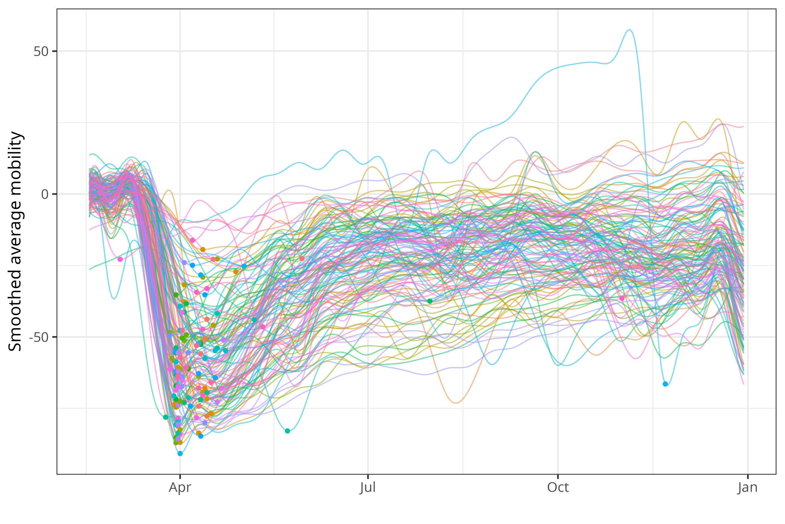
<p class="caption">

<span id="fig:smoothmobility"></span>Figure 2.3: Mobility trajectories
in 2020 for all countries, with points showing the point at which the
largest drop was observed. Trajectories are averaged over Retail and
recreation, Transit stations and Workplaces and smoothed with a spline
of 80 knots.
</p>

</div>

<div class="figure">

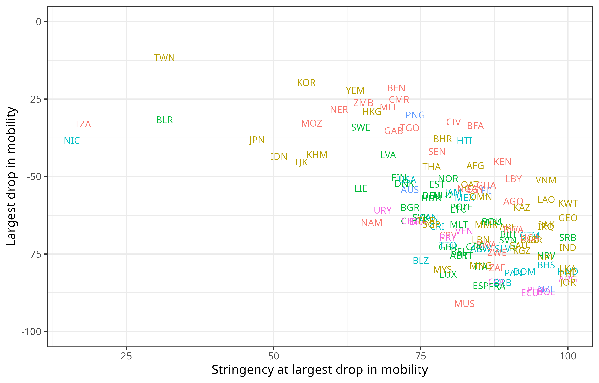
<p class="caption">

<span id="fig:mobilitydrop"></span>Figure 2.4: The largest drop in
mobility plotted against the stringency on that date.
</p>

</div>

- We want to write mobility as a function of mandate and some epi
  outcome, e.g. deaths: $\rho(t) = (1-p^8)f(d(t),e(t)) + p^8$ where
  $\rho(t)$ is mobility (which is operationalised as the uncosted
  transmission reduction (UTR) in the model), $d$ is deaths per million,
  $e$ is government mandate, and $`0 < p^8 < 1`$ is the baseline.
- We want mobility to drop monotonically with both the mandate and the
  epi outcome: $\frac{\partial f}{\partial d}<0$,
  $\frac{\partial f}{\partial e}<0$.
- We want a maximum mobility of 1 when both the mandate and the epi
  outcome are 0: $f(0,0)=1$.
- We want mobility to approach $p^8$ when the mandate and the epi
  outcome become large: $\lim_{d\to 10^6, e\to 1}f(d,e)= 0$.
- We want to allow for the possibility of redundancy between the two
  variables: $f(0,0)/f(0,e) > f(d,0)/f(d,e)$ and
  $f(0,0)/f(d,0) > f(0,e)/f(d,e)$ for $d,e>0$.

A simple model to achieve these criteria is:
$$f(d,e) = \frac{1}{1+p^9d+p^{10}e}$$ with $p^9, p^{10}>0$. We fit this
model to the data in Figure <a href="#fig:mobilitydrop">2.4</a>, and use
the parameter values shown in Figure
<a href="#fig:mobilityposterior">2.5</a> as inputs to our model.

The implications of this modelling choice are that two extremes are
possible in terms of behaviour under (unseen) circumstances of a severe
moment in an outbreak: 1, it is possible that social distancing comes
“free” (i.e. that you get the same reduction in transmission with and
without closures and, without closures, there is no economic cost); and
2, there is no voluntary social distancing, and behaviour is independent
of epidemiological circumstances.

Finally, we assume that the effect wanes over time, with the minimum
(baseline) tending to 1 with a rate of 0 to 0.1% per day.

<div class="figure">

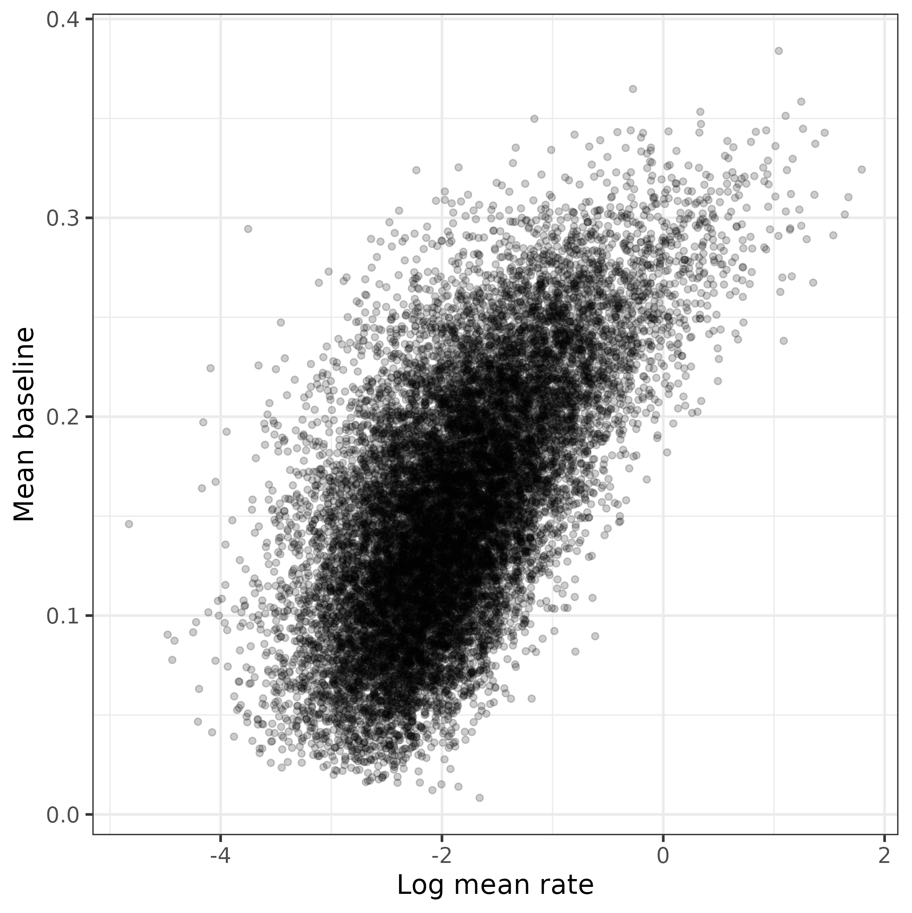
<p class="caption">

<span id="fig:mobilityposterior"></span>Figure 2.5: Posterior
distribution for parameters $p^8$ and $p^{9}$, the base level of
mobility and the responsiveness to deaths, respectively.
</p>

</div>

## 2.6 Testing and self isolating

Infectious people who know their status have a compliance $p^1$ with the
instruction to self isolate, starting one day into their infectious
period. We assume constant infectiousness over time and that a fraction
$p^{26}$ of the symptomatic infectiousness is presymptomatic. Then the
amount of infectiousness averted of symptomatic people is
$p^4=p^1(1-p^{26})$, who isolate due to the onset of symptoms. The
fraction of asymptomatic cases identified by testing is $p^2(t)$. We
assume asymptomatic cases have the same probability to self isolate and
that test results are returned after $p^{17}$ days of infectiousness.
Then the infectiousness that testing averts is
$p^3(t)=p^1p^2(t)\min(0,(T^{I^a:R}-p^{17})/T^{I^a:R})$.

<!-- b0    = 2.197; -->

<!-- b1    = 0.1838; -->

<!-- b2    = -1.024; -->

<!-- frac_cases_found = 1./(1+exp(b0+b1*Ip+b2*log10(trate))); -->

<!-- frac_cases_found(Ip >= trate) = min(frac_cases_found(Ip >= trate),trate/10^5); -->

<!-- frac_cases_found = max(frac_cases_found, trate/10^5 ); -->

# 3 Economic projections

The model projects economic output for the epidemic period taking into
account the availability and presence of workers, as described in
Section <a href="#lost-economic-activity">1.1</a>.

The economy is stratified by sector following the International Standard
Industrial Classification of All Economic Activities (ISIC) Rev. 4 as
used by the OECD (UN Economic and Social Affairs 2008). Economic output
is measured as the sum of gross value added (GVA) of all sectors over
the epidemic period. GVA per sector is assumed to depend linearly on its
workforce.

The size of the workforce present comes primarily from the economic
configuration which is a policy choice, mandated in response to the
epidemic (see Section <a href="#closure-policies">4</a>). Additional
losses come from worker sickness and death (see Section
<a href="#lost-economic-activity">1.1</a>) and loss of tourism, which is
an exogenous random variable (see Section
<a href="#impact-of-tourism">3.1</a>).

Lost education is also quantified monetarily and constitutes an economic
cost. Unlike the other losses, they are not contemporaneous with the
epidemic, but losses that unfold into the future. The assumptions and
equations are described in Section <a href="#lost-education">1.3</a>.

## 3.1 Impact of tourism

### 3.1.1 Food and accommodation services sector

As there is no “tourism” sector in the 45-sector classification we are
using, to model the impact of changes to tourism, we identify the “Food
and accommodation services” sector with tourism. This sector is chosen
to proxy tourism as the correlation of their contributions to GDP is
0.64 and their orders of magnitude similar (1 to 7% vs 2 to 10% of GDP).
Two sectors we considered (Air transport and Arts, entertainment and
recreation) have less correlation with tourism in terms of % of GDP.
(See Figure <a href="#fig:pairs">3.1</a>.)

<div class="figure" style="text-align: center">

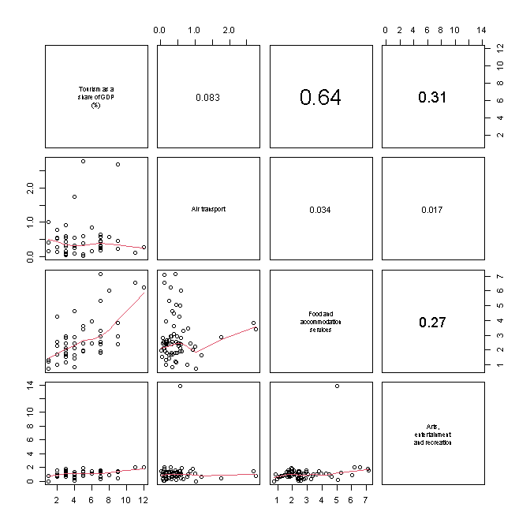
<p class="caption">

<span id="fig:pairs"></span>Figure 3.1: Correlations between a tourism
measure (tourism as a share of GDP UN Tourism (2023)) and three economic
sectors (Air transport, Food and accommodation services and Arts,
entertainment and recreation) (OECD) for up to 69 countries.
</p>

</div>

### 3.1.2 Sector shrinkage as a result of the pandemic

For many countries, tourism was reduced in the COVID-19 pandemic not
because of domestic mandates but because of reduced international
travel. Therefore, the fraction of tourism that comes from abroad is a
factor that can determine the impact of a pandemic on a country’s GDP
independently of what happens within the country.

We model mitigation via business closures, which are mandated by sector.
We represent openness with values $x$ which range from 0 to 1, 1
representing maximum openness. To capture the impact of reduced
international travel, we set the maximum openness of the food and
accommodation services sector to be limited by international tourism as:

``` math
x = \min\{\hat{x}, 1+ b(c-1)\}
```

where $`\hat{x}`$ is the openness of the sector according to the
schedule (i.e. the sector-closure policy), $b$ is the proportion of
tourism that is international, and $c$ is the fraction international
tourism reduces to as a consequence of the pandemic. I.e. the tourism
remaining is the domestic ($1-b$) plus that that comes in from abroad
($bc$).

Therefore, the contribution of the GVA of the food and accommodation
services sector is limited either by the pandemic, or by the
sector-closure policy - whichever is lower.

### 3.1.3 Loss of international tourists

We model the distribution of $c$ using data from 2020 (Figure
<a href="#fig:tourismhist">3.2</a>, bottom-right plot). We fit to it a
log-normal distribution, and find mean value -1.39 and standard
deviation 0.39 (Figure <a href="#fig:ytd">3.3</a>). We use these values
as inputs for all synthetic countries.

<div class="figure" style="text-align: center">

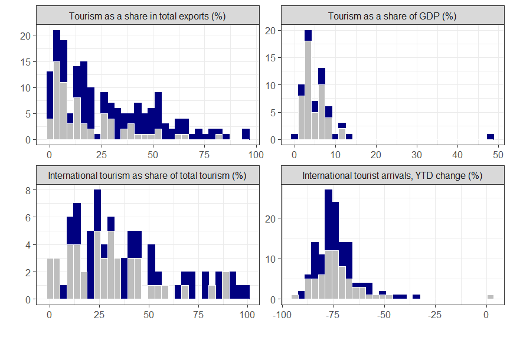
<p class="caption">

<span id="fig:tourismhist"></span>Figure 3.2: Distributions of
tourism-related data from UN Tourism (2023). In grey are the subset of
countries for which we have GVA data by sector.
</p>

</div>

<div class="figure" style="text-align: center">

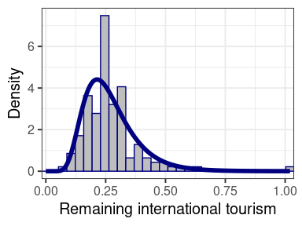
<p class="caption">

<span id="fig:ytd"></span>Figure 3.3: Fit of log-normal distribution to
loss-of-tourism data.
</p>

</div>

### 3.1.4 Dependence on international tourism

We model $b$ as a function of the share of GDP that comes from the
sector. Note that the data we have for this are biased towards
high-income countries.

We write

$$b\sim\text{Beta}(\alpha(z),\beta(z))$$

where $z$ is the fraction of GDP coming from the Food and accommodation
sector. We learn three parameters $p^5$, $p^6$ and $p^7$ to best fit the
relationship between $z$ and $b$ in countries we have observations for:

$$p^5 = \alpha(z)+\beta(z)$$

$$p^6 z + p^7 = \frac{\alpha(z)}{\alpha(z)+\beta(z)}$$

Here, $p^5$ controls the variance of the distribution and $p^6$ and
$p^7$ the linear relationship between $z$ and $b$. Using an optimisation
routine in R we find $p^5=6.73$, $p^6=4.14$ and $p^7=0.05$. Results are
shown in Figure <a href="#fig:sectortourism">3.4</a>. We use these
values as inputs for all country models.

<figure>
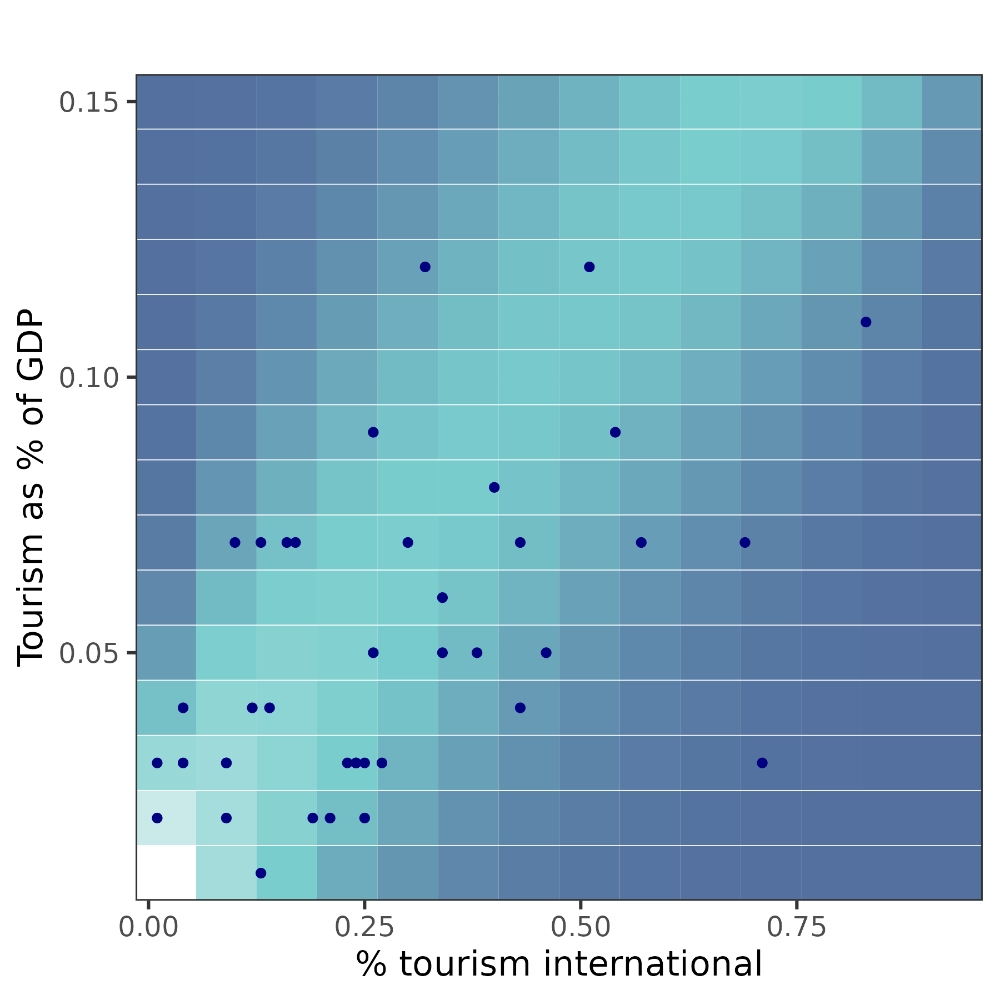
<figcaption aria-hidden="true"><span
id="fig:sectortourism"></span>Figure 3.4: Predicting the percentage of
tourism that comes from abroad as a function of the size of the sector.
Each row represents a beta distribution whose mean is determined by the
size of the sector (z). Blue points show the data we have available
(grey bars in Figure <a href="#fig:tourismhist">3.2</a>).</figcaption>
</figure>

## 3.2 Remote working

For each sector in each country, we have the 90% interval for the
proportion of people who can work from home from Gottlieb et al. (2021).
We sample the same quantile within each range such that a low value in
one sector implies low values in all sectors. We:

- take the subset of countries in the income group (LLMIC / UMIC / HIC);
- take the minimum of the lower bounds by sector (5%);
- take the maximum of the upper bounds by sector (95%);
- sample from a uniform distribution between these bounds, taking the
  same quantile for each sector.

We assume that remote working happens to its fullest extent for the
whole period of mitigation for all policies.

# 4 Closure policies

Impacts of mandated closures of businesses and schools on epidemics can
be described using three factors: length, stringency, and frequency. We
model mandated closures using a discrete set of predefined policies,
which specify the *stringency* of closures in each sector. The policies
we use are the same for each country. The length and frequency of
economic closures are endogenous to the model (via its epidemiology),
and therefore depend on the dynamics of the epidemic that is being
modelled.

## 4.1 Policy specifications

We define four generic policies that might be adopted once a novel
pathogen has been identified. The policies represent possible choices
that range from very stringent to laissez faire, and are grounded in
real-life observations. We name the policies no closures (NC) and
reactive closures 1 to 3 (RC1 to RC3), and they are depicted in Figure
<a href="#fig:policies">4.1</a>, structured by the qualities that
distinguish them.

The three sector-closure policies are each defined by a pair of economic
configurations, and rules for moving between them. An economic
configuration is a vector specifying the extent to which each sector is
open, expressed as a percentage. Our economic configurations are
constructed using data from three countries (Indonesia (RC1), the United
Kingdom (RC2), and Australia (RC3)), via the manifest economic impacts
in the wake of the COVID-19 pandemic. We take the sectoral GVA observed
the COVID-19 pandemic expressed as a percentage of the values observed
in the year before (OECD), i.e. we assume that the relative GVA reflects
the degree to which sectors were open.

In reality, the observed effects combined mandated closures, reductions
in consumption and labour supply due to infection avoidance of
individuals, interruptions in supply chains, and changes in imports and
exports. However, these effects have not been disentangled, and in
Daedalus we model only the mandate. This is equivalent to saying that we
assume the mandate alone determined economic outcomes and we simulate
their repeated application. Thus we neglect two factors in our model:
first, population behaviour, and second, international trade, and we
ignore their impacts in the COVID-19 pandemic by subsuming all effects
into the mandate.

## 4.2 Implementation

The economic configurations define the sector closures for both economic
and epidemiological parts of the model. Contacts associated with sectors
– between and among workers and customers – are scaled down with
closures. GVA per sector is scaled according to economic configurations
in the economic part of the model.

For their dynamic implementation in the model, the three closure
policies follow the same general pattern: they are defined by two
economic configurations, which we refer to as heavy and light (where the
“heavy” configuration has higher stringency than the “light”
configuration; the configurations are tabulated in Table
<a href="#tab:eccon">4.3</a>). The light configuration is implemented at
the response time. Thereafter, the level of closure for the three
policies is mandated in response to the state of the epidemic, reverting
between states as determined by the transmission dynamics. Tables
<a href="#tab:rulesreactive">4.1</a> and
<a href="#tab:ruleselimination">4.2</a> show the transitions and their
conditions. RC1 and RC2 respond to hospital occupancy, allowing cases to
rise and using closures to allow them to fall again. RC1 keeps schools
closed throughout, whereas RC2 has schools open in the light
configuration. RC3 aims to reduce cases and then to keep them low. All
mitigation is suspended when the vaccine rollout has reached its target
coverage (which is when 80% of the eligible population have been
vaccinated).

<div class="figure">

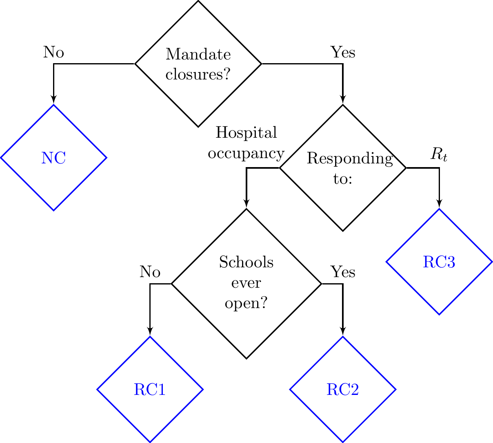
<p class="caption">

<span id="fig:policies"></span>Figure 4.1: The four sector-closure
policy options. No closures (NC) does not mandate any closures. The
other three policies all implement reactive closures (RC), either in
response to hospital occupancy (RC1 and RC2) or $R_t$ (RC3). The
difference between RC1 and RC2 is that in RC1 schools are closed
throughout, whereas in RC2 schools are fully open during the light
configuration.
</p>

</div>

The sector-closure policies are defined as follows:

- NC: No closures are mandated.
- RC1: Schools are mandated to close to 10% of pre-epidemic levels
  throughout, and other economic sectors close to the heavy-closure
  economic configuration when hospital occupancy reaches 95% of its
  capacity, and change to the light configuration once occupancy is less
  than 25% capacity.
- RC2: Sectors (including the education sector) toggle between heavy and
  light closures reactively, as in RC1, albeit with slightly different
  economic configurations.
- RC3: Heavy closures are chosen when $R_t>1.2$ and light closures when
  $R_t<0.95$. Closures are maintained until $R_t<1$ without closures, or
  vaccination targets are reached.

All policies assume there is testing (Section
<a href="#testing-and-self-isolating">2.6</a>), working from home
(Section <a href="#remote-working">3.2</a>), and uncosted transmission
reductions from behavioural changes (Section
<a href="#uncosted-transmission-reductions">2.5</a>), which impact
epidemiological outcomes. They do not directly impact economic outcomes,
but indirectly may reduce the need for closures because of reduced
incidence.

| From/to | No closures | Light closures | Heavy closures |
|:---|:---|:---|:---|
| **No closures** |  | t $\geq$ response time AND Hospital occupancy \> 95% capacity |  |
| **Light closures** | (Growth rate \< 0.025 OR Hospital occupancy \< 25% capacity) AND vaccine rollout complete OR $R_t(M(\textbf{1})) < 1$ |  | Hospital occupancy \> 95% capacity |
| **Heavy closures** |  | Hospital occupancy \< 25% capacity AND t \> 7 + last change time |  |

<span id="tab:rulesreactive"></span>Table 4.1: State transition rules
for policies RC1 and RC2. See Table <a href="#tab:eccon">4.3</a> for
details of closures.

| From/to | No closures | Light closures | Heavy closures |
|:---|:---|:---|:---|
| **No closures** |  | t $\geq$ response time OR Hospital occupancy \> 95% capacity |  |
| **Light closures** | Vaccine rollout complete OR $R_t(M(\textbf{1})) < 1$ |  | $R_t > 1.2$ |
| **Heavy closures** | Vaccine rollout complete OR $R_t(M(\textbf{1})) < 1$ | $R_t(M(x_{\text{light closure}})) < 0.95$ AND t \> 7 + last change time |  |

<span id="tab:ruleselimination"></span>Table 4.2: State transition rules
for policy RC3. See Table <a href="#tab:eccon">4.3</a> for details of
closures.

<table class="table lightable-classic" style="width: auto !important; margin-left: auto; margin-right: auto; font-family: &quot;Arial Narrow&quot;, &quot;Source Sans Pro&quot;, sans-serif; margin-left: auto; margin-right: auto;">

<caption>

<span id="tab:eccon"></span>Table 4.3: Economic configurations used to
implement strategies. Values are the openness of the sector expressed as
a percentage. RC1 values are taken from Indonesia (Q2 and Q4 2020 (Badan
Pusat Statistik 2022)). RC2 values are taken from the UK (April 2020 for
heavy closures, August 2020 for light closures (Office for National
Statistics 2022)). RC3 values for light closures are taken from
Australia (June 2021). RC3 heavy closures are the same as those for RC2.
</caption>

<thead>

<tr>

<th style="empty-cells: hide;border-bottom:hidden;" colspan="1">

</th>

<th style="border-bottom:hidden;padding-bottom:0; padding-left:3px;padding-right:3px;text-align: center; " colspan="2">

<div style="border-bottom: 1px solid #ddd; padding-bottom: 5px; ">

RC1

</div>

</th>

<th style="border-bottom:hidden;padding-bottom:0; padding-left:3px;padding-right:3px;text-align: center; " colspan="2">

<div style="border-bottom: 1px solid #ddd; padding-bottom: 5px; ">

RC2

</div>

</th>

<th style="border-bottom:hidden;padding-bottom:0; padding-left:3px;padding-right:3px;text-align: center; " colspan="2">

<div style="border-bottom: 1px solid #ddd; padding-bottom: 5px; ">

RC3

</div>

</th>

</tr>

<tr>

<th style="text-align:left;">

Sector
</th>

<th style="text-align:right;">

Heavy closures
</th>

<th style="text-align:right;">

Light closures
</th>

<th style="text-align:right;">

Heavy closures
</th>

<th style="text-align:right;">

Light closures
</th>

<th style="text-align:right;">

Heavy closures
</th>

<th style="text-align:right;">

Light closures
</th>

</tr>

</thead>

<tbody>

<tr>

<td style="text-align:left;">

Agriculture, hunting, forestry
</td>

<td style="text-align:right;">

100
</td>

<td style="text-align:right;">

100
</td>

<td style="text-align:right;">

86
</td>

<td style="text-align:right;">

88
</td>

<td style="text-align:right;">

86
</td>

<td style="text-align:right;">

100
</td>

</tr>

<tr>

<td style="text-align:left;">

Fishing and aquaculture
</td>

<td style="text-align:right;">

100
</td>

<td style="text-align:right;">

100
</td>

<td style="text-align:right;">

86
</td>

<td style="text-align:right;">

88
</td>

<td style="text-align:right;">

86
</td>

<td style="text-align:right;">

100
</td>

</tr>

<tr>

<td style="text-align:left;">

Mining and quarrying, energy producing products
</td>

<td style="text-align:right;">

67
</td>

<td style="text-align:right;">

79
</td>

<td style="text-align:right;">

90
</td>

<td style="text-align:right;">

91
</td>

<td style="text-align:right;">

90
</td>

<td style="text-align:right;">

100
</td>

</tr>

<tr>

<td style="text-align:left;">

Mining and quarrying, non-energy producing products
</td>

<td style="text-align:right;">

100
</td>

<td style="text-align:right;">

100
</td>

<td style="text-align:right;">

90
</td>

<td style="text-align:right;">

91
</td>

<td style="text-align:right;">

90
</td>

<td style="text-align:right;">

100
</td>

</tr>

<tr>

<td style="text-align:left;">

Mining support service activities
</td>

<td style="text-align:right;">

100
</td>

<td style="text-align:right;">

100
</td>

<td style="text-align:right;">

90
</td>

<td style="text-align:right;">

91
</td>

<td style="text-align:right;">

90
</td>

<td style="text-align:right;">

100
</td>

</tr>

<tr>

<td style="text-align:left;">

Food products, beverages and tobacco
</td>

<td style="text-align:right;">

100
</td>

<td style="text-align:right;">

100
</td>

<td style="text-align:right;">

70
</td>

<td style="text-align:right;">

94
</td>

<td style="text-align:right;">

70
</td>

<td style="text-align:right;">

100
</td>

</tr>

<tr>

<td style="text-align:left;">

Textiles, textile products, leather and footwear
</td>

<td style="text-align:right;">

89
</td>

<td style="text-align:right;">

92
</td>

<td style="text-align:right;">

70
</td>

<td style="text-align:right;">

94
</td>

<td style="text-align:right;">

70
</td>

<td style="text-align:right;">

98
</td>

</tr>

<tr>

<td style="text-align:left;">

Wood and products of wood and cork
</td>

<td style="text-align:right;">

100
</td>

<td style="text-align:right;">

95
</td>

<td style="text-align:right;">

70
</td>

<td style="text-align:right;">

94
</td>

<td style="text-align:right;">

70
</td>

<td style="text-align:right;">

98
</td>

</tr>

<tr>

<td style="text-align:left;">

Paper products and printing
</td>

<td style="text-align:right;">

100
</td>

<td style="text-align:right;">

98
</td>

<td style="text-align:right;">

70
</td>

<td style="text-align:right;">

94
</td>

<td style="text-align:right;">

70
</td>

<td style="text-align:right;">

98
</td>

</tr>

<tr>

<td style="text-align:left;">

Coke and refined petroleum products
</td>

<td style="text-align:right;">

87
</td>

<td style="text-align:right;">

88
</td>

<td style="text-align:right;">

70
</td>

<td style="text-align:right;">

94
</td>

<td style="text-align:right;">

70
</td>

<td style="text-align:right;">

88
</td>

</tr>

<tr>

<td style="text-align:left;">

Chemical and chemical products
</td>

<td style="text-align:right;">

100
</td>

<td style="text-align:right;">

100
</td>

<td style="text-align:right;">

70
</td>

<td style="text-align:right;">

94
</td>

<td style="text-align:right;">

70
</td>

<td style="text-align:right;">

88
</td>

</tr>

<tr>

<td style="text-align:left;">

Pharmaceuticals, medicinal chemical and botanical products
</td>

<td style="text-align:right;">

100
</td>

<td style="text-align:right;">

100
</td>

<td style="text-align:right;">

70
</td>

<td style="text-align:right;">

94
</td>

<td style="text-align:right;">

70
</td>

<td style="text-align:right;">

88
</td>

</tr>

<tr>

<td style="text-align:left;">

Rubber and plastics products
</td>

<td style="text-align:right;">

87
</td>

<td style="text-align:right;">

100
</td>

<td style="text-align:right;">

70
</td>

<td style="text-align:right;">

94
</td>

<td style="text-align:right;">

70
</td>

<td style="text-align:right;">

88
</td>

</tr>

<tr>

<td style="text-align:left;">

Other non-metallic mineral products
</td>

<td style="text-align:right;">

92
</td>

<td style="text-align:right;">

89
</td>

<td style="text-align:right;">

70
</td>

<td style="text-align:right;">

94
</td>

<td style="text-align:right;">

70
</td>

<td style="text-align:right;">

88
</td>

</tr>

<tr>

<td style="text-align:left;">

Basic metals
</td>

<td style="text-align:right;">

100
</td>

<td style="text-align:right;">

100
</td>

<td style="text-align:right;">

70
</td>

<td style="text-align:right;">

94
</td>

<td style="text-align:right;">

70
</td>

<td style="text-align:right;">

100
</td>

</tr>

<tr>

<td style="text-align:left;">

Fabricated metal products
</td>

<td style="text-align:right;">

90
</td>

<td style="text-align:right;">

100
</td>

<td style="text-align:right;">

70
</td>

<td style="text-align:right;">

94
</td>

<td style="text-align:right;">

70
</td>

<td style="text-align:right;">

100
</td>

</tr>

<tr>

<td style="text-align:left;">

Computer, electronic and optical equipment
</td>

<td style="text-align:right;">

90
</td>

<td style="text-align:right;">

100
</td>

<td style="text-align:right;">

70
</td>

<td style="text-align:right;">

94
</td>

<td style="text-align:right;">

70
</td>

<td style="text-align:right;">

100
</td>

</tr>

<tr>

<td style="text-align:left;">

Electrical equipment
</td>

<td style="text-align:right;">

90
</td>

<td style="text-align:right;">

100
</td>

<td style="text-align:right;">

70
</td>

<td style="text-align:right;">

94
</td>

<td style="text-align:right;">

70
</td>

<td style="text-align:right;">

100
</td>

</tr>

<tr>

<td style="text-align:left;">

Machinery and equipment, nec
</td>

<td style="text-align:right;">

89
</td>

<td style="text-align:right;">

95
</td>

<td style="text-align:right;">

70
</td>

<td style="text-align:right;">

94
</td>

<td style="text-align:right;">

70
</td>

<td style="text-align:right;">

100
</td>

</tr>

<tr>

<td style="text-align:left;">

Motor vehicles, trailers and semi-trailers
</td>

<td style="text-align:right;">

66
</td>

<td style="text-align:right;">

82
</td>

<td style="text-align:right;">

70
</td>

<td style="text-align:right;">

94
</td>

<td style="text-align:right;">

70
</td>

<td style="text-align:right;">

100
</td>

</tr>

<tr>

<td style="text-align:left;">

Other transport equipment
</td>

<td style="text-align:right;">

66
</td>

<td style="text-align:right;">

82
</td>

<td style="text-align:right;">

70
</td>

<td style="text-align:right;">

94
</td>

<td style="text-align:right;">

70
</td>

<td style="text-align:right;">

100
</td>

</tr>

<tr>

<td style="text-align:left;">

Manufacturing nec; repair and installation of machinery and equipment
</td>

<td style="text-align:right;">

98
</td>

<td style="text-align:right;">

100
</td>

<td style="text-align:right;">

70
</td>

<td style="text-align:right;">

94
</td>

<td style="text-align:right;">

70
</td>

<td style="text-align:right;">

98
</td>

</tr>

<tr>

<td style="text-align:left;">

Electricity, gas, steam and air conditioning supply
</td>

<td style="text-align:right;">

94
</td>

<td style="text-align:right;">

94
</td>

<td style="text-align:right;">

89
</td>

<td style="text-align:right;">

100
</td>

<td style="text-align:right;">

89
</td>

<td style="text-align:right;">

97
</td>

</tr>

<tr>

<td style="text-align:left;">

Water supply; sewerage, waste management and remediation activities
</td>

<td style="text-align:right;">

100
</td>

<td style="text-align:right;">

100
</td>

<td style="text-align:right;">

92
</td>

<td style="text-align:right;">

98
</td>

<td style="text-align:right;">

92
</td>

<td style="text-align:right;">

97
</td>

</tr>

<tr>

<td style="text-align:left;">

Construction
</td>

<td style="text-align:right;">

95
</td>

<td style="text-align:right;">

95
</td>

<td style="text-align:right;">

56
</td>

<td style="text-align:right;">

92
</td>

<td style="text-align:right;">

56
</td>

<td style="text-align:right;">

94
</td>

</tr>

<tr>

<td style="text-align:left;">

Wholesale and retail trade; repair of motor vehicles
</td>

<td style="text-align:right;">

92
</td>

<td style="text-align:right;">

97
</td>

<td style="text-align:right;">

64
</td>

<td style="text-align:right;">

100
</td>

<td style="text-align:right;">

64
</td>

<td style="text-align:right;">

100
</td>

</tr>

<tr>

<td style="text-align:left;">

Land transport and transport via pipelines
</td>

<td style="text-align:right;">

83
</td>

<td style="text-align:right;">

100
</td>

<td style="text-align:right;">

63
</td>

<td style="text-align:right;">

82
</td>

<td style="text-align:right;">

63
</td>

<td style="text-align:right;">

100
</td>

</tr>

<tr>

<td style="text-align:left;">

Water transport
</td>

<td style="text-align:right;">

81
</td>

<td style="text-align:right;">

98
</td>

<td style="text-align:right;">

63
</td>

<td style="text-align:right;">

82
</td>

<td style="text-align:right;">

63
</td>

<td style="text-align:right;">

100
</td>

</tr>

<tr>

<td style="text-align:left;">

Air transport
</td>

<td style="text-align:right;">

16
</td>

<td style="text-align:right;">

42
</td>

<td style="text-align:right;">

63
</td>

<td style="text-align:right;">

82
</td>

<td style="text-align:right;">

63
</td>

<td style="text-align:right;">

18
</td>

</tr>

<tr>

<td style="text-align:left;">

Warehousing and support activities for transportation
</td>

<td style="text-align:right;">

64
</td>

<td style="text-align:right;">

91
</td>

<td style="text-align:right;">

63
</td>

<td style="text-align:right;">

82
</td>

<td style="text-align:right;">

63
</td>

<td style="text-align:right;">

91
</td>

</tr>

<tr>

<td style="text-align:left;">

Postal and courier activities
</td>

<td style="text-align:right;">

64
</td>

<td style="text-align:right;">

91
</td>

<td style="text-align:right;">

63
</td>

<td style="text-align:right;">

82
</td>

<td style="text-align:right;">

63
</td>

<td style="text-align:right;">

91
</td>

</tr>

<tr>

<td style="text-align:left;">

Accommodation and food service activities
</td>

<td style="text-align:right;">

77
</td>

<td style="text-align:right;">

91
</td>

<td style="text-align:right;">

10
</td>

<td style="text-align:right;">

85
</td>

<td style="text-align:right;">

10
</td>

<td style="text-align:right;">

92
</td>

</tr>

<tr>

<td style="text-align:left;">

Publishing, audiovisual and broadcasting activities
</td>

<td style="text-align:right;">

100
</td>

<td style="text-align:right;">

100
</td>

<td style="text-align:right;">

88
</td>

<td style="text-align:right;">

91
</td>

<td style="text-align:right;">

88
</td>

<td style="text-align:right;">

100
</td>

</tr>

<tr>

<td style="text-align:left;">

Telecommunications
</td>

<td style="text-align:right;">

100
</td>

<td style="text-align:right;">

100
</td>

<td style="text-align:right;">

88
</td>

<td style="text-align:right;">

91
</td>

<td style="text-align:right;">

88
</td>

<td style="text-align:right;">

100
</td>

</tr>

<tr>

<td style="text-align:left;">

IT and other information services
</td>

<td style="text-align:right;">

100
</td>

<td style="text-align:right;">

100
</td>

<td style="text-align:right;">

88
</td>

<td style="text-align:right;">

91
</td>

<td style="text-align:right;">

88
</td>

<td style="text-align:right;">

100
</td>

</tr>

<tr>

<td style="text-align:left;">

Financial and insurance activities
</td>

<td style="text-align:right;">

100
</td>

<td style="text-align:right;">

100
</td>

<td style="text-align:right;">

94
</td>

<td style="text-align:right;">

96
</td>

<td style="text-align:right;">

94
</td>

<td style="text-align:right;">

100
</td>

</tr>

<tr>

<td style="text-align:left;">

Real estate activities
</td>

<td style="text-align:right;">

100
</td>

<td style="text-align:right;">

100
</td>

<td style="text-align:right;">

98
</td>

<td style="text-align:right;">

98
</td>

<td style="text-align:right;">

98
</td>

<td style="text-align:right;">

100
</td>

</tr>

<tr>

<td style="text-align:left;">

Professional, scientific and technical activities
</td>

<td style="text-align:right;">

90
</td>

<td style="text-align:right;">

95
</td>

<td style="text-align:right;">

85
</td>

<td style="text-align:right;">

92
</td>

<td style="text-align:right;">

85
</td>

<td style="text-align:right;">

100
</td>

</tr>

<tr>

<td style="text-align:left;">

Administrative and support services
</td>

<td style="text-align:right;">

90
</td>

<td style="text-align:right;">

95
</td>

<td style="text-align:right;">

66
</td>

<td style="text-align:right;">

80
</td>

<td style="text-align:right;">

66
</td>

<td style="text-align:right;">

90
</td>

</tr>

<tr>

<td style="text-align:left;">

Public administration and defence; compulsory social security
</td>

<td style="text-align:right;">

96
</td>

<td style="text-align:right;">

100
</td>

<td style="text-align:right;">

100
</td>

<td style="text-align:right;">

100
</td>

<td style="text-align:right;">

100
</td>

<td style="text-align:right;">

100
</td>

</tr>

<tr>

<td style="text-align:left;">

Education
</td>

<td style="text-align:right;">

10
</td>

<td style="text-align:right;">

10
</td>

<td style="text-align:right;">

10
</td>

<td style="text-align:right;">

100
</td>

<td style="text-align:right;">

10
</td>

<td style="text-align:right;">

100
</td>

</tr>

<tr>

<td style="text-align:left;">

Human health and social work activities
</td>

<td style="text-align:right;">

100
</td>

<td style="text-align:right;">

100
</td>

<td style="text-align:right;">

75
</td>

<td style="text-align:right;">

92
</td>

<td style="text-align:right;">

75
</td>

<td style="text-align:right;">

100
</td>

</tr>

<tr>

<td style="text-align:left;">

Arts, entertainment and recreation
</td>

<td style="text-align:right;">

90
</td>

<td style="text-align:right;">

96
</td>

<td style="text-align:right;">

55
</td>

<td style="text-align:right;">

71
</td>

<td style="text-align:right;">

55
</td>

<td style="text-align:right;">

94
</td>

</tr>

<tr>

<td style="text-align:left;">

Other service activities
</td>

<td style="text-align:right;">

90
</td>

<td style="text-align:right;">

96
</td>

<td style="text-align:right;">

54
</td>

<td style="text-align:right;">

83
</td>

<td style="text-align:right;">

54
</td>

<td style="text-align:right;">

94
</td>

</tr>

<tr>

<td style="text-align:left;">

Activities of households as employers; undifferentiated goods- and
services-producing activities of households for own use
</td>

<td style="text-align:right;">

90
</td>

<td style="text-align:right;">

96
</td>

<td style="text-align:right;">

49
</td>

<td style="text-align:right;">

53
</td>

<td style="text-align:right;">

49
</td>

<td style="text-align:right;">

94
</td>

</tr>

</tbody>

</table>

<!-- \input{configtable.tex} -->

<!-- \newpage -->

# 5 Daedalus model parameters

In this section we list the parameters used to construct a country in
order to run the model. We organise them by the way in which they are
sampled. Fixed values are described elsewhere.

## 5.1 Sampling from empirical and uniform distributions

The following quantities are sampled from the set of values belonging to
countries from one income level and/or uniform distributions:

- Population distribution by age (Doohan et al. 2026)
- Life expectancy (Doohan et al. 2026)
- Number of workers per sector (Doohan et al. 2026)
- GVA per worker per sector (Doohan et al. 2026)
- Community contact matrix (Walker et al. 2020)
- Testing rate (Doohan et al. 2026)
- Scaling factors for all workplace-related contacts
- The extent to which there is uncosted transmission reduction
- Type of VSL calculation
- VSL elasticity
- Remote teaching effectiveness
- Date of importation
- Response time
- Size of epidemic seed

<table class="table" style="width: auto !important; margin-left: auto; margin-right: auto;">

<caption>

<span id="tab:ages"></span>Table 5.1: Mean ages for all countries within
each income-level group.
</caption>

<thead>

<tr>

<th style="text-align:left;">

Income group
</th>

<th style="text-align:left;">

Mean
</th>

<th style="text-align:left;">

Min
</th>

<th style="text-align:left;">

Max
</th>

</tr>

</thead>

<tbody>

<tr>

<td style="text-align:left;">

LLMIC
</td>

<td style="text-align:left;">

26.1
</td>

<td style="text-align:left;">

20.4
</td>

<td style="text-align:left;">

41.5
</td>

</tr>

<tr>

<td style="text-align:left;">

UMIC
</td>

<td style="text-align:left;">

33.8
</td>

<td style="text-align:left;">

24
</td>

<td style="text-align:left;">

43.9
</td>

</tr>

<tr>

<td style="text-align:left;">

HIC
</td>

<td style="text-align:left;">

40.1
</td>

<td style="text-align:left;">

29.8
</td>

<td style="text-align:left;">

50.7
</td>

</tr>

</tbody>

</table>

<table class="table" style="width: auto !important; margin-left: auto; margin-right: auto;">

<caption>

<span id="tab:lifeexp"></span>Table 5.2: Mean life expectancy for all
countries within each income-level group. Life expectancy as given
“Expected years of life remaining” for the youngest age group (0 to 4
years old).
</caption>

<thead>

<tr>

<th style="text-align:left;">

Income group
</th>

<th style="text-align:left;">

Mean
</th>

<th style="text-align:left;">

Min
</th>

<th style="text-align:left;">

Max
</th>

</tr>

</thead>

<tbody>

<tr>

<td style="text-align:left;">

LLMIC
</td>

<td style="text-align:left;">

68.4
</td>

<td style="text-align:left;">

53.6
</td>

<td style="text-align:left;">

77.7
</td>

</tr>

<tr>

<td style="text-align:left;">

UMIC
</td>

<td style="text-align:left;">

74.1
</td>

<td style="text-align:left;">

63.3
</td>

<td style="text-align:left;">

80.5
</td>

</tr>

<tr>

<td style="text-align:left;">

HIC
</td>

<td style="text-align:left;">

79.2
</td>

<td style="text-align:left;">

73
</td>

<td style="text-align:left;">

83.4
</td>

</tr>

</tbody>

</table>

## 5.2 Sampling from parametric distributions informed by data

The following are sampled from parametric distributions:

<table class="table" style="width: auto !important; margin-left: auto; margin-right: auto;">

<caption>

<span id="tab:paramdist"></span>Table 5.3: Parameter distributions.
Tourism parameters are those described in Section
<a href="#dependence-on-international-tourism">3.1.4</a>. “school1
fraction” and “school2 fraction” are the fractions of contacts that
pre-school children and school-age children make in nursery and school,
respectively. Work fraction is the fraction of contacts people in the
working-age age group make in the workplace. hospitality1 fraction,
hospitality2 fraction, hospitality3 fraction and hospitality4 fraction
are the fractions of non-work, non-school contacts made in the
hospitality setting for the four ordered age groups. hospitality age1,
hospitality age2, hospitality age3 and hospitality age4 give the
fractions of hospitality contacts made with age groups 20–64 and 65 and
over, for the four age groups in order. Workforce in place is the
fraction of 20 to 64 year olds counted among sector workers, i.e. it is
the size of the workforce minus the number unemployed. Hospital capacity
is beds per 100,000 population (Doohan et al. 2026).
</caption>

<thead>

<tr>

<th style="text-align:left;">

Parameter
</th>

<th style="text-align:left;">

Income group
</th>

<th style="text-align:left;">

Distribution
</th>

<th style="text-align:right;">

Parameter 1
</th>

<th style="text-align:right;">

Parameter 2
</th>

</tr>

</thead>

<tbody>

<tr>

<td style="text-align:left;">

remaining international tourism
</td>

<td style="text-align:left;">

all
</td>

<td style="text-align:left;">

Log normal
</td>

<td style="text-align:right;">

-1.39
</td>

<td style="text-align:right;">

0.39
</td>

</tr>

<tr>

<td style="text-align:left;">

Labour share of GVA
</td>

<td style="text-align:left;">

LLMIC
</td>

<td style="text-align:left;">

Beta
</td>

<td style="text-align:right;">

5.09
</td>

<td style="text-align:right;">

4.51
</td>

</tr>

<tr>

<td style="text-align:left;">

Labour share of GVA
</td>

<td style="text-align:left;">

UMIC
</td>

<td style="text-align:left;">

Beta
</td>

<td style="text-align:right;">

7.06
</td>

<td style="text-align:right;">

8.18
</td>

</tr>

<tr>

<td style="text-align:left;">

Labour share of GVA
</td>

<td style="text-align:left;">

HIC
</td>

<td style="text-align:left;">

Beta
</td>

<td style="text-align:right;">

7.97
</td>

<td style="text-align:right;">

6.87
</td>

</tr>

<tr>

<td style="text-align:left;">

gdp to gnippp
</td>

<td style="text-align:left;">

LLMIC
</td>

<td style="text-align:left;">

Gamma
</td>

<td style="text-align:right;">

9.40
</td>

<td style="text-align:right;">

0.33
</td>

</tr>

<tr>

<td style="text-align:left;">

gdp to gnippp
</td>

<td style="text-align:left;">

UMIC
</td>

<td style="text-align:left;">

Gamma
</td>

<td style="text-align:right;">

16.40
</td>

<td style="text-align:right;">

0.14
</td>

</tr>

<tr>

<td style="text-align:left;">

gdp to gnippp
</td>

<td style="text-align:left;">

HIC
</td>

<td style="text-align:left;">

Gamma
</td>

<td style="text-align:right;">

11.89
</td>

<td style="text-align:right;">

0.12
</td>

</tr>

<tr>

<td style="text-align:left;">

Hospital capacity
</td>

<td style="text-align:left;">

LLMIC
</td>

<td style="text-align:left;">

Gamma
</td>

<td style="text-align:right;">

1.30
</td>

<td style="text-align:right;">

20.20
</td>

</tr>

<tr>

<td style="text-align:left;">

Hospital capacity
</td>

<td style="text-align:left;">

UMIC
</td>

<td style="text-align:left;">

Gamma
</td>

<td style="text-align:right;">

1.73
</td>

<td style="text-align:right;">

40.73
</td>

</tr>

<tr>

<td style="text-align:left;">

Hospital capacity
</td>

<td style="text-align:left;">

HIC
</td>

<td style="text-align:left;">

Gamma
</td>

<td style="text-align:right;">

2.05
</td>

<td style="text-align:right;">

46.57
</td>

</tr>

<tr>

<td style="text-align:left;">

tourism parameter sum
</td>

<td style="text-align:left;">

all
</td>

<td style="text-align:left;">

NA
</td>

<td style="text-align:right;">

6.73
</td>

<td style="text-align:right;">

NA
</td>

</tr>

<tr>

<td style="text-align:left;">

Tourism to international
</td>

<td style="text-align:left;">

all
</td>

<td style="text-align:left;">

NA
</td>

<td style="text-align:right;">

4.14
</td>

<td style="text-align:right;">

0.05
</td>

</tr>

<tr>

<td style="text-align:left;">

pupil teacher ratio
</td>

<td style="text-align:left;">

LLMIC
</td>

<td style="text-align:left;">

Gamma
</td>

<td style="text-align:right;">

9.15
</td>

<td style="text-align:right;">

3.11
</td>

</tr>

<tr>

<td style="text-align:left;">

pupil teacher ratio
</td>

<td style="text-align:left;">

UMIC
</td>

<td style="text-align:left;">

Gamma
</td>

<td style="text-align:right;">

13.29
</td>

<td style="text-align:right;">

1.22
</td>

</tr>

<tr>

<td style="text-align:left;">

pupil teacher ratio
</td>

<td style="text-align:left;">

HIC
</td>

<td style="text-align:left;">

Gamma
</td>

<td style="text-align:right;">

14.53
</td>

<td style="text-align:right;">

0.86
</td>

</tr>

<tr>

<td style="text-align:left;">

school1 fraction
</td>

<td style="text-align:left;">

all
</td>

<td style="text-align:left;">

Beta
</td>

<td style="text-align:right;">

2.14
</td>

<td style="text-align:right;">

3.38
</td>

</tr>

<tr>

<td style="text-align:left;">

school2 fraction
</td>

<td style="text-align:left;">

all
</td>

<td style="text-align:left;">

Beta
</td>

<td style="text-align:right;">

13.23
</td>

<td style="text-align:right;">

10.85
</td>

</tr>

<tr>

<td style="text-align:left;">

work fraction
</td>

<td style="text-align:left;">

all
</td>

<td style="text-align:left;">

Beta
</td>

<td style="text-align:right;">

10.94
</td>

<td style="text-align:right;">

13.83
</td>

</tr>

<tr>

<td style="text-align:left;">

hospitality1 fraction
</td>

<td style="text-align:left;">

all
</td>

<td style="text-align:left;">

Beta
</td>

<td style="text-align:right;">

21.08
</td>

<td style="text-align:right;">

381.22
</td>

</tr>

<tr>

<td style="text-align:left;">

hospitality2 fraction
</td>

<td style="text-align:left;">

all
</td>

<td style="text-align:left;">

Beta
</td>

<td style="text-align:right;">

3.71
</td>

<td style="text-align:right;">

88.67
</td>

</tr>

<tr>

<td style="text-align:left;">

hospitality3 fraction
</td>

<td style="text-align:left;">

all
</td>

<td style="text-align:left;">

Beta
</td>

<td style="text-align:right;">

19.44
</td>

<td style="text-align:right;">

149.44
</td>

</tr>

<tr>

<td style="text-align:left;">

hospitality4 fraction
</td>

<td style="text-align:left;">

all
</td>

<td style="text-align:left;">

Beta
</td>

<td style="text-align:right;">

7.69
</td>

<td style="text-align:right;">

62.33
</td>

</tr>

<tr>

<td style="text-align:left;">

hospitality age1
</td>

<td style="text-align:left;">

all
</td>

<td style="text-align:left;">

NA
</td>

<td style="text-align:right;">

0.63
</td>

<td style="text-align:right;">

0.09
</td>

</tr>

<tr>

<td style="text-align:left;">

hospitality age2
</td>

<td style="text-align:left;">

all
</td>

<td style="text-align:left;">

NA
</td>

<td style="text-align:right;">

0.57
</td>

<td style="text-align:right;">

0.06
</td>

</tr>

<tr>

<td style="text-align:left;">

hospitality age3
</td>

<td style="text-align:left;">

all
</td>

<td style="text-align:left;">

NA
</td>

<td style="text-align:right;">

0.85
</td>

<td style="text-align:right;">

0.08
</td>

</tr>

<tr>

<td style="text-align:left;">

hospitality age4
</td>

<td style="text-align:left;">

all
</td>

<td style="text-align:left;">

NA
</td>

<td style="text-align:right;">

0.56
</td>

<td style="text-align:right;">

0.41
</td>

</tr>

<tr>

<td style="text-align:left;">

workforce in place
</td>

<td style="text-align:left;">

LLMIC
</td>

<td style="text-align:left;">

Beta
</td>

<td style="text-align:right;">

3.69
</td>

<td style="text-align:right;">

2.16
</td>

</tr>

<tr>

<td style="text-align:left;">

workforce in place
</td>

<td style="text-align:left;">

UMIC
</td>

<td style="text-align:left;">

Beta
</td>

<td style="text-align:right;">

5.72
</td>

<td style="text-align:right;">

2.64
</td>

</tr>

<tr>

<td style="text-align:left;">

workforce in place
</td>

<td style="text-align:left;">

HIC
</td>

<td style="text-align:left;">

Beta
</td>

<td style="text-align:right;">

9.26
</td>

<td style="text-align:right;">

2.01
</td>

</tr>

</tbody>

</table>

### 5.2.1 Compliance with the requirement to self isolate

We sought estimates to parametrise compliance with the requirement to
self isolate. A YouGov survey (Jones, Sarah P et al. 2020) asked “If you
were advised to do so by a healthcare professional or public health
authority to what extent are you willing or not to self-isolate for 7
days?” The question was asked in 30 different countries (21 high income,
five upper-middle income, four lower-middle income) and 63 different
weeks of the COVID-19 pandemic to a total of 837,368 people. The
possible answers were ‘Very unwilling’, ‘Somewhat unwilling’, ‘Neither
willing nor unwilling’, ‘Not sure’, ‘Somewhat willing’, ‘Very willing’.
Excluding the answer ‘Not sure’, and weighting all other answers on a
uniform scale of 0 to 1, the average compliance from all participants is
84%. The range across countries is 73% to 90%. The average value for the
UK is 87%. In contrast, Smith et al. (2021) found that duration-adjusted
adherence to full self isolation was 42.5%. The average value for
Australia was 88%. A survey undertaken in 2009 found that 55% of
households complied with quarantine requirements (Kavanagh et al. 2011).
Given the mixed evidence, we assume that infectious people who know
their status have a compliance $p^1\sim\text(Beta)(5,5)$ with the
instruction to self isolate, starting one day into their infectious
period.

### 5.2.2 Hospital capacity

<div class="figure">

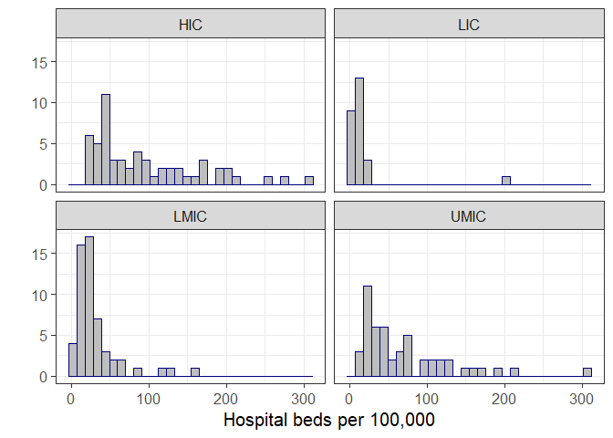
<p class="caption">

<span id="fig:hmax"></span>Figure 5.1: Hospital capacity: available beds
minus usual occupancy.
</p>

</div>

We model hospital capacity by sampling values according to data collated
in Doohan et al. (2026), which describe using gamma distributions. For
LLMICs, we have parameters 1.3 and 0.05. For UMICs, we have parameters
1.73 and 0.02. For HICs, we have parameters 2.05 and 0.02. (Data
sources: World Bank (beds); OECD, WHO euro (bed occupancy rates).)

### 5.2.3 Labour share of GVA

We estimate the average annual income per working-age adult as the total
GVA multiplied by the fraction of GVA that goes to labour divided by the
number of working-age adults. For the fraction of GVA that goes to
labour we use PWT estimates from 2011 (Feenstra et al. 2015) (Figure
<a href="#fig:labsh">5.2</a>).

<!-- For the value of a year of education, we use results from [@Psacharopoulos2021a]. For an LIC, the cost of a lost school year is 207% of GDP. For a UMIC, the cost of a lost school year is 73% of GDP. For an HIC, the cost of a lost school year is 30% of GDP. -->

<div class="figure">

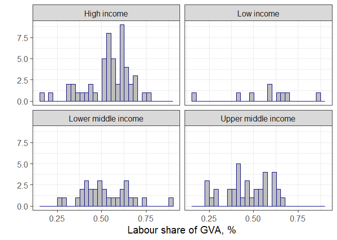
<p class="caption">

<span id="fig:labsh"></span>Figure 5.2: Fraction of GVA that goes to
labour (PWT, 2011).
</p>

</div>

We model these values with Beta distributions. For LLMICs, we have
parameters 5.09 and 4.51. For UMICs, we have parameters 7.06 and 8.18.
For HICs, we have parameters 7.97 and 6.87.

### 5.2.4 Contact rates

The fraction of total contacts made by working-age people that occur in
the workplace are modelled using data from Jarvis et al. (2024), in
which the fraction in three countries (UK, Belgium, Netherlands) is
close to 40% for all three countries. We extrapolated these values using
time-use survey results for fraction of time spent at work (OECD,
December 2023). These data covered 33 countries, with values ranging
from 12 to 25%. The three reference countries have values 16 to 18%. The
resulting distribution is shown in Figure
<a href="#fig:workfrac">5.3</a>.

<div class="figure">

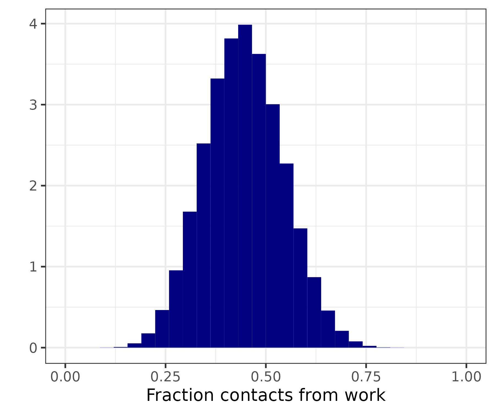
<p class="caption">

<span id="fig:workfrac"></span>Figure 5.3: Distribution over fraction of
contacts made at work.
</p>

</div>

Numbers of contacts by sector of work were also modelled using estimates
from Jarvis et al. (2024) corresponding to the UK, Netherlands and
Switzerland. We use the reported occupation and map it probabilistically
from ISCO-88 descriptions of occupation to ISIC rev 4 using ONS data.
The resulting distributions are shown in Figure @(fig:allsector). In the
model, in order to account for the uncertainty we have around how these
values might vary country by country, we sample values from half to
double the average. The distribution of workplace contacts by age is
constructed similarly, and is shown in Figure
<a href="#fig:uksecdistage">5.5</a>.

<div class="figure">

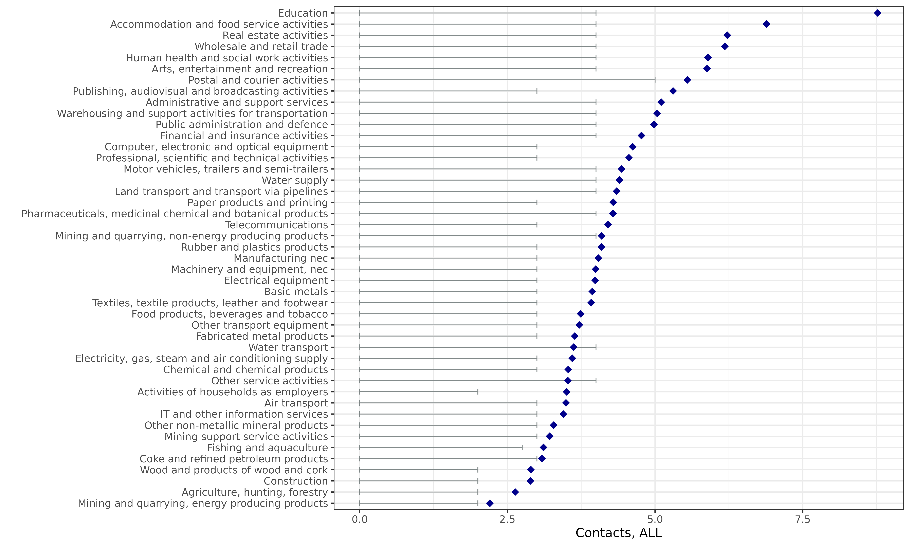
<p class="caption">

<span id="fig:allsector"></span>Figure 5.4: Number of contacts made at
work by sector. Diamonds show average numbers and ranges are 50%
quantile intervals.
</p>

</div>

<div class="figure">

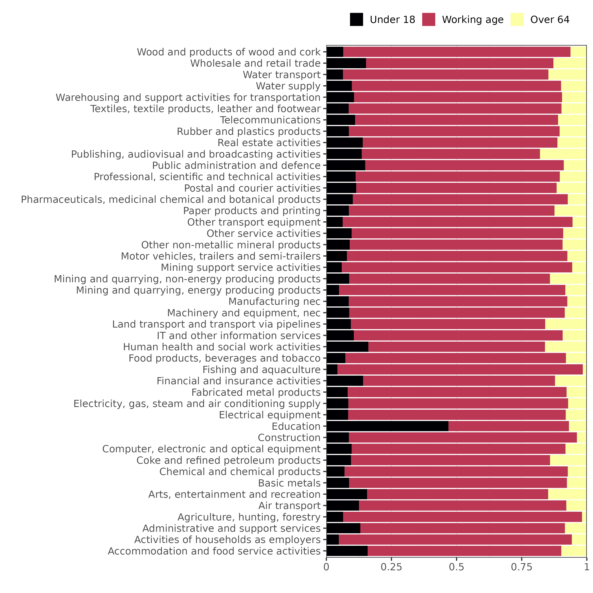
<p class="caption">

<span id="fig:uksecdistage"></span>Figure 5.5: Age distribution of
contacts made at work by sector.
</p>

</div>

We model contacts made in schools as a fraction of all contacts made by
children, and hospitality-related contacts as a fraction of non-school
and non-work contacts for all ages. These fractions are shown in Figures
<a href="#fig:school1frac">5.6</a>, <a href="#fig:school2frac">5.7</a>
and <a href="#fig:hospfrac">5.8</a>. Figure
<a href="#fig:conagefrac">5.9</a> shows how hospitality contacts are
distributed by age.

<div class="figure">

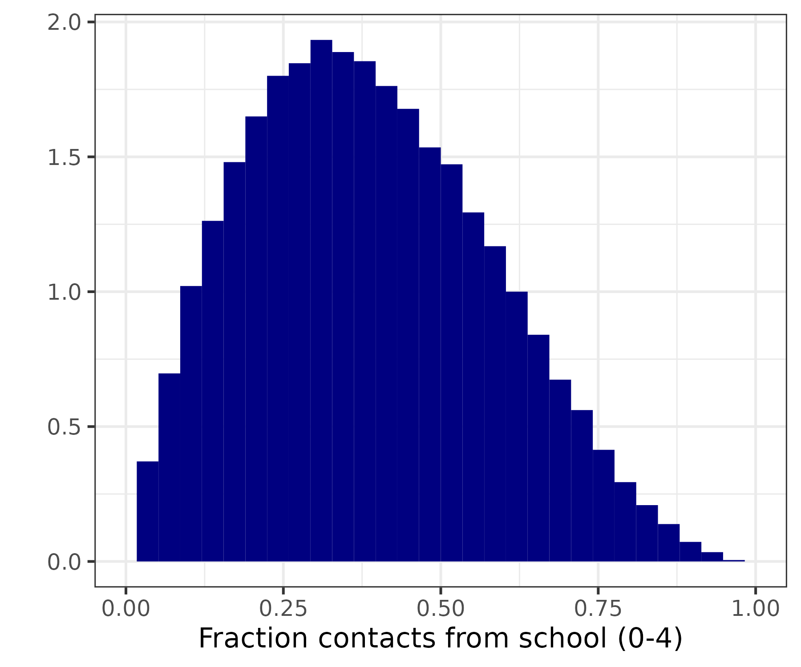
<p class="caption">

<span id="fig:school1frac"></span>Figure 5.6: Fraction of contacts made
at school for ages 0 to 4, from Jarvis et al. (2024).
</p>

</div>

<div class="figure">

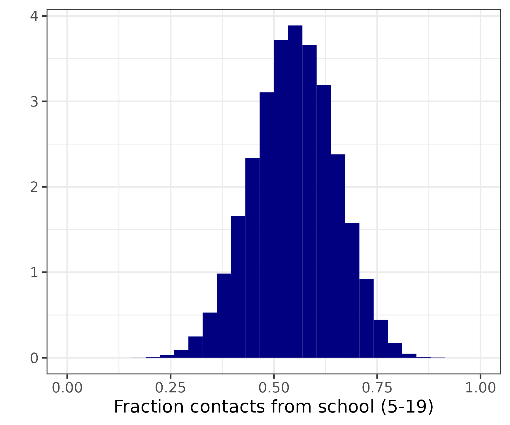
<p class="caption">

<span id="fig:school2frac"></span>Figure 5.7: Fraction of contacts made
at school for ages 5 to 19, from Jarvis et al. (2024).
</p>

</div>

<div class="figure">

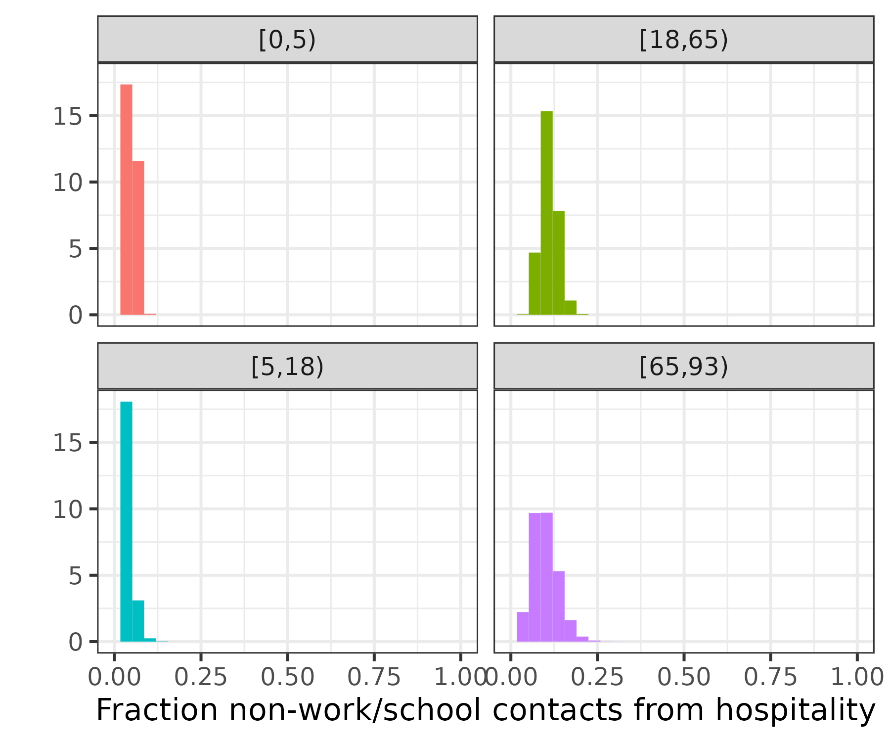
<p class="caption">

<span id="fig:hospfrac"></span>Figure 5.8: Fraction of non-school and
non-work contacts made in hospitality settings, by age group, from
Jarvis et al. (2024).
</p>

</div>

<div class="figure">

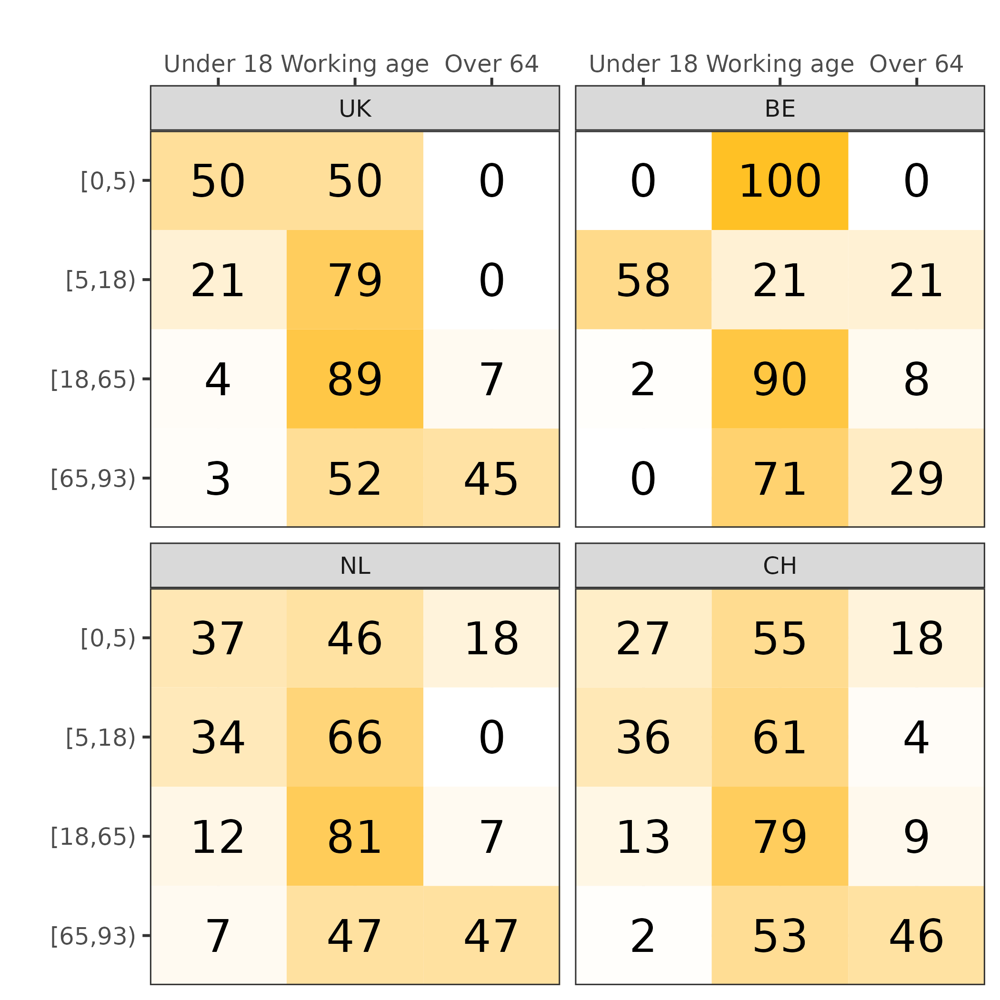
<p class="caption">

<span id="fig:conagefrac"></span>Figure 5.9: Distribution of non-school
and non-work contacts made in hospitality settings by age group, from
Jarvis et al. (2024).
</p>

</div>

### 5.2.5 Disease parameters

We sample disease profiles by defining distributions over each
parameter. The distributions are made using data sourced by Doohan et
al. (2026), and are described in Table
<a href="#tab:pathogenparameters">5.4</a>. Severity ratios as a function
of age are shown in Figure <a href="#fig:ratesbyage">5.10</a>.
$\text{R}_0$ is truncated at 1.5 and 3.5 following Whittaker et al.
(2024).

| Model parameter name | Distribution | Distribution parameter values | Correlations |
|:---|:---|:---|:---|
| Probability symptomatic | Beta | 5, 5 | None |
| Latent period | Gamma | 2.28, 1.06 | None |
| Asymptomatic infectious period | Gamma | 139.0, 0.017 | None |
| Time from symptom onset to recovery | Gamma | 18.61, 0.17 | 0.99 (time to hospitalisation); 0.60 ($\text{R}_0$) |
| Time from symptom onset to hospitalisation | Gamma | 21.21, 0.14 | 0.99 (time to recovery); 0.66 ($\text{R}_0$) |
| Time from hospitalisation to recovery | Gamma | 2.46, 3.75 | 0.997 |
| Time from hospitalisation to death | Gamma | 2.93, 2.96 | 0.997 |
| Time to immunity waning | Constant | Inf | None |
| Relative infectiousness of asymptomatic | Constant | 0.58 | None |
| $\text{R}_0$ | Truncated normal | 2.45, 1.32; (1.5, 3.5) | 0.60 (time to recovery); 0.66 (time to hospitalisation) |
| Fatality ratio without care relative to HFR | Gamma | 5, 1 | None |

<span id="tab:pathogenparameters"></span>Table 5.4: Distributions for
pathogen parameters used to sample synthetic pathogens. Distributions
are built from values from Doohan et al. (2026).

<figure>
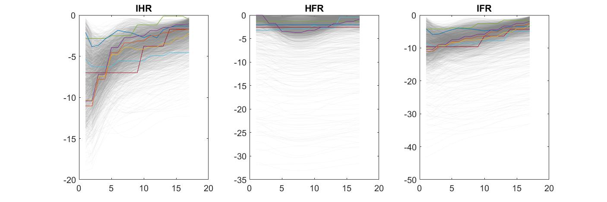
<figcaption aria-hidden="true"><span id="fig:ratesbyage"></span>Figure
5.10: Infection hospitalisation (IHR) and hospital fatality ratios HFR)
are generated by modelling profiles from SARS and influenza ratios. x
axis: age group index. y axis: log ratio. Lines show sampled profiles.
Profiles are built from values from <span class="citation"
data-cites="Doohan2026">Doohan et al. (2026)</span>.</figcaption>
</figure>

# 6 Notation

In general in this notation, subscripts are indices, and superscripts
are never indices but instead define new labels. In particular, note
that numerical superscripts are attached to letters $k$ for rates and
$p$ for parameters. Where a power is applied to one of these letters,
the letter will be enclosed in parentheses for clarity.

| Letter | Script | Subscript | Superscript |
|:--:|:--:|:--:|:--:|
| $A$ |  |  |  |
| $B$ |  |  |  |
| $C$ |  |  | community (contacts) |
| $D$ | COMPARTMENT: Died |  | related to death state |
| $E$ | COMPARTMENT: Exposed |  | related to exposed state |
| $F$ |  |  |  |
| $G$ |  |  |  |
| $GDP$ | GDP (annual) |  |  |
| $H$ | COMPARTMENT: Hospitalised |  | related to hospitalised state |
| $H_{\text{max}}$ | hospital capacity |  |  |
| $I$ | Infectious |  |  |
| $I^{a}$ | COMPARTMENT: Infectious asymptomatic |  | related to asymptomatic state |
| $I^{s}$ | COMPARTMENT: Infectious symptomatic |  | related to symptomatic state |
| $J$ |  | MAX: strata |  |
| $K$ | Loss (cost calculation) |  |  |
| $L$ | number of people by sector (workforce in place) |  |  |
| $M^{\text{com}}$ | CONTACTS: community |  |  |
| $M^{\text{home}}$ | CONTACTS: community, home |  |  |
| $M^{\text{CC}}$ | CONTACTS: community, customers |  |  |
| $M^{\text{trav}}$ | CONTACTS: community, public transport |  |  |
| $M^{\text{sch}}$ | CONTACTS: community, school |  |  |
| $M^{\text{WC}}$ | CONTACTS: work, worker to customer |  |  |
| $M^{\text{CW}}$ | CONTACTS: work, customer to worker |  |  |
| $M$ | CONTACTS: total |  |  |
| $\tilde{M}$ | Total contacts by five-year age bands |  |  |
| $\hat{M}$ | Total contacts by DAEDALUS age groups |  |  |
| $N$ | number of people by stratum |  |  |
| $\tilde{N}$ | Number of people by five-year age bands |  |  |
| $\hat{N}$ | Number of people in DAEDALUS age groups |  |  |
| $O$ | – |  |  |
| $P$ | (probability) |  |  |
| $Q$ |  |  |  |
| $R$ | COMPARTMENT: Recovered |  | related to recovered state |
| $R_0$ | Basic reproduction number |  |  |
| $R_t$ | Effective reproduction number |  |  |
| $S$ | COMPARTMENT: Susceptible | MAX: sectors |  |
| $S^{c}$ | COMPARTMENT: Susceptible seroconverting |  |  |
| $T^c$ | duration from vaccination to protection |  |  |
| $T^H$ | duration in hospital |  |  |
| $T^{H:D}$ | duration in hospital given death |  |  |
| $T^{H:R}$ | duration in hospital given recovery |  |  |
| $T^{I^a}$ | duration asymptomatic |  |  |
| $T^{I^s}$ | duration symptomatic |  |  |
| $T^{I^s:H}$ | duration symptomatic given hospitalised |  |  |
| $T^{I^s:R}$ | duration symptomatic given recovery |  |  |
| $T^{E:I}$ | latent period |  |  |
| $U$ |  |  |  |
| $V$ |  | MAX: vaccines |  |
| $W$ |  |  | worker (contacts) |
| $X$ |  |  |  |
| $Y$ | GDP (simulation) | MAX: years |  |
| $Y_0$ | max GDP (simulation) |  |  |
| $Z$ |  |  |  |

Capital letters

| Letter | Script | Subscript | Superscript |
|:--:|:--:|:--:|:--:|
| $a$ |  | INDEX: age index, five-year age bands | asymptomatic |
| $b$ | proportion of tourism that is international |  |  |
| $c$ | fraction international tourism reduces to as a consequence of the pandemic |  | seroconverting |
| $d$ | deaths per million |  |  |
| $e$ | government mandate |  |  |
| $\text{ed}$ |  | education sector (j index) |  |
| $f$ | functions: UTR, hospitalisation |  |  |
| $g$ |  | INDEX: age index, DAEDALUS age groups |  |
| $h$ |  | INDEX: dummy index |  |
| $i$ |  |  | self isolating |
| $j$ |  | INDEX: stratum index |  |
| $k$ | state transition rates |  |  |
| $l$ | life expectancy |  |  |
| $m_J$ | number of strata |  |  |
| $m_S$ | number of sectors |  |  |
| $m_V$ | number of vaccines |  |  |
| $m_Y$ | number of years in work |  |  |
| $n$ |  |  |  |
| $o$ | – |  |  |
| $p$ | parameters |  |  |
| $q$ | proportions working from home |  |  |
| $r$ | discount rate |  |  |
| $s$ |  |  | symptomatic |
| $\text{school}$ |  | student strata (j index) |  |
| $t$ | time (day) |  |  |
| $u$ | dummy variable | INDEX: dummy index |  |
| $v$ |  | INDEX: vaccination status |  |
| $w$ |  |  |  |
| $x$ | sector openness |  |  |
| $y$ | GVA | INDEX: year |  |
| $z$ | fraction of GDP coming from the Food and accommodation sector |  |  |

Lower-case letters

|   Letter   |                       Definition                        |
|:----------:|:-------------------------------------------------------:|
|  $\alpha$  |                                                         |
|  $\beta$   |                    transmission rate                    |
|  $\gamma$  |                                                         |
|  $\delta$  |                                                         |
| $\epsilon$ |          ratio transmission from asymptomatic           |
|  $\zeta$   |                                                         |
|   $\eta$   |                     vaccine effects                     |
|  $\theta$  |                                                         |
|  $\iota$   |                                                         |
|  $\kappa$  |                                                         |
| $\lambda$  |                                                         |
|   $\mu$    |                                                         |
|   $\nu$    |                                                         |
|    $o$     |                            –                            |
|   $\pi$    |                                                         |
|   $\rho$   | transmission modifier (uncosted transmission reduction) |
|  $\sigma$  |                                                         |
|   $\tau$   |                        max time                         |
| $\upsilon$ |                            –                            |
|   $\phi$   |   Fatality rate without hospital care relative to HFR   |
|   $\chi$   |                                                         |
|   $\psi$   |                                                         |
|  $\omega$  |                                                         |

Greek letters

|  Letter  |                  Definition                  |
|:--------:|:--------------------------------------------:|
|  $k^1$   |              rate of infection               |
|  $k^2$   |   rate of onset of asymptomatic infection    |
|  $k^3$   | rate of recovery from asymptomatic infection |
|  $k^4$   |    rate of onset of symptomatic infection    |
|  $k^5$   | rate of recovery from symptomatic infection  |
|  $k^6$   |           rate of hospitalisation            |
|  $k^7$   |    rate of recovery from hospitalisation     |
|  $k^8$   |      rate of death from hospitalisation      |
|  $k^9$   |        rate of vaccine seroconversion        |
| $k^{10}$ |               vaccination rate               |
| $k^{11}$ |                                              |
| $k^{12}$ |              rate of infection               |
| $k^{13}$ |                                              |
| $k^{14}$ |                                              |
| $k^{15}$ |                                              |
| $k^{16}$ |                                              |
| $k^{17}$ |                                              |
| $k^{18}$ |                                              |
| $k^{19}$ |              rate of infection               |

Rates

| Letter | Definition |
|:--:|:--:|
| $p^{I^S}$ | probability to be symptomatic |
| $\tilde{p}^H$ | Basic probability to be hospitalised (IHR) |
| $p^H$ | Adjusted probability to be hospitalised (IHR) |
| $\tilde{p}^D$ | Basic probability to die (HFR) |
| $p^D$ | Adjusted probability to die (HFR) |
| $p^1$ | Compliance with the instruction to self isolate |
| $p^2$ | fraction of cases identified by testing |
| $p^3$ | proportion of asymptomatic infectiousness averted due to self isolating |
| $p^4$ | proportion of symptomatic infectiousness averted due to self isolating |
| $p^5$ | tourism parameter |
| $p^6$ | tourism parameter |
| $p^7$ | tourism parameter |
| $p^8$ | minimum mobility |
| $p^9$ | deaths coefficient for mobility |
| $p^{10}$ | mandate coefficient for mobility |
| $p^{11}$ | mobility mixing parameter |
| $p^{12}$ | present value of lost earnings |
| $p^{13}$ | mean annual earnings |
| $p^{14}$ | effective amount of education lost per student |
| $p^{15}$ | rate of return for one year of education |
| $p^{16}$ | relative effectiveness of remote education |
| $p^{17}$ | number of days from onset of infectiousness to self isolation |
| $p^{18}$ | number of asymptomatic days spent in self isolation per day of infectiousness |
| $p^{19}$ | number of symptomatic days spent in self isolation per day of infectiousness |
| $p^{20}$ | number of days from onset of symptoms to self isolation |
| $p^{21}$ | public transport mode share |
| $p^{22}$ | work absence, asymptomatic (cost calculation) |
| $p^{23}$ | work absence, symptomatic (cost calculation) |
| $p^{24}$ | school absence, asymptomatic (cost calculation) |
| $p^{25}$ | school absence, symptomatic (cost calculation) |
| $p^{26}$ | fraction of symptomatic infectiousness that is presymptomatic |
| $p^{27}$ | hospitality openness |

Parameters

<div id="refs" class="references csl-bib-body hanging-indent">

<div id="ref-Ananthapavan2021" class="csl-entry">

Ananthapavan, Jaithri, Marj Moodie, Andrew J. Milat, and Rob Carter.
2021. “Systematic Review to Update ‘Value of a Statistical Life’
Estimates for Australia.” *International Journal of Environmental
Research and Public Health* 18 (11).
<https://doi.org/10.3390/ijerph18116168>.

</div>

<div id="ref-BadanPusatStatistik2022" class="csl-entry">

Badan Pusat Statistik. 2022. *PDB Menurut Lapangan Usaha Seri 2010*.
<https://www.bps.go.id/indicator/11/65/1/-2010-version-gdp-at-2010-version.html>.

</div>

<div id="ref-Beraud2015" class="csl-entry">

Béraud, Guillaume, Sabine Kazmercziak, Philippe Beutels, et al. 2015.
“The French Connection: The First Large Population-Based Contact Survey
in France Relevant for the Spread of Infectious Diseases.” *PLoS ONE* 10
(7): 1–22. <https://doi.org/10.1371/journal.pone.0133203>.

</div>

<div id="ref-Betthauser2023" class="csl-entry">

Betthäuser, Bastian A, Anders M Bach-Mortensen, and Per Engzell. 2023.
“A Systematic Review and Meta-Analysis of the Evidence on Learning
During the COVID-19 Pandemic.” *Nature Human Behaviour* 7 (March).
<https://doi.org/10.1038/s41562-022-01506-4>.

</div>

<div id="ref-Cutler2020" class="csl-entry">

Cutler, David M., and Lawrence H. Summers. 2020. “The COVID-19 Pandemic
and the \$16 Trillion Virus.” *JAMA* 324 (15).
<https://doi.org/10.1257/pol.20170046>.

</div>

<div id="ref-Doohan2026" class="csl-entry">

Doohan, Patrick, Pratik Gupte, David Haw, et al. 2026. *Daedalus R
Package*. <a href="https://github.com/jameel-institute/daedalus"
class="uri">Https://github.com/jameel-institute/daedalus</a>.
<https://github.com/jameel-institute/daedalus>.

</div>

<div id="ref-Feenstra2015" class="csl-entry">

Feenstra, Robert C., Robert Inklaar, and Marcel P. Timmer. 2015. “The
Next Generation of the Penn World Table.” *American Economic Review* 105
(10): 3150–82. [www.ggdc.net/pwt](https://www.ggdc.net/pwt).

</div>

<div id="ref-GlobalBurdenofDiseaseCollaborativeNetwork2021"
class="csl-entry">

Global Burden of Disease Collaborative Network. 2021. *Global Burden of
Disease Study 2019 (GBD 2019) Reference Life Table*. Institute for
Health Metrics and Evaluation (IHME).

</div>

<div id="ref-Gottlieb2021" class="csl-entry">

Gottlieb, Charles, Jan Grobovšek, Markus Poschke, and Fernando Saltiel.
2021. “Working from Home in Developing Countries.” *European Economic
Review* 133: 103679. <https://doi.org/10.1016/j.euroecorev.2021.103679>.

</div>

<div id="ref-Hammitt2020" class="csl-entry">

Hammitt, James K. 2020. “Valuing Mortality Risk in the Time of
COVID-19.” *Journal of Risk and Uncertainty* 61 (2): 129–54.
<https://doi.org/10.1007/s11166-020-09338-1>.

</div>

<div id="ref-Haw2020" class="csl-entry">

Haw, David, Giovanni Forchini, Patrick Doohan, et al. 2022. “Optimizing
Social and Economic Activity While Containing SARS-CoV-2 Transmission
Using DAEDALUS.” *Nature Computational Science* 2: 223–33.
<https://doi.org/10.1038/s43588-022-00233-0>.

</div>

<div id="ref-Jarvis2024" class="csl-entry">

Jarvis, Christopher I., Pietro Coletti, Jantien A. Backer, et al. 2024.
“Social Contact Patterns Following the COVID-19 Pandemic: A Snapshot of
Post-Pandemic Behaviour from the CoMix Study.” *Epidemics* 48
(September): 100778. <https://doi.org/10.1016/j.epidem.2024.100778>.

</div>

<div id="ref-jonessarahpImperialCollegeLondon2020" class="csl-entry">

Jones, Sarah P, Imperial College London Big Data Analytical Unit, and
YouGov Plc. 2020. *Imperial College London YouGov Covid 19 Behaviour
Tracker Data Hub*. <https://github.com/YouGov-Data/covid-19-tracker>.

</div>

<div id="ref-Kavanagh2011" class="csl-entry">

Kavanagh, Anne M, Rebecca J Bentley, Kate E Mason, et al. 2011.
“Sources, Perceived Usefulness and Understanding of Information
Disseminated to Families Who Entered Home Quarantine During the H1N1
Pandemic in Victoria, Australia: A Cross-Sectional Study.” *BMC
Infectious Diseases* 11 (1): 2.
<https://doi.org/10.1186/1471-2334-11-2>.

</div>

<div id="ref-Liu2025" class="csl-entry">

Liu, Chang, Tim K. Tsang, Sheena G. Sullivan, Benjamin J. Cowling, and
Bingyi Yang. 2025. “Comparative Duration of Neutralizing Responses and
Protections of COVID-19 Vaccination and Correlates of Protection.”
*Nature Communications* 16 (1): 4748.
<https://doi.org/10.1038/s41467-025-60024-9>.

</div>

<div id="ref-Moscoviz2022" class="csl-entry">

Moscoviz, Laura, and David K Evans. 2022. *Learning Loss and Student
Dropouts During the COVID-19 Pandemic: A Review of the Evidence Two
Years After Schools Shut down*. Center for Global Development.

</div>

<div id="ref-OfficeforNationalStatistics2022" class="csl-entry">

Office for National Statistics. 2022. *GDP Monthly Estimate, UK*.
<https://www.ons.gov.uk/economy/grossdomesticproductgdp/bulletins/gdpmonthlyestimateuk/latest>.

</div>

<div id="ref-Patrinos2023" class="csl-entry">

Patrinos, Harry Anthony. 2023. “The Longer Students Were Out of School,
the Less They Learned.” *Journal of School Choice* 17 (2): 161–75.
<https://doi.org/10.1080/15582159.2023.2210941>.

</div>

<div id="ref-Prem2021" class="csl-entry">

<span class="nocase">Prem, Kiesha, Kevin van Zandvoort, Petra Klepac, et
al.</span> 2021. “Projecting Contact Matrices in 177 Geographical
Regions: An Update and Comparison with Empirical Data for the COVID-19
Era.” *PLoS Computational Biology* 17 (7).
<https://doi.org/10.1371/journal.pcbi.1009098>.

</div>

<div id="ref-Psacharopoulos2021a" class="csl-entry">

Psacharopoulos, George, Victoria Collis, Harry Anthony Patrinos, and
Emiliana Vegas. 2021. “The COVID-19 Cost of School Closures in Earnings
and Income Across the World.” *Comparative Education Review* 65 (2).
<https://doi.org/10.1086/713540>.

</div>

<div id="ref-Robinson2021" class="csl-entry">

Robinson, Lisa A., Ryan Sullivan, and Jason F. Shogren. 2021. “Do the
Benefits of COVID-19 Policies Exceed the Costs? Exploring Uncertainties
in the Age–VSL Relationship.” *Risk Analysis* 41 (5): 761–70.
<https://doi.org/10.1111/risa.13561>.

</div>

<div id="ref-Smith2021" class="csl-entry">

Smith, Louise E., Henry W. W. Potts, Richard Amlôt, Nicola T. Fear,
Susan Michie, and G. James Rubin. 2021. “Adherence to the Test, Trace,
and Isolate System in the UK: Results from 37 Nationally Representative
Surveys.” *The BMJ* 372. <https://doi.org/10.1136/bmj.n608>.

</div>

<div id="ref-TheGlobalFund2022" class="csl-entry">

The Global Fund. 2022. *Fight for What Counts Investment Case*. <a
href="https://plataformalac.org/en/2022/02/fight-for-whats-count-investment-case-seventh-replenishment-2022/"
class="uri">Https://plataformalac.org/en/2022/02/fight-for-whats-count-investment-case-seventh-replenishment-2022/</a>.
<https://plataformalac.org/en/2022/02/fight-for-whats-count-investment-case-seventh-replenishment-2022/>.

</div>

<div id="ref-un" class="csl-entry">

UN Economic and Social Affairs. 2008. *International Standard Industrial
Classification of All Economic Activities Revision 4*. United Nations.
<https://doi.org/10.4337/9781781955659.00009>.

</div>

<div id="ref-untourismInternationalTourismCOVID192023"
class="csl-entry">

UN Tourism. 2023. *International Tourism and COVID-19*.
<https://www.unwto.org/tourism-data/international-tourism-and-covid-19>.

</div>

<div id="ref-Walker2020" class="csl-entry">

Walker, Patrick G. T., Charles Whittaker, Oliver J. Watson, et al. 2020.
“The Impact of COVID-19 and Strategies for Mitigation and Suppression in
Low- and Middle-Income Countries.” *Science* 369 (6502): 413–22.
<https://doi.org/10.1126/science.abc0035>.

</div>

<div id="ref-whittakerQuantifyingImpactBroadly2024" class="csl-entry">

Whittaker, Charles, Gregory Barnsley, Daniela Olivera Mesa, et al. 2024.
*Quantifying the Impact of a Broadly Protective Sarbecovirus Vaccine in
a Future SARS-X Pandemic*.
<https://doi.org/10.1101/2024.08.12.24311730>.

</div>

</div>
