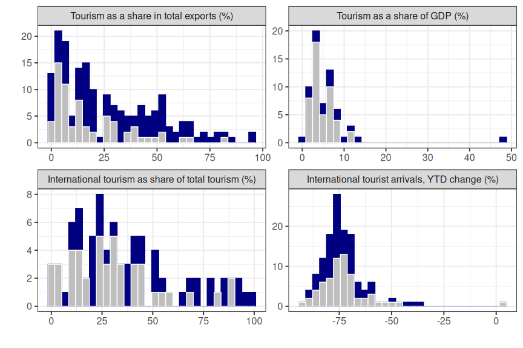

100-day mission: Model description
================

-   [1 Simulation rules](#1-simulation-rules)
-   [2 Socio-economic costs](#2-socio-economic-costs)
    -   [2.1 Lost lives](#21-lost-lives)
    -   [2.2 Lost economic output](#22-lost-economic-output)
    -   [2.3 Lost education](#23-lost-education)
-   [3 Epi model](#3-epi-model)
    -   [3.1 Ordinary differential
        equations](#31-ordinary-differential-equations)
    -   [3.2 Disease state transitions](#32-disease-state-transitions)
    -   [3.3 Vaccination state
        transitions](#33-vaccination-state-transitions)
    -   [3.4 Contact rates](#34-contact-rates)
        -   [3.4.1 Matrix $T$: community
            contacts](#341-matrix-t-community-contacts)
        -   [3.4.2 Matrix $U$: Worker-to-worker
            contacts](#342-matrix-u-worker-to-worker-contacts)
        -   [3.4.3 Matrix $V$: Consumer-to-worker
            contacts](#343-matrix-v-consumer-to-worker-contacts)
    -   [3.5 Social distancing](#35-social-distancing)
    -   [3.6 Self isolating](#36-self-isolating)
-   [4 Econ model](#4-econ-model)
    -   [4.1 Configurations](#41-configurations)
    -   [4.2 Impact of tourism](#42-impact-of-tourism)
        -   [4.2.1 Food and accommodation services
            sector](#421-food-and-accommodation-services-sector)
        -   [4.2.2 Sector shrinkage as a result of the
            pandemic](#422-sector-shrinkage-as-a-result-of-the-pandemic)
        -   [4.2.3 Loss of international
            tourists](#423-loss-of-international-tourists)
        -   [4.2.4 Dependence on international
            tourism](#424-dependence-on-international-tourism)
    -   [4.3 Remote working](#43-remote-working)
-   [5 Parametric distributions](#5-parametric-distributions)
    -   [5.1 Hospital capacity](#51-hospital-capacity)
    -   [5.2 Labour share of GVA](#52-labour-share-of-gva)

# 1 Simulation rules

-   Countries are instantiated with two random variables: the response
    time, and their importation time
-   The response time is the time at which the reporting country reports
    having seen X hospital cases, where X is a random number between 1
    and 20
-   The importation time is a random number between 0 and 20 days, where
    0 days would be equivalent to the spillover, or origin, country
-   The simulation starts at the minimum between the response time and
    the importation time
-   At the response time, the BPSV, if present, is given to people aged
    65 and older; testing begins; social distancing begins; economic
    closures, if in use, are implemented
-   At the importation time, five people are moved from compartment S to
    compartment E
-   If closures are being implemented, the rules in Tables
    <a href="#tab:rulesreactive">1.1</a> and
    <a href="#tab:ruleselimination">1.2</a> are followed
-   The SARS-X–specific vaccine is rolled out starting on day 107 or 372
    after the response time, depending on the investment assumption
-   All people aged 15 and over are eligible for vaccination, and we
    assume 80% take it up
-   Distribution rate increases linearly to a maximum of 1% of the
    population per day, at which is stays until 80% coverage is reached
-   When vaccine rollout is complete, closures, testing and social
    distancing end
-   When the doubling time is more than 30 days and there are fewer than
    1,000 people in hospital, the simulation ends.

| From/to            | No closures                                                                                                             | Light closures                                                    | Heavy closures                                            |
|:-------------------|:------------------------------------------------------------------------------------------------------------------------|:------------------------------------------------------------------|:----------------------------------------------------------|
| **No closures**    |                                                                                                                         |                                                                   | t = response time OR Hospital occupancy &gt; 95% capacity |
| **Light closures** | (Growth rate &lt; 0.025 OR Hospital occupancy &lt; 25% capacity) AND vaccine rollout complete OR $R(D(\textbf{1}) < 1$) |                                                                   | Hospital occupancy &gt; 95% capacity                      |
| **Heavy closures** |                                                                                                                         | Hospital occupancy &lt; 25% capacity AND t &gt; 7 + response time |                                                           |

Table 1.1: State transition rules for reactive closure strategies

| From/to            | No closures                                        | Light closures                            | Heavy closures                                            |
|:-------------------|:---------------------------------------------------|:------------------------------------------|:----------------------------------------------------------|
| **No closures**    |                                                    |                                           | t = response time OR Hospital occupancy &gt; 95% capacity |
| **Light closures** | Vaccine rollout complete OR $R(D(\textbf{1}) < 1$) |                                           | Rt &gt; 1.2                                               |
| **Heavy closures** | Vaccine rollout complete OR $R(D(\textbf{1}) < 1$) | Rt &lt; 0.95 AND t &gt; 7 + response time |                                                           |

Table 1.2: State transition rules for the elimination strategy

# 2 Socio-economic costs

We assign monetary values to YLLs and to years of education in order to
add health and education costs of mitigation strategies to the costs of
economic closures. We define the total socio-economic costs TSC of an
epidemic as the sum of the individual costs:

$$\begin{equation}
\text{TSC} = L_1\text{VLY} + L_2 + L_3\text{VSY},
\label{eq:swf}
\end{equation}$$

where $L_1$ is the number of discounted life years lost and VLY the
value of a discounted life year; $L_2$ is the lost output over the
period due to reduced economic activity; and $L_3$ is the number of
school years lost and VSY the value of one school year.

## 2.1 Lost lives

To value lives lost, we make use of the expected remaining life years
per age group (Global Burden of Disease Collaborative Network 2021).
These are used to estimate the expected number of years of life lost per
death, and to estimate the value of a life year. We map the remaining
life expectancy $l_a$ for the GBD age groups $a$ to $l_g$ for the model
age groups $g$ as a population-weighted average, taking into account the
size of each age group, $N_a$. For the expected number of life years
lost per death, we take into account also the probability to die given
infection, $P(D|I,a)$:
$$l_g^{\text{(death)}} = \frac{\sum_{a\in g}N_al_aP(D|I,a)}{\sum_{a\in g}N_aP(D|I,a)}; $$
$$l_g^{\text{(life)}} = \frac{\sum_{a\in g}N_al_a}{\sum_{a\in g}N_a}; $$

Expected life years remaining with discounting taken into account can be
written

``` math
\hat{l}_g=\sum_{y=1}^{l_g}\frac{1}{(1+r)^{y}}
```

for discount rate $r>0$. The discounted number of years lost given $D_g$
deaths due to COVID-19 for each age group is

``` math
L_1=\sum_gD_g\hat{l}_g^{\text{(death)}}.
```

The VLY used by policy makers should reflect the value that members of
the society place on reductions of their own mortality. We rely on the
intrinsic rather than instrumental interpretation of the valuation of
life (Cutler and Summers 2020), and we use existing estimates of the
value of a statistical life (VSL) to estimate VLY. We interpret the VSL
as a population-weighted average (Ananthapavan et al. 2021; Robinson,
Sullivan, and Shogren 2021), where each age group has a VSL defined by
the number of expected life years remaining, and where each discounted
year has the same value:

$$\begin{equation}
\text{VSL}=\frac{\sum_gN_g\hat{l}_g^{\text{(life)}}}{\sum_gN_g}\text{VLY}.
\end{equation}$$

## 2.2 Lost economic output

We measure the cost of economic closures in terms of lost gross value
added (GVA): the GDP generated by an economic configuration is the
maximum GVA (denoted $y_j$ for each sector $j$) multiplied by the
respective sector openings, summed over the period. The maximum possible
GDP (which is with no closures) is $Y_0=\frac{T}{365}\sum_{j}y_j$, and
we use pre-pandemic output to define the maximum possible values.

All economic sectors contribute GVA according to the level they are open
for production, except for the education sector which contributes its
maximum possible GVA, $y_{\text{ed}}$. $x_{j}(t)$ is the proportion of
the workforce contributing to economic production in sector $j$ out of
the total workforce $W_j$ on day $t$. The workforce can be additionally
depleted due to self isolation, sickness, hospitalisation and death,
leaving a smaller fraction ($`\hat{x}_{j}(t)`$) to contribute to
production.

``` math
\hat{x}_{j}(t)=x_{j}(t) - \left((1-x_{j}(t))A_{1,j}(t)  + (1-x_{j}(t)(1-q_j))A_{2,j}(t)\right)/W_j
```

where $q_j$ is the fraction of the sector working from home.
$A_{1,j}(t)$ represents worker sickness and death:

$$A_{1,j}(t)=\sum_{v=0}^2\left((1-p_{H}^{j,v})p_1p_{18}^sI_{j,v}^{s}+p_{H}^{j,v}p_1I_{j,v}^{s}+H_{j,v}+D_{j,v}\right),$$

and $A_{2,j}(t)$ represents output from asymptomatic self-isolating
workers:

$$A_{2,j}(t)=p_2(t)p_{18}^aI_{j}^{a}.$$

$p_{18}$ is the number of days spent in self isolation per day of
infectiousness (e.g. suppose the average infectious period is four days
and mandatory self-isolation time is ten days, then $p_{18}^s=2.5$ and
$p_{18}^a=p_{18}^s\gamma_I/\gamma_A$, where $\gamma_I$ and $\gamma_A$
are expected infectious periods for symptomatic and asymptomatic,
respectively). $p_1$ is compliance with the requirement to self isolate
and $p_2(t)$ is the fraction of cases identified. Other notations are
vaccine status $v$, infectious and asymptomatic $I_{j,v}^{a}$,
infectious and symptomatic $I_{j,v}^{s}$, hospitalised $H$, deceased
$D$, and probability to be hospitalised $p_H$.

Then the total output is

``` math
Y =  \frac{1 }{365} \sum_{j\neq\text{ed}}y_j\int_{t=0}^{T}\hat{x}_{j}(t)dt + \frac{T }{365}{y_\text{ed}},
```

and the GDP loss compared to the maximum is

$$L_2=Y_0-Y.$$

## 2.3 Lost education

The loss due to school closure is

<!-- $$L_3 =  \frac{p_{14} }{365}\left( Tp_{16}W_{g_{\text{school}}}+B_2 + (1-p_{16})B_1 \right)\text{VSY}$$ -->

$$L_3 =  \frac{1 }{365} \int_{t=0}^{T}\left(p_{14}(t)W_{g_{\text{school}}} + (1-p_{14}(t))B_1(t)  +(1-2p_{14}(t))B_2(t)\right)dt,$$

where $p_{14}(t)$ is the effective amount of education lost per student
at time $t$ due to school closure:
$$p_{14}(t) = (1-p_{16})(1-x_{\text{ed}}(t)),$$ $W_{g_{\text{school}}}$
is the total number of students, $p_{16}$ is relative effectiveness of
remote education and $x_{\text{ed}}(t)$ is the openness of schools,
$B_1(t)$ represents education lost due to student sickness with
COVID-19:

$$B_1(t)=\sum_{v=0}^2\left((1-p_{H}^{j_{\text{school}},v})p_1p_{18}^sI_{j_{\text{school}},v}^{s}+p_{H}^{j_{\text{school}},v}p_1I_{j_{\text{school}},v}^{s}+H_{j_{\text{school}},v}\right),$$

$p_{18}$ is the number of days spent in self isolation per day of
infectiousness (e.g. suppose the average infectious period is four days
and mandatory self-isolation time is ten days, then $p_{18}^s=2.5$ and
$p_{18}^a=p_{18}^s\gamma_I/\gamma_A$, where $\gamma_I$ and $\gamma_A$
are expected infectious periods for symptomatic and asymptomatic,
respectively), and $B_2(t)$ represents education lost due to
asymptomatic self isolation (which comes at a cost only when schools are
open):

$$B_2(t)=p_2(t)p_{18}^aI_{j_{\text{school}}}^{a}.$$

For the value of a year of education, we use the method of
(Psacharopoulos, Collis, and Patrinos 2021).

$$\text{VSY} =  p_{12}\cdot p_{13}\cdot p_{15}.$$

$p_{12}$ is the present value of lost earnings:

$$p_{12} = \frac{1}{W_{g_{\text{school}}}}\sum_{a\in g_{\text{school}}}N_a\left( \frac{1-(1+r)^{-(n+20-a)}}{r} -  \frac{1-(1+r)^{-(20-a)}}{r}\right)$$

for discount rate $r=0.03$, number $N_a$ students currently age $a$, and
expected number of years of work $n=45$. $p_{13}$ is mean annual
earnings, $p_{15}=0.08$ is the rate of return for one year.

The value $p_{16}$ represents the effectiveness of remote teaching,
which we sample as a standard uniform random variable. We note that no
strong predictors of effectiveness of remote teaching have been
identified (Patrinos 2023). We assume that losses are linear in duration
of school closure, although there is not consensus even on this
(Betthäuser, Bach-Mortensen, and Engzell 2023). Important factors to
include in future work might be those relating to parental circumstances
including education level, engagement and socio-economic status
(Moscoviz and Evans 2022). However, these factors might be more
pertinent to intra- rather than international modelling.

# 3 Epi model

## 3.1 Ordinary differential equations

$$\begin{align}
\frac{dS_{j,v}}{dt} & = \sum_{u=0}^{v-1}k_9S_{j,u}^{c_v} - \left( k_{1}^{j,v}(t) + \sum_{u=v+1}^{2}k_{10,c_u}^{j,v}(t) \right)S_{j,v} \\
\frac{dS_{j,u}^{c_v}}{dt} & = k_{10,c_v}^{u,j}(t)S_{j,u} -\left( k_{1}^{j,v}(t) + k_9 \right)S_{j,u}^{c_v}  \\
\frac{dE_{j,v}}{dt} & = k_{1}^{j,v}(t)\left(S_{j,v}+\sum_{u=v+1}^2S_{j,v}^{c_u}\right) - (k_2+k_4)E_{j,v} \\
\frac{dI_{j,v}^a}{dt} & = k_2E_{j,v} - k_3I_{j,v}^a \\
\frac{dI_{j,v}^s}{dt} & = k_4E_{j,v} - (k_{5}^{j,v}+k_{6}^{j,v})I_{j,v}^s \\
\frac{dR_{j,v}}{dt} & = k_3I_{j,v}^a + k_{5}^{j,v}I_{j,v}^s + k_{7}^{j}(t) H_{j,v} - \sum_{u=v+1}^{2}k_{10,c_u}^{j,v}(t)R_{j,v} + \sum_{u=0}^{v-1}k_{10,c_v}^{u,j}(t)R_{j,v-1}\\
\frac{dH_{j,v}}{dt} & = k_{6}^{j,v}I_{j,v}^s - (k_{7}^{j}(t) + k_{8}^{j}(t)) H_{j,v} \\
\frac{dD_{j,v}}{dt} & =  k_{8}^{j}(t) H_{j,v}
\end{align}$$

## 3.2 Disease state transitions

<div class="figure">


<p class="caption">

Figure 3.1: Disease state transitions. $S$: susceptible. $E$: exposed.
$I^{a}$: asymptomatic infectious. $I^{s}$: symptomatic infectious. $H$:
hospitalised. $R$: recovered. $D$: died. $j$: stratum. $v$: vaccination
status.

</p>

</div>

Possible transitions between disease states are shown in Figure
<a href="#fig:statetransitions">3.1</a>. Transition rates are functions
of time $t$, vaccination status $v$, and group identity $j$ (where the
groups are the 45 sectors and the four age groups).

The rate of infection of susceptible individuals, $k_{1}^{j,v}(t)$, is
defined as

$$\begin{equation}
k_{1}^{j,v}(t) = \eta_{A}^{v}\rho(t)\beta\sum_{h=1}^{m}M_{j,h}(x) I_h(t)
\qquad(3.1)
\end{equation}$$

with $m=49$ strata and

``` math
 I_h(t)=\sum_{v=0}^2\left(\epsilon (1-p_3(t))I_{h,v}^{a}(t)+(1-p_4(t))I_{h,v}^{(S)}(t)\right). 
```

Here, $\eta_{A,v}$ is the relative probability to be infected given
vaccine status $v$; $\rho(t)$ is the time-dependent modifier of the rate
of infection, $\beta$, which captures the impact of social distancing;
$M(x)$ is the contact matrix between groups and depends on the economic
configuration $x$; $\epsilon$ is the reduction in infectiousness from
asymptomatic relative to symptomatic individuals; $p_3$ and $p_4$ are
the proportions of asymptomatic and symptomatic infectiousness averted,
respectively, due to self isolating; and $I_{h,\cdot}^{\cdot}$ is the
number of infectious asymptomatic ($I_{h,\cdot}^{a}$) and symptomatic
($I_{h,\cdot}^{s}$) people who are unvaccinated ($I_{h,v=0}^{\cdot}$),
vaccinated with the BPSV ($I_{h,v=1}^{\cdot}$), or vaccinated with the
specific vaccine ($I_{h,v=2}^{\cdot}$) in stratum $h$.

``` math
 k_2 = (1-p_S)/\sigma 
```

is the rate to asymptomatic infectiousness, where $p_S$ is the
probability to become symptomatic, and $\sigma$ is the expected duration
of the latent period before the onset of infectiousness;

``` math
 k_3 = 1/\gamma_A  
```

is the rate of recovery from asymptomatic infection;

``` math
 k_4 = p_S/ \sigma; 
```

is the rate of symptom onset;

``` math
k_{5}^{j,v} =  (1-p_{H}^{j,v}) / \gamma_{I}^{j,v}
```

is the rate of recovery from symptomatic infection, where $p_{H}^{j,v}$
is the probability to be hospitalised, and
$\gamma_{I}^{j,v} = p_{H}^{j,v}\gamma_H + (1-p_{H}^{j,v})\gamma_R$ is
the expected time to be in compartment $I^s$: $\gamma_H$ is the expected
duration before hospitalisation and $\gamma_R$ is the expected duration
before recovery.

``` math
p_{H}^{j,v}=\eta_{H}^{v}\hat{p}_{H}^{j}
```

is the baseline probability to be hospitalised ($`\hat{p}_{H}^{j}`$)
adjusted by the vaccine effect protecting against hospitalisation
($`\eta_{H}^{v}`$). Then

``` math
k_{6}^{j,v} = p_{H}^{j,v}/\gamma_{I}^{j,v}
```

is the rate of hospitalisation following symptomatic infection.

``` math
k_{7}^{j}(t) = (1-p_{D}^{j}(t)) / \lambda_{H}^{j}(t)
```

is the rate of recovery of hospitalised patients, where
$`p_{D}^{j}(t)=\hat{p}_{D}^{j}f_H(t)`$ is the baseline probability to
die given hospitalisation, adjusted by a factor encoding the increase in
fatality rate as hospital occupancy increases,
$`f_H(t)=\max\{1,1+1.87(H(t)-H_{\text{max}})/H_{\text{max}}\}`$.
$\lambda_H^j(t) = p_D^j(t)\lambda_D + (1-p_{D}^{j}(t))\lambda_R$ is the
expected time to be in compartment $H$: $\lambda_D$ is the expected
duration before death and $\lambda_R$ is the expected duration before
recovery. Finally,

``` math
k_{8}^{j}(t) = p_{D}^{j}(t)/\lambda_{H}^{j}(t)
```

is the rate of death following hospitalisation.

## 3.3 Vaccination state transitions

In our model, $v=0$ refers to unvaccinated people, $v=1$ to people who
have received a full schedule of BPSV, and $v=2$ to people who have
received a full schedule of the specific vaccine. How we model
transitions between vaccination states is shown in Figure
<a href="#fig:vaccinetransitions">3.2</a>.

$k_{10,c_1}^{j,v=0}(t)$ represents the rates of BPSV vaccination of
unvaccinated susceptible and recovered people, and
$k_{10,c_2}^{j,v=1}(t)$ represents the rates of vaccinating
BPSV-vaccinated susceptible and recovered people.
$k_{10,c_2}^{j,v=0}(t)$ represents the rates of vaccinating people
directly with the specific vaccine. Put more succintly,
$k_{10,c_u}^{j,v}(t)$ is the rate to go from vaccine state $v$ to $u$.
$k_9$ is the rate of seroconversion to vaccine-induced immunity, and
$k_{12}^{j}(t)=k_{1}^{j,v=0}(t)$ and $k_{19}^{j}(t)=k_{1}^{j,v=1}(t)$
are the rates of infection of just-vaccinated people, which returns them
to the epidemiological pathway of the lower vaccination level.

<div class="figure">


<p class="caption">

Figure 3.2: Vaccine state transitions. $S$: susceptible.
$S^{c_u},\, u\in\{1,2\}$: recently vaccinated but has not yet
seroconverted (i.e. is not protected by most recent vaccination). $R$:
recovered. $j$: stratum. $v$: initial vaccination status. $u$: final
vaccination status.

</p>

</div>

## 3.4 Contact rates

The configuration $x$ and the proportion of workers working from home
$q$ determine the scaling of exposure to infection between different
groups for different reasons:

-   Worker absence due to sector closure
-   Worker absence due to working from home
-   Student absence due to school closure
-   Customer absence due to sector closure: impact on workers
-   Customer absence due to sector closure: impact on customers

We construct contact matrix $M(x)$ as the sum of four matrices: $T(x)$
(community contacts), $B(x)$ (worker-to-worker contacts), $V(x)$
(consumer-to-worker contacts), and $\hat{V}(x)$ (worker-to-consumer
contacts). We construct peacetime matrices ($x=\textbf{1}$) beginning
with a “target matrix,” which the four matrices should add up to, which
is taken from (Walker et al. 2020). By sampling relevant values, we
decompose the whole matrix into its component parts. To incorporate
closures, each matrix is transformed independently, before they are all
added together again.

Matrix $M(\textbf{1})$ is estimated using as a basis a contact matrix
from (Walker et al. 2020). These are 16-by-16 matrices, $M^{(16)}$, for
five-year age bands $a$ up to age group 75+. We map the matrix to a
four-by-four matrix $M^{(4)}$ corresponding to the four age groups $g$
used in the DAEDALUS model, using population sizes $N_a$:

``` math
M_{gg'}^{(4)} = \frac{\sum_{a\in g}N_{a}\sum_{a'\in g'}M^{(16)}_{a,a'}}{\sum_{a\in g}N_{a}},
```

and $P_g$ to represent the population sizes of the DAEDALUS age groups,

``` math
P_g=\sum_{a\in g}N_a.
```

We get to the matrix $M(\textbf{1})$ by broadcasting the four-by-four
matrix to the 49-by-49 one. Contacts from all groups $j$ to working
groups $h$ depend on the age group of the group ($`g(j)`$), and the
fraction of the age-population represented in group $h$, where $W_{h}$
is the number of people in group $h$:

``` math
M_{j,h}(\textbf{1}) = M^{(4)}_{g(j),g(h)}\frac{W_{h}}{P_{g(h)}}
```

for $j$ and $h$ including all groups (working and non-working). Each
group $j$ contains people that belong to only one age group $g$. We
refer to the age group of the people in group $j$ as $g(j)$. Then
$P_{g(h)}$ is the number of people in the age group of group $h$, so
$P_{g(h)}=W_{h}$ for age groups 0 to 4, 5 to 19 and 65+, and
$P_{g(h)}=\sum_{h\in\{1,...,N,N+3\}}W_{h}$ for ages 20 to 64.

In setting up a country, we sample values for $M^{(16)}$ (from which we
get $`M(\textbf{1})`$). At the same time, we sample the proportion of
contacts that come from workplaces, and workplace-related contacts. From
these, we get $U(\textbf{1})$ and $V(\textbf{1})$, constructing the
matrices and normalising.

Matrix U is diagonal and $U_{j,j}(\textbf{1})=0$ for $j>N$ (Haw et al.
2022). Consumer-to-worker contacts (matrix $V$) describe contacts
experienced by workers from consumers per sector. Note that
$V_{j,h}(\textbf{1})=0$ for $j>N$. Matrix $\hat{V}(\textbf{1})$ is the
complement of matrix $V(\textbf{1})$, computed by multiplying through by
population, transposing, and dividing again by population.

With $M(\textbf{1})$, $V(\textbf{1})$, $U(\textbf{1})$ and
$\hat{V}(\textbf{1})$, we learn $T(\textbf{1})$.

$T$ is decomposed into its constituent parts, representing intra- and
inter-household interactions ($L$), school interactions ($S$),
hospitality interactions ($H$) and travel interactions ($T$):

``` math
T(\textbf{1})=T^{(L)} + T^{(S)}(\textbf{1}) + T^{(H)}(\textbf{1}) + T^{(T)}(\textbf{1})
```

Values for $T^{(S)}(\textbf{1})$ come from sampled values representing
the fractions of contacts that come from school. School contacts are
estimated separately in two age groups (pre-school age: 0—4; school age:
5—19): $T^{(S)}(\textbf{1})$ has entries of zero for groups $g$ not in
school, and values for $g$=0 to 4 years old and $g$=5 to 19 year olds.

Likewise, $T^{(T)}(\textbf{1})$ is also sampled as a fraction of total
contacts. $T_{j,h}^{(T)}(\textbf{1})\geq 0$ for $j=1,...,N$.
$T_{j,h}^{(T)}(\textbf{1})=0$ for $j>N$.

Finally, $T^{(H)}(\textbf{1})$ is sampled as a fraction of
$T(\textbf{1})- T^{(S)}(\textbf{1}) - T^{(T)}(\textbf{1})$, which leaves
$T^{(L)}$.

### 3.4.1 Matrix $T$: community contacts

We construct $T(x)$ from its constituent parts, representing intra- and
inter-household interactions ($L$), school interactions ($S$),
hospitality interactions ($H$) and travel interactions ($T$):

``` math
T(x)=T^{(L)} + T^{(S)}(x) + T^{(H)}(x) + T^{(T)}(x).
```

School contacts under $x$ are the peacetime values scaled by the extent
of closure. $x_{S}$ is the extent to which schools are open, so that the
number of contacts per person scales superlinearly with school closure.

$$\begin{equation}
T_{j,j}^{(S)}(x)=x_{S}^2T_{j,j}^{(S)}(\textbf{1}).
\qquad(3.2)
\end{equation}$$

Matrix $T^{(T)}$ counts contacts between working people, representing
travel. We assume that transport contacts only add to the infection risk
if the sector is open and the workers travel to and from their
workplace. Again, the value for configuration $x$ is the value for
$\textbf{1}$ scaled accordingly:

$$\begin{equation}
T_{j,h}^{(T)}(x) = x_{h}(1-q_j)(1-q_h)T_{j,h}^{(T)}(\textbf{1}).
\qquad(3.3)
\end{equation}$$

$q_j$ is the proportion of workers from sector $j$ working from home,
and $(1-q_j)(1-q_h)$ scales contacts between workers superlinearly to
approximate the reduced transmission between commuting workers: there
should be fewer contacts per person on average, and there should be
fewer people having these contacts.

Also in this equation, $x_{h}$ scales the numbers of contacts linearly
with respect to sector closure. At the same time, the number of people
in the compartments will be reduced by their sector closure, $x_{j}$.
This, in combination with the scaled contacts, leads to superlinear
scaling.

Matrix $T^{(H)}(x)$ gives the contacts made in the hospitality sector:

$$\begin{equation}
T^{(H)}(x) = x_{H}^2T^{(H)}(\textbf{1})
\qquad(3.4)
\end{equation}$$

The value $x_{H}$ is the workforce-weighted average extent to which the
hospitality sectors are open, so that the number of contacts per person
scales superlinearly according to closure:

``` math
x_{H} = \frac{\sum_jx_{j}W_j}{\sum_jW_j}
```

where we sum over only the hospitality sectors.

### 3.4.2 Matrix $U$: Worker-to-worker contacts

$$\begin{equation}
U_{j,j}(x) = x_{j}(1-q_j)^2U_{j,j}(\textbf{1}),
\qquad(3.5)
\end{equation}$$

for the working groups, with the number of contacts adjusted according
to at-home working ($q_j$) and sector openness ($x_{j}$). As before,
there is superlinear scaling of contacts with respect to working from
home. There is linear scaling with respect to sector closure: that is,
there are fewer contacts per person, but we do not approximate there
being fewer people having them. This is because the latter is accounted
for in the movement of people out of the group upon its closure.

$$U_{j,j}(x) = x_{j}^2(1-q_j)^2U_{j,j}(\textbf{1})$$

``` math
U_{j,j}(x) = \hat{x}_j^2U_{j,j}(\textbf{1}), \quad \hat{x}_j=\max(x_{j}-q_j,0)
```

### 3.4.3 Matrix $V$: Consumer-to-worker contacts

$$\begin{equation}
V_{j,h}(x) = x_{j}(1-q_j)V_{j,h}(\textbf{1}),
\qquad(3.6)
\end{equation}$$

for $h=1,...,N+3$.

Here, there is linear scaling of $V_{j,h}(\textbf{1})$ with respect to
working from home, and linear scaling with respect to sector closure,
which becomes superlinear scaling for sectors as individuals are moved
out of the compartment, as with matrix $U(x)$.

## 3.5 Social distancing

We parametrise the effects of ‘social distancing’ in the model using
Google’s mobility data (Figure <a href="#fig:smoothmobility">3.3</a>).
These changes in mobility were consequences of both government mandates
and individual’s choices. As we cannot separate the two, we consider a
range of possibilities, based on the range of mobility changes observed
for a given level of stringency (Figure
<a href="#fig:mobilitydrop">3.4</a>). In our model, the mandated
economic configuration leads to a change in contacts. We associate the
reduction in contacts, which translates as a relative reduction in
transmission, with the reduction in mobility.

<div class="figure">


<p class="caption">

Figure 3.3: Mobility trajectories in 2020 for all countries, with points
showing the point at which the largest drop was observed. Trajectories
are averaged over “Retail and recreation,” “Transit stations” and
“Workplaces” and smoothed with a spline of 80 knots.

</p>

</div>

<div class="figure">


<p class="caption">

Figure 3.4: The largest drop in mobility plotted against the stringency
on that date.

</p>

</div>

-   We want to write mobility as a function of mandate and some epi
    outcome, e.g. deaths: $\rho(t) = (1-p_8)f(d(t),s(t)) + p_8$ where
    $\rho(t)$ is mobility, $d$ is deaths per million, $s$ is government
    mandate, and $`0 < p_8 < 1`$ is the baseline.
-   We want mobility to drop monotonically with both the mandate and the
    epi outcome: $\frac{df}{dy}<0$, $\frac{df}{dg}<0$.
-   We want a maximum mobility of 1 when both the mandate and the epi
    outcome are 0: $f(0,0)=1$.
-   We want mobility to approach $p_8$ when the mandate and the epi
    outcome become large: $\lim_{x\to 10^6, s\to 1}f(d,s)= 0$.
-   We want to allow for the possibility of redundancy between the two
    variables: $f(0,0)/f(0,s) > f(x,0)/f(d,s)$ and
    $f(0,0)/f(d,0) > f(0,s)/f(d,s)$ for $d,s>0$.

A simple model to achieve these criteria is:
$$f(d,s) = \frac{1}{1+p_9y+p_{10}s}$$ with $p_9, p_{10}>0$.

However, we might also want a model that can be parametrised with a
distribution whose uncertainty covers the whole range of possible
eventualities. The equivalent model with compounded effects would be
$$f_1(d,s) = \frac{1}{1+p_9y}\frac{1}{1+p_{10}s}.$$ The equivalent model
with completely overlapping effects would be
$$f_2(d,s) = \frac{1}{1+\max(p_9y,p_{10}s)}.$$ Then we could include
‘model uncertainty’ via some parameter $\beta\sim\mathcal{U}(0,1)$,
defining $$f(d,s) = (f_1(d,s))^{p_{11}}(f_2(d,s))^{(1-p_{11})}.$$

<div class="figure">


<p class="caption">

Figure 3.5: Fit of model to data.

</p>

</div>

<div class="figure">


<p class="caption">

Figure 3.6: Posterior distribution for parameters $p_9$ and $p_8$.

</p>

</div>

<div class="figure">


<p class="caption">

Figure 3.7: Sampled curves for four levels of mitigation. Data shown as
points.

</p>

</div>

## 3.6 Self isolating

We assume that infectious people who know their status have a compliance
$p_1\sim\mathcal(U)(0,1)$ with the instruction to self isolate, starting
one day into their infectious period. We assume constant infectiousness
over time and that a fraction $p_{19}$ of the symptomatic infectiousness
is presymptomatic. Then the amount of infectiousness averted of
symptomatic people is $p_4=p_1(1-p_{19})$, who isolate due to the onset
of symptoms. The fraction of asymptomatic cases identified by testing is
$p_2(t)$. We assume asymptomatic cases have the same probability to self
isolate and that test results are returned after $p_{17}$ days of
infectiousness. Then the infectiousness that testing averts is
$p_3(t)=p_1p_2(t)\min(0,(\gamma_A-p_{17})/\gamma_A)$.

<!-- b0    = 2.197; -->
<!-- b1    = 0.1838; -->
<!-- b2    = -1.024; -->
<!-- frac_cases_found = 1./(1+exp(b0+b1*Ip+b2*log10(trate))); -->
<!-- frac_cases_found(Ip >= trate) = min(frac_cases_found(Ip >= trate),trate/10^5); -->
<!-- frac_cases_found = max(frac_cases_found, trate/10^5 ); -->

# 4 Econ model

## 4.1 Configurations

<table class="table lightable-classic" style="width: auto !important; margin-left: auto; margin-right: auto; font-family: &quot;Arial Narrow&quot;, &quot;Source Sans Pro&quot;, sans-serif; margin-left: auto; margin-right: auto;">
<caption>

Table 4.1: Economic configurations used to implement strategies. Values
are the openness of the sector expressed as a percentage. Elimination
values are taken from Australia. Lockdown and Economic Closures values
are taken from the UK. School Closures values are taken from Indonesia.

</caption>
<thead>
<tr>
<th style="empty-cells: hide;border-bottom:hidden;" colspan="1">
</th>
<th style="border-bottom:hidden;padding-bottom:0; padding-left:3px;padding-right:3px;text-align: center; " colspan="2">

<div style="border-bottom: 1px solid #ddd; padding-bottom: 5px; ">

Elimination

</div>

</th>
<th style="border-bottom:hidden;padding-bottom:0; padding-left:3px;padding-right:3px;text-align: center; " colspan="2">

<div style="border-bottom: 1px solid #ddd; padding-bottom: 5px; ">

Economic closures

</div>

</th>
<th style="border-bottom:hidden;padding-bottom:0; padding-left:3px;padding-right:3px;text-align: center; " colspan="2">

<div style="border-bottom: 1px solid #ddd; padding-bottom: 5px; ">

School closures

</div>

</th>
</tr>
<tr>
<th style="text-align:left;">

Sector

</th>
<th style="text-align:right;">

Lockdown

</th>
<th style="text-align:right;">

Elimination

</th>
<th style="text-align:right;">

Lockdown

</th>
<th style="text-align:right;">

Economic Closures

</th>
<th style="text-align:right;">

Lockdown (School Closures)

</th>
<th style="text-align:right;">

School Closures

</th>
</tr>
</thead>
<tbody>
<tr>
<td style="text-align:left;">

Agriculture, hunting, forestry

</td>
<td style="text-align:right;">

86

</td>
<td style="text-align:right;">

100

</td>
<td style="text-align:right;">

86

</td>
<td style="text-align:right;">

88

</td>
<td style="text-align:right;">

100

</td>
<td style="text-align:right;">

100

</td>
</tr>
<tr>
<td style="text-align:left;">

Fishing and aquaculture

</td>
<td style="text-align:right;">

86

</td>
<td style="text-align:right;">

100

</td>
<td style="text-align:right;">

86

</td>
<td style="text-align:right;">

88

</td>
<td style="text-align:right;">

100

</td>
<td style="text-align:right;">

100

</td>
</tr>
<tr>
<td style="text-align:left;">

Mining and quarrying, energy producing products

</td>
<td style="text-align:right;">

90

</td>
<td style="text-align:right;">

100

</td>
<td style="text-align:right;">

90

</td>
<td style="text-align:right;">

91

</td>
<td style="text-align:right;">

67

</td>
<td style="text-align:right;">

79

</td>
</tr>
<tr>
<td style="text-align:left;">

Mining and quarrying, non-energy producing products

</td>
<td style="text-align:right;">

90

</td>
<td style="text-align:right;">

100

</td>
<td style="text-align:right;">

90

</td>
<td style="text-align:right;">

91

</td>
<td style="text-align:right;">

100

</td>
<td style="text-align:right;">

100

</td>
</tr>
<tr>
<td style="text-align:left;">

Mining support service activities

</td>
<td style="text-align:right;">

90

</td>
<td style="text-align:right;">

100

</td>
<td style="text-align:right;">

90

</td>
<td style="text-align:right;">

91

</td>
<td style="text-align:right;">

100

</td>
<td style="text-align:right;">

100

</td>
</tr>
<tr>
<td style="text-align:left;">

Food products, beverages and tobacco

</td>
<td style="text-align:right;">

70

</td>
<td style="text-align:right;">

100

</td>
<td style="text-align:right;">

70

</td>
<td style="text-align:right;">

94

</td>
<td style="text-align:right;">

100

</td>
<td style="text-align:right;">

100

</td>
</tr>
<tr>
<td style="text-align:left;">

Textiles, textile products, leather and footwear

</td>
<td style="text-align:right;">

70

</td>
<td style="text-align:right;">

98

</td>
<td style="text-align:right;">

70

</td>
<td style="text-align:right;">

94

</td>
<td style="text-align:right;">

89

</td>
<td style="text-align:right;">

92

</td>
</tr>
<tr>
<td style="text-align:left;">

Wood and products of wood and cork

</td>
<td style="text-align:right;">

70

</td>
<td style="text-align:right;">

98

</td>
<td style="text-align:right;">

70

</td>
<td style="text-align:right;">

94

</td>
<td style="text-align:right;">

100

</td>
<td style="text-align:right;">

95

</td>
</tr>
<tr>
<td style="text-align:left;">

Paper products and printing

</td>
<td style="text-align:right;">

70

</td>
<td style="text-align:right;">

98

</td>
<td style="text-align:right;">

70

</td>
<td style="text-align:right;">

94

</td>
<td style="text-align:right;">

100

</td>
<td style="text-align:right;">

98

</td>
</tr>
<tr>
<td style="text-align:left;">

Coke and refined petroleum products

</td>
<td style="text-align:right;">

70

</td>
<td style="text-align:right;">

88

</td>
<td style="text-align:right;">

70

</td>
<td style="text-align:right;">

94

</td>
<td style="text-align:right;">

87

</td>
<td style="text-align:right;">

88

</td>
</tr>
<tr>
<td style="text-align:left;">

Chemical and chemical products

</td>
<td style="text-align:right;">

70

</td>
<td style="text-align:right;">

88

</td>
<td style="text-align:right;">

70

</td>
<td style="text-align:right;">

94

</td>
<td style="text-align:right;">

100

</td>
<td style="text-align:right;">

100

</td>
</tr>
<tr>
<td style="text-align:left;">

Pharmaceuticals, medicinal chemical and botanical products

</td>
<td style="text-align:right;">

70

</td>
<td style="text-align:right;">

88

</td>
<td style="text-align:right;">

70

</td>
<td style="text-align:right;">

94

</td>
<td style="text-align:right;">

100

</td>
<td style="text-align:right;">

100

</td>
</tr>
<tr>
<td style="text-align:left;">

Rubber and plastics products

</td>
<td style="text-align:right;">

70

</td>
<td style="text-align:right;">

88

</td>
<td style="text-align:right;">

70

</td>
<td style="text-align:right;">

94

</td>
<td style="text-align:right;">

87

</td>
<td style="text-align:right;">

100

</td>
</tr>
<tr>
<td style="text-align:left;">

Other non-metallic mineral products

</td>
<td style="text-align:right;">

70

</td>
<td style="text-align:right;">

88

</td>
<td style="text-align:right;">

70

</td>
<td style="text-align:right;">

94

</td>
<td style="text-align:right;">

92

</td>
<td style="text-align:right;">

89

</td>
</tr>
<tr>
<td style="text-align:left;">

Basic metals

</td>
<td style="text-align:right;">

70

</td>
<td style="text-align:right;">

100

</td>
<td style="text-align:right;">

70

</td>
<td style="text-align:right;">

94

</td>
<td style="text-align:right;">

100

</td>
<td style="text-align:right;">

100

</td>
</tr>
<tr>
<td style="text-align:left;">

Fabricated metal products

</td>
<td style="text-align:right;">

70

</td>
<td style="text-align:right;">

100

</td>
<td style="text-align:right;">

70

</td>
<td style="text-align:right;">

94

</td>
<td style="text-align:right;">

90

</td>
<td style="text-align:right;">

100

</td>
</tr>
<tr>
<td style="text-align:left;">

Computer, electronic and optical equipment

</td>
<td style="text-align:right;">

70

</td>
<td style="text-align:right;">

100

</td>
<td style="text-align:right;">

70

</td>
<td style="text-align:right;">

94

</td>
<td style="text-align:right;">

90

</td>
<td style="text-align:right;">

100

</td>
</tr>
<tr>
<td style="text-align:left;">

Electrical equipment

</td>
<td style="text-align:right;">

70

</td>
<td style="text-align:right;">

100

</td>
<td style="text-align:right;">

70

</td>
<td style="text-align:right;">

94

</td>
<td style="text-align:right;">

90

</td>
<td style="text-align:right;">

100

</td>
</tr>
<tr>
<td style="text-align:left;">

Machinery and equipment, nec

</td>
<td style="text-align:right;">

70

</td>
<td style="text-align:right;">

100

</td>
<td style="text-align:right;">

70

</td>
<td style="text-align:right;">

94

</td>
<td style="text-align:right;">

89

</td>
<td style="text-align:right;">

95

</td>
</tr>
<tr>
<td style="text-align:left;">

Motor vehicles, trailers and semi-trailers

</td>
<td style="text-align:right;">

70

</td>
<td style="text-align:right;">

100

</td>
<td style="text-align:right;">

70

</td>
<td style="text-align:right;">

94

</td>
<td style="text-align:right;">

66

</td>
<td style="text-align:right;">

82

</td>
</tr>
<tr>
<td style="text-align:left;">

Other transport equipment

</td>
<td style="text-align:right;">

70

</td>
<td style="text-align:right;">

100

</td>
<td style="text-align:right;">

70

</td>
<td style="text-align:right;">

94

</td>
<td style="text-align:right;">

66

</td>
<td style="text-align:right;">

82

</td>
</tr>
<tr>
<td style="text-align:left;">

Manufacturing nec; repair and installation of machinery and equipment

</td>
<td style="text-align:right;">

70

</td>
<td style="text-align:right;">

98

</td>
<td style="text-align:right;">

70

</td>
<td style="text-align:right;">

94

</td>
<td style="text-align:right;">

98

</td>
<td style="text-align:right;">

100

</td>
</tr>
<tr>
<td style="text-align:left;">

Electricity, gas, steam and air conditioning supply

</td>
<td style="text-align:right;">

89

</td>
<td style="text-align:right;">

97

</td>
<td style="text-align:right;">

89

</td>
<td style="text-align:right;">

100

</td>
<td style="text-align:right;">

94

</td>
<td style="text-align:right;">

94

</td>
</tr>
<tr>
<td style="text-align:left;">

Water supply; sewerage, waste management and remediation activities

</td>
<td style="text-align:right;">

92

</td>
<td style="text-align:right;">

97

</td>
<td style="text-align:right;">

92

</td>
<td style="text-align:right;">

98

</td>
<td style="text-align:right;">

100

</td>
<td style="text-align:right;">

100

</td>
</tr>
<tr>
<td style="text-align:left;">

Construction

</td>
<td style="text-align:right;">

56

</td>
<td style="text-align:right;">

94

</td>
<td style="text-align:right;">

56

</td>
<td style="text-align:right;">

92

</td>
<td style="text-align:right;">

95

</td>
<td style="text-align:right;">

95

</td>
</tr>
<tr>
<td style="text-align:left;">

Wholesale and retail trade; repair of motor vehicles

</td>
<td style="text-align:right;">

64

</td>
<td style="text-align:right;">

100

</td>
<td style="text-align:right;">

64

</td>
<td style="text-align:right;">

100

</td>
<td style="text-align:right;">

92

</td>
<td style="text-align:right;">

97

</td>
</tr>
<tr>
<td style="text-align:left;">

Land transport and transport via pipelines

</td>
<td style="text-align:right;">

63

</td>
<td style="text-align:right;">

100

</td>
<td style="text-align:right;">

63

</td>
<td style="text-align:right;">

82

</td>
<td style="text-align:right;">

83

</td>
<td style="text-align:right;">

100

</td>
</tr>
<tr>
<td style="text-align:left;">

Water transport

</td>
<td style="text-align:right;">

63

</td>
<td style="text-align:right;">

100

</td>
<td style="text-align:right;">

63

</td>
<td style="text-align:right;">

82

</td>
<td style="text-align:right;">

81

</td>
<td style="text-align:right;">

98

</td>
</tr>
<tr>
<td style="text-align:left;">

Air transport

</td>
<td style="text-align:right;">

63

</td>
<td style="text-align:right;">

18

</td>
<td style="text-align:right;">

63

</td>
<td style="text-align:right;">

82

</td>
<td style="text-align:right;">

16

</td>
<td style="text-align:right;">

42

</td>
</tr>
<tr>
<td style="text-align:left;">

Warehousing and support activities for transportation

</td>
<td style="text-align:right;">

63

</td>
<td style="text-align:right;">

91

</td>
<td style="text-align:right;">

63

</td>
<td style="text-align:right;">

82

</td>
<td style="text-align:right;">

64

</td>
<td style="text-align:right;">

91

</td>
</tr>
<tr>
<td style="text-align:left;">

Postal and courier activities

</td>
<td style="text-align:right;">

63

</td>
<td style="text-align:right;">

91

</td>
<td style="text-align:right;">

63

</td>
<td style="text-align:right;">

82

</td>
<td style="text-align:right;">

64

</td>
<td style="text-align:right;">

91

</td>
</tr>
<tr>
<td style="text-align:left;">

Accommodation and food service activities

</td>
<td style="text-align:right;">

10

</td>
<td style="text-align:right;">

92

</td>
<td style="text-align:right;">

10

</td>
<td style="text-align:right;">

85

</td>
<td style="text-align:right;">

77

</td>
<td style="text-align:right;">

91

</td>
</tr>
<tr>
<td style="text-align:left;">

Publishing, audiovisual and broadcasting activities

</td>
<td style="text-align:right;">

88

</td>
<td style="text-align:right;">

100

</td>
<td style="text-align:right;">

88

</td>
<td style="text-align:right;">

91

</td>
<td style="text-align:right;">

100

</td>
<td style="text-align:right;">

100

</td>
</tr>
<tr>
<td style="text-align:left;">

Telecommunications

</td>
<td style="text-align:right;">

88

</td>
<td style="text-align:right;">

100

</td>
<td style="text-align:right;">

88

</td>
<td style="text-align:right;">

91

</td>
<td style="text-align:right;">

100

</td>
<td style="text-align:right;">

100

</td>
</tr>
<tr>
<td style="text-align:left;">

IT and other information services

</td>
<td style="text-align:right;">

88

</td>
<td style="text-align:right;">

100

</td>
<td style="text-align:right;">

88

</td>
<td style="text-align:right;">

91

</td>
<td style="text-align:right;">

100

</td>
<td style="text-align:right;">

100

</td>
</tr>
<tr>
<td style="text-align:left;">

Financial and insurance activities

</td>
<td style="text-align:right;">

94

</td>
<td style="text-align:right;">

100

</td>
<td style="text-align:right;">

94

</td>
<td style="text-align:right;">

96

</td>
<td style="text-align:right;">

100

</td>
<td style="text-align:right;">

100

</td>
</tr>
<tr>
<td style="text-align:left;">

Real estate activities

</td>
<td style="text-align:right;">

98

</td>
<td style="text-align:right;">

100

</td>
<td style="text-align:right;">

98

</td>
<td style="text-align:right;">

98

</td>
<td style="text-align:right;">

100

</td>
<td style="text-align:right;">

100

</td>
</tr>
<tr>
<td style="text-align:left;">

Professional, scientific and technical activities

</td>
<td style="text-align:right;">

85

</td>
<td style="text-align:right;">

100

</td>
<td style="text-align:right;">

85

</td>
<td style="text-align:right;">

92

</td>
<td style="text-align:right;">

90

</td>
<td style="text-align:right;">

95

</td>
</tr>
<tr>
<td style="text-align:left;">

Administrative and support services

</td>
<td style="text-align:right;">

66

</td>
<td style="text-align:right;">

90

</td>
<td style="text-align:right;">

66

</td>
<td style="text-align:right;">

80

</td>
<td style="text-align:right;">

90

</td>
<td style="text-align:right;">

95

</td>
</tr>
<tr>
<td style="text-align:left;">

Public administration and defence; compulsory social security

</td>
<td style="text-align:right;">

100

</td>
<td style="text-align:right;">

100

</td>
<td style="text-align:right;">

100

</td>
<td style="text-align:right;">

100

</td>
<td style="text-align:right;">

96

</td>
<td style="text-align:right;">

100

</td>
</tr>
<tr>
<td style="text-align:left;">

Education

</td>
<td style="text-align:right;">

10

</td>
<td style="text-align:right;">

100

</td>
<td style="text-align:right;">

10

</td>
<td style="text-align:right;">

100

</td>
<td style="text-align:right;">

10

</td>
<td style="text-align:right;">

10

</td>
</tr>
<tr>
<td style="text-align:left;">

Human health and social work activities

</td>
<td style="text-align:right;">

75

</td>
<td style="text-align:right;">

100

</td>
<td style="text-align:right;">

75

</td>
<td style="text-align:right;">

92

</td>
<td style="text-align:right;">

100

</td>
<td style="text-align:right;">

100

</td>
</tr>
<tr>
<td style="text-align:left;">

Arts, entertainment and recreation

</td>
<td style="text-align:right;">

55

</td>
<td style="text-align:right;">

94

</td>
<td style="text-align:right;">

55

</td>
<td style="text-align:right;">

71

</td>
<td style="text-align:right;">

90

</td>
<td style="text-align:right;">

96

</td>
</tr>
<tr>
<td style="text-align:left;">

Other service activities

</td>
<td style="text-align:right;">

54

</td>
<td style="text-align:right;">

94

</td>
<td style="text-align:right;">

54

</td>
<td style="text-align:right;">

83

</td>
<td style="text-align:right;">

90

</td>
<td style="text-align:right;">

96

</td>
</tr>
<tr>
<td style="text-align:left;">

Activities of households as employers; undifferentiated goods- and
services-producing activities of households for own use

</td>
<td style="text-align:right;">

49

</td>
<td style="text-align:right;">

94

</td>
<td style="text-align:right;">

49

</td>
<td style="text-align:right;">

53

</td>
<td style="text-align:right;">

90

</td>
<td style="text-align:right;">

96

</td>
</tr>
</tbody>
</table>

## 4.2 Impact of tourism

### 4.2.1 Food and accommodation services sector

As there is no “tourism” sector in the 45-sector classification we are
using, to model the impact of changes to tourism, we identify the “Food
and accommodation services” sector with tourism. This is imperfect. The
correlation of their % contributions to GDP is 0.64 and the order of
magnitude is similar (1 to 7% vs 2 to 10% of GDP). The other two sectors
considered (Air transport and Arts, entertainment and recreation) have
little correlation with tourism in terms of % of GDP. (See Figure
<a href="#fig:pairs">4.1</a>.)

<div class="figure" style="text-align: center">


<p class="caption">

Figure 4.1: Correlations between tourism-related data. First:
<https://www.unwto.org/tourism-statistics/key-tourism-statistics>.
Second to fourth:
<https://www.unwto.org/tourism-data/international-tourism-and-covid-19>.
Fifth to seventh: OECD.

</p>

</div>

### 4.2.2 Sector shrinkage as a result of the pandemic

For many countries, tourism was reduced in the COVID-19 pandemic not
because of domestic mandates but because of reduced international
travel. Therefore, the fraction of tourism that comes from abroad is a
factor that can determine the impact of a pandemic on a country’s GDP
potentially independently of what happens within the country. (A useful
model extension would be to include some dependence on country factors,
e.g. case numbers.)

We model mitigation via business closures, which are mandated by sector.
We represent openness with values $x$ which range from 0 to 1, 1
representing maximum openness. To capture the impact of reduced
international travel, we set the maximum openness of the food and
accommodation services sector to be limited by international tourism as:

``` math
x = \min\{\hat{x}, 1+ b(c-1)\}
```

where $`\hat{x}`$ is the openness of the sector according to the
schedule (i.e. the mitigation strategy), $b$ is the proportion of
tourism that is international, and $c$ is the fraction international
tourism reduces to as a consequence of the pandemic. I.e. the tourism
remaining is the domestic ($1-b$) plus that that comes in from abroad
($bc$).

Therefore, the contribution of the GVA of the food and accommodation
services sector is limited either by the pandemic, or by the mitigation
measures - whichever is lower.

### 4.2.3 Loss of international tourists

We model the distribution of $c$ using data from 2020 (Figure
<a href="#fig:tourismhist">4.2</a>, bottom-right plot). We fit to it a
log-normal distribution, and find mean value -1.39 and standard
deviation 0.39 (Figure <a href="#fig:ytd">4.3</a>). We use these values
as inputs for all country models.

<div class="figure" style="text-align: center">



<p class="caption">

Figure 4.2: Distributions of tourism-related data from
<https://www.unwto.org/tourism-data/international-tourism-and-covid-19>.
In grey are the subset of countries for which we have GVA data by
sector.

</p>

</div>

<div class="figure" style="text-align: center">


<p class="caption">

Figure 4.3: Fit of log-normal distribution to loss-of-tourism data.

</p>

</div>

### 4.2.4 Dependence on international tourism

We model $b$ as a function of the share of GDP that comes from the
sector. Note that the data we have for this are biased towards
high-income countries.

We write

$$b\sim\text{Beta}(\alpha(u),\beta(u))$$

where $u$ is the fraction of GDP coming from the Food and accommodation
sector. We learn three parameters $p_5$, $p_6$ and $p_7$ to best fit the
relationship between $u$ and $b$ in countries we have observations for:

$$p_5 = \alpha(u)+\beta(u)$$

$$p_6u + p_7 = \frac{\alpha(u)}{\alpha(u)+\beta(u)}$$

Here, $p_5$ controls the variance of the distribution and $p_6$ and
$p_7$ the linear relationship between $u$ and $b$. Using an optimisation
routine in R we find $p_5=5.93$, $p_6=3.66$ and $p_7=0.099$. Results are
shown in Figure <a href="#fig:sectortourism">4.4</a>. We use these
values as inputs for all country models.

<figure>
<figcaption aria-hidden="true">Figure 4.4: Predicting the percentage of tourism that comes from abroad as a function of the size of the sector. Each row represents a beta distribution whose mean is determined by the size of the sector (u). Blue points show the data we have available (grey bars in Figure <a href="#fig:tourismhist">4.2</a>).</figcaption>
</figure>

## 4.3 Remote working

For each sector in each country, we have the 90% interval for the
proportion of people who can work from home from (Gottlieb et al. 2021).
We assume that the value we sample within the range is related to
internet infrastructure, so that a low value in one sector implies low
values in all sectors. We:

-   take the subset of countries in the income group (LLMIC / UMIC /
    HIC);
-   take the minimum of the lower bounds by sector (5%);
-   take the maximum of the upper bounds by sector (95%);
-   sample from a uniform distribution between these bounds, taking the
    same quantile for each sector.

<!-- We model the Figure <a href="#fig:internet"><strong>??</strong></a> values with Beta distributions. For LLMICs, we have parameters 1.78 and  3.11. For UMICs, we have parameters 14.32 and  6.44. For HICs, we have parameters 9.57 and  1.39. -->

# 5 Parametric distributions

<table class="table" style="width: auto !important; margin-left: auto; margin-right: auto;">
<caption>

Table 5.1: Parameter distributions.

</caption>
<thead>
<tr>
<th style="text-align:left;">

Parameter

</th>
<th style="text-align:left;">

Income group

</th>
<th style="text-align:left;">

Distribution

</th>
<th style="text-align:right;">

Parameter 1

</th>
<th style="text-align:right;">

Parameter 2

</th>
</tr>
</thead>
<tbody>
<tr>
<td style="text-align:left;">

internet coverage

</td>
<td style="text-align:left;">

LLMIC

</td>
<td style="text-align:left;">

Beta

</td>
<td style="text-align:right;">

1.78

</td>
<td style="text-align:right;">

3.11

</td>
</tr>
<tr>
<td style="text-align:left;">

internet coverage

</td>
<td style="text-align:left;">

UMIC

</td>
<td style="text-align:left;">

Beta

</td>
<td style="text-align:right;">

14.32

</td>
<td style="text-align:right;">

6.44

</td>
</tr>
<tr>
<td style="text-align:left;">

internet coverage

</td>
<td style="text-align:left;">

HIC

</td>
<td style="text-align:left;">

Beta

</td>
<td style="text-align:right;">

9.57

</td>
<td style="text-align:right;">

1.39

</td>
</tr>
<tr>
<td style="text-align:left;">

remaining international tourism

</td>
<td style="text-align:left;">

all

</td>
<td style="text-align:left;">

Log normal

</td>
<td style="text-align:right;">

-1.39

</td>
<td style="text-align:right;">

0.39

</td>
</tr>
<tr>
<td style="text-align:left;">

Labour share of GVA

</td>
<td style="text-align:left;">

LLMIC

</td>
<td style="text-align:left;">

Beta

</td>
<td style="text-align:right;">

5.09

</td>
<td style="text-align:right;">

4.51

</td>
</tr>
<tr>
<td style="text-align:left;">

Labour share of GVA

</td>
<td style="text-align:left;">

UMIC

</td>
<td style="text-align:left;">

Beta

</td>
<td style="text-align:right;">

7.06

</td>
<td style="text-align:right;">

8.18

</td>
</tr>
<tr>
<td style="text-align:left;">

Labour share of GVA

</td>
<td style="text-align:left;">

HIC

</td>
<td style="text-align:left;">

Beta

</td>
<td style="text-align:right;">

7.97

</td>
<td style="text-align:right;">

6.87

</td>
</tr>
<tr>
<td style="text-align:left;">

Hospital capacity

</td>
<td style="text-align:left;">

LLMIC

</td>
<td style="text-align:left;">

Gamma

</td>
<td style="text-align:right;">

1.30

</td>
<td style="text-align:right;">

20.20

</td>
</tr>
<tr>
<td style="text-align:left;">

Hospital capacity

</td>
<td style="text-align:left;">

UMIC

</td>
<td style="text-align:left;">

Gamma

</td>
<td style="text-align:right;">

1.73

</td>
<td style="text-align:right;">

40.73

</td>
</tr>
<tr>
<td style="text-align:left;">

Hospital capacity

</td>
<td style="text-align:left;">

HIC

</td>
<td style="text-align:left;">

Gamma

</td>
<td style="text-align:right;">

2.05

</td>
<td style="text-align:right;">

46.57

</td>
</tr>
<tr>
<td style="text-align:left;">

Public transport fraction

</td>
<td style="text-align:left;">

LLMIC

</td>
<td style="text-align:left;">

Beta

</td>
<td style="text-align:right;">

4.88

</td>
<td style="text-align:right;">

3.65

</td>
</tr>
<tr>
<td style="text-align:left;">

Public transport fraction

</td>
<td style="text-align:left;">

UMIC

</td>
<td style="text-align:left;">

Beta

</td>
<td style="text-align:right;">

2.06

</td>
<td style="text-align:right;">

2.59

</td>
</tr>
<tr>
<td style="text-align:left;">

Public transport fraction

</td>
<td style="text-align:left;">

HIC

</td>
<td style="text-align:left;">

Beta

</td>
<td style="text-align:right;">

3.23

</td>
<td style="text-align:right;">

11.65

</td>
</tr>
<tr>
<td style="text-align:left;">

Nursery contacts fraction

</td>
<td style="text-align:left;">

LLMIC

</td>
<td style="text-align:left;">

Beta

</td>
<td style="text-align:right;">

1.35

</td>
<td style="text-align:right;">

1.56

</td>
</tr>
<tr>
<td style="text-align:left;">

Nursery contacts fraction

</td>
<td style="text-align:left;">

UMIC

</td>
<td style="text-align:left;">

Beta

</td>
<td style="text-align:right;">

1.51

</td>
<td style="text-align:right;">

1.21

</td>
</tr>
<tr>
<td style="text-align:left;">

Nursery contacts fraction

</td>
<td style="text-align:left;">

HIC

</td>
<td style="text-align:left;">

Beta

</td>
<td style="text-align:right;">

4.31

</td>
<td style="text-align:right;">

2.82

</td>
</tr>
<tr>
<td style="text-align:left;">

School contacts fraction

</td>
<td style="text-align:left;">

LLMIC

</td>
<td style="text-align:left;">

Beta

</td>
<td style="text-align:right;">

3.87

</td>
<td style="text-align:right;">

2.22

</td>
</tr>
<tr>
<td style="text-align:left;">

School contacts fraction

</td>
<td style="text-align:left;">

UMIC

</td>
<td style="text-align:left;">

Beta

</td>
<td style="text-align:right;">

8.23

</td>
<td style="text-align:right;">

5.77

</td>
</tr>
<tr>
<td style="text-align:left;">

School contacts fraction

</td>
<td style="text-align:left;">

HIC

</td>
<td style="text-align:left;">

Beta

</td>
<td style="text-align:right;">

7.63

</td>
<td style="text-align:right;">

3.75

</td>
</tr>
<tr>
<td style="text-align:left;">

tourism P1+P2

</td>
<td style="text-align:left;">

all

</td>
<td style="text-align:left;">

NA

</td>
<td style="text-align:right;">

6.73

</td>
<td style="text-align:right;">

NA

</td>
</tr>
<tr>
<td style="text-align:left;">

Tourism to international

</td>
<td style="text-align:left;">

all

</td>
<td style="text-align:left;">

NA

</td>
<td style="text-align:right;">

4.14

</td>
<td style="text-align:right;">

0.05

</td>
</tr>
</tbody>
</table>

## 5.1 Hospital capacity

<div class="figure">


<p class="caption">

Figure 5.1: Hospital capacity: available beds minus usual occupancy.

</p>

</div>

We model these values with gamma distributions. For LLMICs, we have
parameters 1.3 and 0.05. For UMICs, we have parameters 1.73 and 0.02.
For HICs, we have parameters 2.05 and 0.02. (Data sources: World Bank
(beds); OECD, WHO euro (bed occupancy rates).)

## 5.2 Labour share of GVA

We estimate the average annual income per working-age adult as the total
GVA multiplied by the fraction of GVA that goes to labour divided by the
number of working-age adults. For the fraction of GVA that goes to
labour we use PWT estimates from 2011 (Figure
<a href="#fig:labsh">5.2</a>).

<!-- For the value of a year of education, we use results from [@Psacharopoulos2021a]. For an LIC, the cost of a lost school year is 207% of GDP. For a UMIC, the cost of a lost school year is 73% of GDP. For an HIC, the cost of a lost school year is 30% of GDP. -->

<div class="figure">


<p class="caption">

Figure 5.2: Fraction of GVA that goes to labour (PWT, 2011).

</p>

</div>

We model these values with Beta distributions. For LLMICs, we have
parameters 5.09 and 4.51. For UMICs, we have parameters 7.06 and 8.18.
For HICs, we have parameters 7.97 and 6.87.

<div id="refs" class="references csl-bib-body hanging-indent">

<div id="ref-Ananthapavan2021" class="csl-entry">

Ananthapavan, Jaithri, Marj Moodie, Andrew J. Milat, and Rob Carter.
2021. “<span class="nocase">Systematic review to update ‘value of a
statistical life’ estimates for Australia</span>.” *International
Journal of Environmental Research and Public Health* 18 (11).
<https://doi.org/10.3390/ijerph18116168>.

</div>

<div id="ref-Betthauser2023" class="csl-entry">

Betthäuser, Bastian A, Anders M Bach-Mortensen, and Per Engzell. 2023.
“<span class="nocase">A systematic review and meta-analysis of the
evidence on learning during the COVID-19 pandemic</span>.” *Nature Human
Behaviour* 7 (March). <https://doi.org/10.1038/s41562-022-01506-4>.

</div>

<div id="ref-Cutler2020" class="csl-entry">

Cutler, David M., and Lawrence H. Summers. 2020. “<span
class="nocase">The COVID-19 pandemic and the \$16 trillion
virus</span>.” *JAMA* 324 (15). <https://doi.org/10.1257/pol.20170046>.

</div>

<div id="ref-GlobalBurdenofDiseaseCollaborativeNetwork2021"
class="csl-entry">

Global Burden of Disease Collaborative Network. 2021. “<span
class="nocase">Global Burden of Disease Study 2019 (GBD 2019) Reference
Life Table</span>.” Seattle, United States of America: Institute for
Health Metrics; Evaluation (IHME).

</div>

<div id="ref-Gottlieb2021" class="csl-entry">

Gottlieb, Charles, Jan Grobovšek, Markus Poschke, and Fernando Saltiel.
2021. “<span class="nocase">Working from home in developing
countries</span>.” *European Economic Review* 133: 103679.
<https://doi.org/10.1016/j.euroecorev.2021.103679>.

</div>

<div id="ref-Haw2020" class="csl-entry">

Haw, David, Giovanni Forchini, Patrick Doohan, Paula Christen, Matteo
Pianella, Rob Johnson, Sumali Bajaj, et al. 2022. “<span
class="nocase">Optimizing social and economic activity while containing
SARS-CoV-2 transmission using DAEDALUS</span>.” *Nature Computational
Science* 2: 223–33. <https://doi.org/10.25561/83928>.

</div>

<div id="ref-Moscoviz2022" class="csl-entry">

Moscoviz, Laura, and David K Evans. 2022. “<span class="nocase">Learning
loss and student dropouts during the COVID-19 pandemic: A review of the
evidence two years after schools shut down</span>.” Washington, DC:
Center for Global Development.

</div>

<div id="ref-Patrinos2023" class="csl-entry">

Patrinos, Harry Anthony. 2023. “<span class="nocase">The longer students
were out of school, the less they learned</span>.” *Journal of School
Choice* 17 (2): 161–75. <https://doi.org/10.1080/15582159.2023.2210941>.

</div>

<div id="ref-Psacharopoulos2021a" class="csl-entry">

Psacharopoulos, George, Victoria; Collis, and Patrinos. 2021. “<span
class="nocase">The COVID-19 Cost of School Closures in Earnings and
Income across the World</span>.” *Comparative Education Review* 65 (2).

</div>

<div id="ref-Robinson2021" class="csl-entry">

Robinson, Lisa A., Ryan Sullivan, and Jason F. Shogren. 2021. “<span
class="nocase">Do the benefits of COVID-19 policies exceed the costs?
Exploring uncertainties in the age–VSL relationship</span>.” *Risk
Analysis* 41 (5): 761–70. <https://doi.org/10.1111/risa.13561>.

</div>

<div id="ref-Walker2020" class="csl-entry">

Walker, Patrick G. T., Charles Whittaker, Oliver J. Watson, Marc
Baguelin, Peter Winskill, Arran Hamlet, Bimandra A. Djafaara, et al.
2020. “<span class="nocase">The impact of COVID-19 and strategies for
mitigation and suppression in low- and middle-income countries</span>.”
*Science* 369 (6502): 413–22. <https://doi.org/10.1126/science.abc0035>.

</div>

</div>
