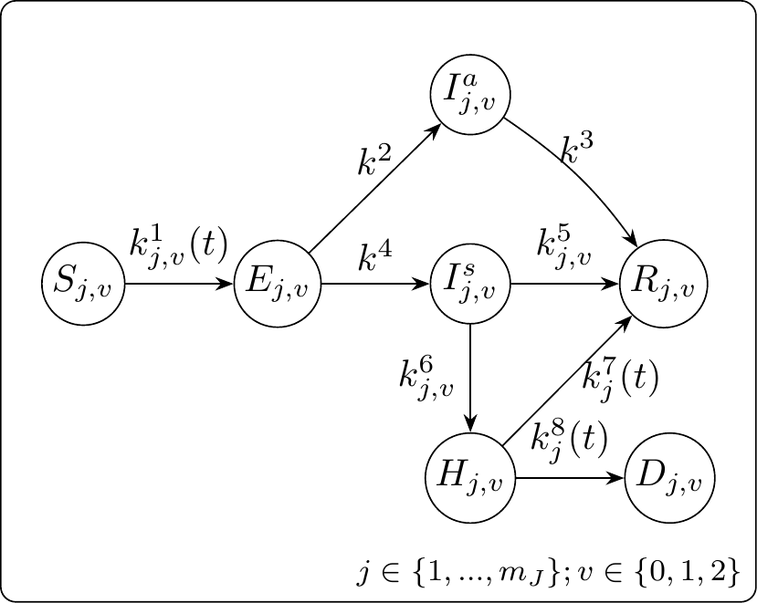
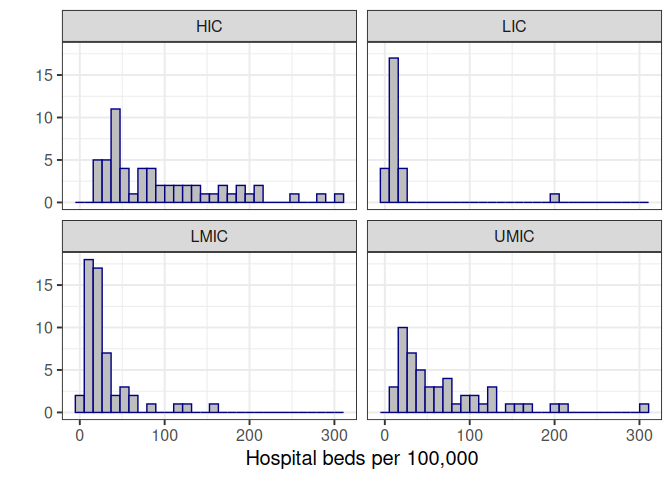
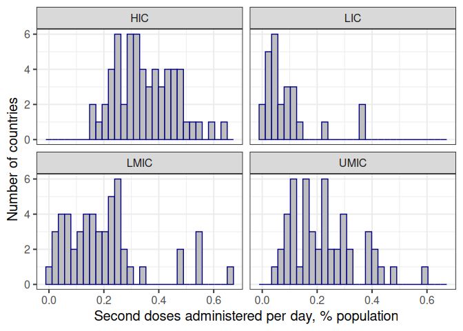

DAEDALUS for CEPI’s 100-day mission: code and model description
================

- [1 Simulation rules](#1-simulation-rules)
- [2 Socio-economic costs](#2-socio-economic-costs)
  - [2.1 Lost lives](#21-lost-lives)
  - [2.2 Lost economic activity](#22-lost-economic-activity)
  - [2.3 Lost education](#23-lost-education)
- [3 Epi model](#3-epi-model)
  - [3.1 Ordinary differential
    equations](#31-ordinary-differential-equations)
  - [3.2 Disease state transitions](#32-disease-state-transitions)
  - [3.3 Vaccination state
    transitions](#33-vaccination-state-transitions)
  - [3.4 Contact rates](#34-contact-rates)
    - [3.4.1 Community contacts](#341-community-contacts)
    - [3.4.2 Community-to-worker
      contacts](#342-community-to-worker-contacts)
  - [3.5 Social distancing](#35-social-distancing)
  - [3.6 Self isolating](#36-self-isolating)
- [4 Econ model](#4-econ-model)
  - [4.1 Configurations](#41-configurations)
  - [4.2 Impact of tourism](#42-impact-of-tourism)
    - [4.2.1 Food and accommodation services
      sector](#421-food-and-accommodation-services-sector)
    - [4.2.2 Sector shrinkage as a result of the
      pandemic](#422-sector-shrinkage-as-a-result-of-the-pandemic)
    - [4.2.3 Loss of international
      tourists](#423-loss-of-international-tourists)
    - [4.2.4 Dependence on international
      tourism](#424-dependence-on-international-tourism)
  - [4.3 Remote working](#43-remote-working)
- [5 Parametric distributions](#5-parametric-distributions)
  - [5.1 Hospital capacity](#51-hospital-capacity)
  - [5.2 Labour share of GVA](#52-labour-share-of-gva)
  - [5.3 Vaccine administration](#53-vaccine-administration)
  - [5.4 Compliance with the requirement to self
    isolate](#54-compliance-with-the-requirement-to-self-isolate)
- [6 Notation](#6-notation)

# 1 Simulation rules

- Countries are instantiated with two random variables: the response
  time, and their importation time
- The response time is the time at which the reporting country reports
  having seen X hospital cases, where X is a random number between 1 and
  20
- The importation time is a random number between 0 and 20 days, where 0
  days would be equivalent to the spillover, or origin, country
- The simulation starts at the minimum between the response time and the
  importation time
- At the response time, the BPSV, if present, is given to people aged 65
  and older; testing begins; social distancing begins; economic
  closures, if in use, are implemented
- At the importation time, five people are moved from compartment S to
  compartment E
- If closures are being implemented, the rules in Tables
  <a href="#tab:rulesreactive">1.1</a> and
  <a href="#tab:ruleselimination">1.2</a> are followed
- The SARS-X–specific vaccine is rolled out starting on day 107 or 372
  after the response time, depending on the investment assumption
- All people aged 15 and over are eligible for vaccination, and we
  assume 80% take it up
- Distribution rate increases linearly to a maximum of 1% of the
  population per day, at which is stays until 80% coverage is reached
- When vaccine rollout is complete, closures, testing and social
  distancing end
- When the doubling time is more than 30 days and there are fewer than
  1,000 people in hospital, the simulation ends.

| From/to            | No closures                                                                                                           | Light closures                                                   | Heavy closures                                                |
|:-------------------|:----------------------------------------------------------------------------------------------------------------------|:-----------------------------------------------------------------|:--------------------------------------------------------------|
| **No closures**    |                                                                                                                       |                                                                  | t $\geq$ response time AND Hospital occupancy \> 95% capacity |
| **Light closures** | (Growth rate \< 0.025 OR Hospital occupancy \< 25% capacity) AND vaccine rollout complete OR $R_t(M(\textbf{1})) < 1$ |                                                                  | Hospital occupancy \> 95% capacity                            |
| **Heavy closures** |                                                                                                                       | Hospital occupancy \< 25% capacity AND t \> 7 + last change time |                                                               |

<span id="tab:rulesreactive"></span>Table 1.1: State transition rules
for reactive closure strategies. See Table <a href="#tab:eccon">4.1</a>
for details of closures.

| From/to            | No closures                                          | Light closures                                                          | Heavy closures                                               |
|:-------------------|:-----------------------------------------------------|:------------------------------------------------------------------------|:-------------------------------------------------------------|
| **No closures**    |                                                      |                                                                         | t $\geq$ response time OR Hospital occupancy \> 95% capacity |
| **Light closures** | Vaccine rollout complete OR $R_t(M(\textbf{1})) < 1$ |                                                                         | $R_t > 1.2$                                                  |
| **Heavy closures** | Vaccine rollout complete OR $R_t(M(\textbf{1})) < 1$ | $R_t(M(x_{\text{light closure}})) < 0.95$ AND t \> 7 + last change time |                                                              |

<span id="tab:ruleselimination"></span>Table 1.2: State transition rules
for the elimination policy. See Table <a href="#tab:eccon">4.1</a> for
details of closures.

# 2 Socio-economic costs

We assign monetary values to YLLs and to years of education in order to
add health and education costs of sector-closure policies to the costs
of economic closures. We define the total socio-economic costs TSC of an
epidemic as the sum of the individual costs:

$$\begin{equation}
\text{TSC} = K_1\text{VLY} + K_2 + K_3\text{VSY},
\label{eq:swf}
\end{equation}$$

where $K_1$ is the number of discounted life years lost and VLY the
value of a life year; $K_2$ is the lost GDP over the period due to
reduced economic activity; and $K_3$ is the number of school years lost
and VSY the value of one school year.

## 2.1 Lost lives

To value lives lost, we make use of the expected remaining life years
per age group (Global Burden of Disease Collaborative Network 2021).
These are used to estimate the expected number of years of life lost per
death, and to estimate the value of a life year. We map the remaining
life expectancy $\tilde{l}_a$ for the GBD age groups $a$ to $l_g$ for
the model age groups $g$ as a population-weighted average, taking into
account the size of each age group, $`\tilde{N}_a`$. For the expected
number of life years lost per death, we take into account also the
probability to die given infection, $P(D|I,a)$:

``` math
l_g^{\text{(death)}} = \frac{\sum_{a\in g}N_a\tilde{l}_aP(D|I,a)}{\sum_{a\in g}N_aP(D|I,a)}; 
```

``` math
l_g^{\text{(life)}} = \frac{\sum_{a\in g}N_a\tilde{l}_a}{\sum_{a\in g}\tilde{N}_a}; 
```

The number of years lost given $D_g$ deaths due to COVID-19 for each age
group is

``` math
K_1=\sum_gD_gl_g^{\text{(death)}}.
```

The VLY used by policy makers should reflect the value that members of
the society place on reductions of their own mortality. We rely on the
intrinsic rather than instrumental interpretation of the valuation of
life (Cutler and Summers 2020), and we use existing estimates of the
value of a statistical life (VSL) to estimate VLY. We interpret the VSL
as a population-weighted average (Ananthapavan et al. 2021; Robinson,
Sullivan, and Shogren 2021), where each age group has a VSL defined by
the number of expected life years remaining, and where each year has the
same value:

$$\begin{equation}
\text{VSL}=\frac{\sum_gN_gl_g^{\text{(life)}}}{\sum_gN_g}\text{VLY}.
\end{equation}$$

Following The Global Fund (2022), “In this way, we made a choice to
value deaths proportionally to the remaining life expectancy associated
with the counterfactual of that death (how long they would live if they
had not died)”.

We estimate VSL as a function of GDP:

``` math
\text{VSL}=\text{VSL}_{\text{USA}}\left(r_p\frac{\text{GDP}}{\text{GDP}_{\text{USA}}}\right)^{r_e}.
```

Here, $`\text{VSL}_{\text{USA}}`$ is the VSL of the USA (10.9 million
\$) and $`\text{GDP}_{\text{USA}}`$. We sample two random variables to
encode a choice of method from Robinson, Sullivan, and Shogren (2021):
$r_p$ is a conversion from GDP to GDP with PPP, which is 1 with
probability 0.5 and an income-level–specific random variable with
probability 0.5. $r_e$ is an elasticity relating VSL to GDP, whose
definition depends on income level, given in Table
<a href="#tab:ruleselimination">1.2</a>.

| Method               | Probability | $r_p$                | $r_e$ (LLMIC)     | $r_e$ (UMIC, GNIpc \< \$8,809) | $r_e$ (UMIC, GNIpc \> \$8,809) | $r_e$ (HIC)      |
|:---------------------|:------------|:---------------------|:------------------|:-------------------------------|:-------------------------------|:-----------------|
| OECD/IHME/World Bank | 0.5         | Sampled from WB data | Uniform(0.9, 1.2) | Uniform(0.9, 1.2)              | Uniform(0.9, 1.2)              | 0.8              |
| Viscusi/Masterman    | 0.5         | 1                    | 1                 | 1                              | Uniform(0.85, 1)               | Uniform(0.85, 1) |

<span id="tab:vslrules"></span>Table 2.1: values for elasticities, from
Robinson, Sullivan, and Shogren (2021), Table 2 (page 25)

## 2.2 Lost economic activity

We measure the cost of economic closures in terms of lost gross value
added (GVA): the GDP generated by an economic configuration is the
maximum GVA (denoted $y_j$ for each sector $j$) multiplied by the
respective sector openings, summed over the period ($\tau$ days). The
maximum possible GDP (which is with no closures) is

$$Y_0=\frac{\tau}{365}\sum_{j=1}^{m_S}y_j$$

for $m_S$ sectors, and we use pre-pandemic GVA to define the maximum
possible values.

All economic sectors contribute GVA according to the level they are open
for production, except for the education sector which contributes its
maximum possible GVA, $y_{\text{ed}}$. $x_{j}(t)$ is the proportion of
the workforce contributing to economic production in sector $j$ out of
the total workforce $N_j$ on day $t$. The workforce can be additionally
depleted due to self isolation, sickness, hospitalisation and death,
leaving a smaller fraction ($`\hat{x}_{j}(t)`$) to contribute to
production.

``` math
\hat{x}_{j}(t)=x_{j}(t)\left(1 - \left(p_j^{23}(t)  + (1-q_j)p_j^{22}(t)\right)/N_j\right)
```

where $q_j$ is the fraction of the sector working from home.
$p_j^{23}(t)$ represents worker sickness and death:

$$p_j^{23}(t)=\sum_{v=0}^{m_V}\left(\left(1-p^H_{j,v}\right)p^1p^{19}I_{j,v}^{s}+p^H_{j,v}p^1I_{j,v}^{s}+H_{j,v}+D_{j,v}\right),$$

with $m_V=2$ vaccines and $p_j^{22}(t)$ represents lost output from
asymptomatic self-isolating workers:

$$p_j^{22}(t)=p^2(t)p^{18}I_{j}^{a}.$$

$p^{18}$ is the number of days spent in self isolation per day of
infectiousness (e.g. suppose the average infectious period is four days
and mandatory self-isolation time is ten days, then $p^{19}=2.5$ and
$p^{18}=p^{19}T^{I^s}/T^{I^a:R}$, where $T^{I^s}$ and $T^{I^a:R}$ are
expected infectious periods for symptomatic and asymptomatic,
respectively). $p^1$ is compliance with the requirement to self isolate
and $p^2(t)$ is the fraction of cases identified. Other notations are
vaccine status $v$, infectious and asymptomatic $I_{j,v}^{a}$,
infectious and symptomatic $I_{j,v}^{s}$, hospitalised $H$, deceased
$D$, and probability to be hospitalised $p^H$.

Then the total GDP is

``` math
Y =  \frac{1 }{365} \sum_{j\neq\text{ed}}^{m_S}y_j\int_{t=0}^{\tau}\hat{x}_{j}(t)dt + \frac{\tau }{365}{y_\text{ed}},
```

and the GDP loss compared to the maximum is

$$K_2=Y_0-Y.$$

## 2.3 Lost education

The loss due to school closure is

<!-- $$K3 =  \frac{p^{14} }{365}\left( Tp^{16}N_{j_{\text{school}}}+p^{24} + (1-p^{16})p^{25} \right)\text{VSY}$$ -->

$$K_3 =  \frac{1 }{365} \int_{t=0}^{\tau}\left(p^{14}(t)N_{j_{\text{school}}} + (1-p^{14}(t))p^{25}(t)  +(1-2p^{14}(t))p^{24}(t)\right)dt,$$

where $p^{14}(t)$ is the effective amount of education lost per student
at time $t$ due to school closure:
$$p^{14}(t) = (1-p^{16})(1-x_{\text{ed}}(t)),$$ $N_{j_{\text{school}}}$
is the total number of students, $p^{16}$ is relative effectiveness of
remote education and $x_{\text{ed}}(t)$ is the openness of schools,
$p^{25}(t)$ represents education lost due to student sickness with
COVID-19:

$$p^{25}(t)=\sum_{v=0}^{m_V}\left((1-p^H_{j_{\text{school}},v})p^1p^{19}I_{j_{\text{school}},v}^{s}+p^H_{j_{\text{school}},v}p^1I_{j_{\text{school}},v}^{s}+H_{j_{\text{school}},v}\right),$$

$p^{18}$ is the number of days spent in self isolation per day of
infectiousness (e.g. suppose the average infectious period is four days
and mandatory self-isolation time is ten days, then $p^{19}=2.5$ and
$p^{18}=p^{19}T^{I^s}/T^{I^a:R}$, where $T^{I^s}$ and $T^{I^a:R}$ are
expected infectious periods for symptomatic and asymptomatic,
respectively), and $p^{24}(t)$ represents education lost due to
asymptomatic self isolation (which comes at a cost only when schools are
open):

$$p^{24}(t)=p^2(t)p^{18}I_{j_{\text{school}}}^{a}.$$

For the value of a year of education, we use the method of
(Psacharopoulos et al. 2021).

$$\text{VSY} =  p^{12}\cdot p^{13}\cdot p^{15}.$$

$p^{12}$ is the present value of lost earnings:

$$p^{12} = \frac{1}{N_{j_{\text{school}}}}\sum_{a\in j_{\text{school}}}\tilde{N}_a\left( \frac{1-(1+r)^{-(m_Y+20-a)}}{r} -  \frac{1-(1+r)^{-(20-a)}}{r}\right)$$

for discount rate $r=0.03$, number $\tilde{N}_a$ students currently age
$a$, and expected number of years of work $m_Y=45$. $p^{13}$ is mean
annual earnings, $p^{15}=0.08$ is the rate of return for one year.

The value $p^{16}$ represents the effectiveness of remote teaching,
which we sample as a standard uniform random variable. We note that no
strong predictors of effectiveness of remote teaching have been
identified (Patrinos 2023). We assume that losses are linear in duration
of school closure, although there is not consensus even on this
(Betthäuser, Bach-Mortensen, and Engzell 2023). Important factors to
include in future work might be those relating to parental circumstances
including education level, engagement and socio-economic status
(Moscoviz and Evans 2022). However, these factors might be more
pertinent to intra- rather than international modelling.

# 3 Epi model

## 3.1 Ordinary differential equations

$$\begin{align}
\frac{dS_{j,v}}{dt} & = \sum_{u=0}^{v-1}k^9S_{j,u}^{c_v} - \left( k_{j,v}^{1}(t) + \sum_{u=v+1}^{{m_V}}k_{j,v}^{10,c_u}(t) \right)S_{j,v} \\
\frac{dS_{j,u}^{c_v}}{dt} & = k_{j,u}^{10,c_v}(t)S_{j,u} -\left( k_{j,u}^{1}(t) + k^9 \right)S_{j,u}^{c_v}  \\
\frac{dE_{j,v}}{dt} & = k_{j,v}^{1}(t)\left(S_{j,v}+\sum_{u=v+1}^2S_{j,v}^{c_u}\right) - (k^2+k^4)E_{j,v} \\
\frac{dI_{j,v}^a}{dt} & = k^2E_{j,v} - k^3I_{j,v}^a \\
\frac{dI_{j,v}^s}{dt} & = k^4E_{j,v} - (k_{j,v}^{5}+k_{j,v}^{6})I_{j,v}^s \\
\frac{dR_{j,v}}{dt} & = k^3I_{j,v}^a + k_{j,v}^{5}I_{j,v}^s + k_{j}^{7}(t) H_{j,v} - \sum_{u=v+1}^{{m_V}}k_{j,v}^{10,c_u}(t)R_{j,v} + \sum_{u=0}^{v-1}k_{u,j}^{10,c_v}(t)R_{j,v-1}\\
\frac{dH_{j,v}}{dt} & = k_{j,v}^{6}I_{j,v}^s - (k_{j}^{7}(t) + k_{j}^{8}(t)) H_{j,v} \\
\frac{dD_{j,v}}{dt} & =  k_{j}^{8}(t) H_{j,v}
\end{align}$$

## 3.2 Disease state transitions

<div class="figure">



<p class="caption">

<span id="fig:statetransitions"></span>Figure 3.1: Disease state
transitions. $S$: susceptible. $E$: exposed. $I^{a}$: asymptomatic
infectious. $I^{s}$: symptomatic infectious. $H$: hospitalised. $R$:
recovered. $D$: died. $j$: stratum. $v$: vaccination status.

</p>

</div>

Possible transitions between disease states are shown in Figure
<a href="#fig:statetransitions">3.1</a>. Transition rates are functions
of time $t$, vaccination status $v$, and group identity $j$ (where the
groups are the 45 sectors and the four age groups).

The rate of infection of susceptible individuals, $`k^{1}_{j,v}(t)`$, is
defined as

$$\begin{equation}
k_{j,v}^{1}(t) = \eta_{v}^{E}\rho(t)\beta\sum_{h=1}^{m_J}M_{j,h}(x) I_h(t)
\qquad(3.1)
\end{equation}$$

with $m_J=49$ strata and

``` math
 I_h(t)=\sum_{v=0}^{m_V}\left(\epsilon (1-p^3(t))I_{h,v}^{a}(t)+(1-p^4(t))I_{h,v}^{s}(t)\right). 
```

Here, $`\eta^{E}_{v}`$ is the relative probability to be infected given
vaccine status $v$; $\rho(t)$ is the time-dependent modifier of the rate
of infection, $\beta$, which captures the impact of social distancing;
$M(x)$ is the contact matrix between groups and depends on the economic
configuration $x$; $\epsilon$ is the reduction in infectiousness from
asymptomatic relative to symptomatic individuals; $p^3$ and $p^4$ are
the proportions of asymptomatic and symptomatic infectiousness averted,
respectively, due to self isolating; and $I_{h,\cdot}^{\cdot}$ is the
number of infectious asymptomatic ($I_{h,\cdot}^{a}$) and symptomatic
($I_{h,\cdot}^{s}$) people who are unvaccinated ($I_{h,v=0}^{\cdot}$),
vaccinated with the BPSV ($I_{h,v=1}^{\cdot}$), or vaccinated with the
specific vaccine ($I_{h,v=2}^{\cdot}$) in stratum $h$.

``` math
 k^2 = \big(1-p^{I^S}\big)/T^{E:I} 
```

is the rate to asymptomatic infectiousness, where $p^{I^S}$ is the
probability to become symptomatic given infection, and $T^{E:I}$ is the
expected duration of the latent period before the onset of
infectiousness;

``` math
 k^3 = 1/T^{I^a:R}  
```

is the rate of recovery from asymptomatic infection;

``` math
 k^4 = p^{I^S}/ T^{E:I}; 
```

is the rate of symptom onset;

``` math
k^{5}_{j,v} =  \big(1-p^H_{j,v}\big) / T_{j,v}^{I^s}
```

is the rate of recovery from symptomatic infection, where $p^H_{j,v}$ is
the probability to be hospitalised given symptomatic infection, and
$T_{j,v}^{I^s} = p^H_{j,v}T^{I^s:H} + (1-p^H_{j,v})T^{I^s:R}$ is the
expected time to be in compartment $I^s$: $T^{I^s:H}$ is the expected
duration before hospitalisation and $T^{I^s:R}$ is the expected duration
before recovery.

``` math
p^H_{j,v}=\eta^{H}_{v}\tilde{p}^{H}_{j}
```

is the baseline probability to be hospitalised ($`\tilde{p}^{H}_{j}`$)
adjusted by the vaccine effect protecting against hospitalisation
($`\eta^{H}_{v}`$). Then

``` math
k^{6}_{j,v} = p^H_{j,v}/T_{j,v}^{I^s}
```

is the rate of hospitalisation following symptomatic infection.

``` math
k^{7}_{j}(t) = (1-p^{D}_{j}(t)) / T_j^{H}(t)
```

is the rate of recovery of hospitalised patients, where
$`p^{D}_{j}(t)=\tilde{p}^{D}_{j}f_H(t)`$ is the baseline probability to
die given hospitalisation, adjusted by a factor encoding the increase in
fatality rate as hospital occupancy increases:

``` math
f_H(t)=\max\{1,1+1.87(H_{\text{tot}}(t)-H_{\text{max}})/H_{\text{max}}\},
```

``` math
H_{\text{tot}}(t) = \sum_{v=0}^{m_V}\sum_{j=1}^{m_J} H_{j,v}(t).
```

$$T_j^{H}(t) = p_j^{D}(t)T^{H:D} + (1-p_{j}^{D}(t))T^{H:R}$$

is the expected time to be in compartment $H$: $T^{H:D}$ is the expected
duration before death and $T^{H:R}$ is the expected duration before
recovery. Finally,

``` math
k^{8}_{j}(t) = p^{D}_{j}(t)/T_j^{H}(t)
```

is the rate of death following hospitalisation.

## 3.3 Vaccination state transitions

In our model, $v=0$ refers to unvaccinated people, $v=1$ to people who
have received a full schedule of BPSV, and $v=2$ to people who have
received a full schedule of the specific vaccine. How we model
transitions between vaccination states is shown in Figure
<a href="#fig:vaccinetransitions">3.2</a>.

$`k^{10,c_1}_{j,v=0}(t)`$ represents the rates of BPSV vaccination of
unvaccinated susceptible and recovered people, and
$`k^{10,c_2}_{j,v=1}(t)`$ represents the rates of vaccinating
BPSV-vaccinated susceptible and recovered people.
$`k^{10,c_2}_{j,v=0}(t)`$ represents the rates of vaccinating people
directly with the specific vaccine. Put more succinctly,
$`k^{10,c_u}_{j,v}(t)`$ is the rate to go from vaccine state $v$ to $u$.
$k^9=1/T^c$ is the rate of seroconversion to vaccine-induced immunity,
and $`k^{12}_{j}(t)=k^{1}_{j,v=0}(t)`$ and
$`k^{19}_{j}(t)=k^{1}_{j,v=1}(t)`$ are the rates of infection of
just-vaccinated people, which returns them to the epidemiological
pathway of the lower vaccination level.

<div class="figure">


<p class="caption">

<span id="fig:vaccinetransitions"></span>Figure 3.2: Vaccine state
transitions. $S$: susceptible. $S^{c_u}, u\in\{1,2\}$: recently
vaccinated but has not yet seroconverted (i.e. is not protected by most
recent vaccination). $R$: recovered. $j$: stratum. $v$: initial
vaccination status. $u$: final vaccination status.

</p>

</div>

## 3.4 Contact rates

The configuration $x$ and the proportion of workers working from home
$q$ determine the scaling of exposure to infection between different
groups for different reasons:

- Worker absence due to sector closure
- Worker absence due to working from home
- Student absence due to school closure
- Customer absence due to sector closure: impact on workers
- Customer absence due to sector closure: impact on customers

We approach this differently from (Haw et al. 2022). Instead of contact
matrices from (Prem et al. 2021), we use those from (Walker et al.
2020). Instead of work contacts from (Béraud et al. 2015), we use those
from (Jarvis et al. 2023). (Haw et al. 2022) modelled closures using a
combination of moving workers between sector compartments and a
non-working compartment, and scaling of contacts. Here, we only use
contacts to model closures, and do not move workers out of their
compartments. An advantage of this is that workers within sectors retain
their infection histories.

We construct contact matrix $M(x)$ as the sum of three matrices:
$M^{\text{com}}(x)$ (community contacts), $M^{\text{CW}}(x)$
(community-to-worker contacts), and $M^{\text{WC}}(x)$
(worker-to-community contacts). We construct peacetime matrices
($x=\textbf{1}$) beginning with a “target matrix”, which the three
matrices should add up to, which is taken from (Walker et al. 2020). By
sampling relevant values, we decompose the whole matrix into its
component parts. To incorporate closures, each matrix is transformed
independently, before they are all added together again.

Matrix $M(\textbf{1})$ is estimated using as a basis a contact matrix
from (Walker et al. 2020). These are 16-by-16 matrices, $\tilde{M}$, for
five-year age bands $a$ up to age group 75+. We map the matrix to a
four-by-four matrix $\hat{M}$ corresponding to the four age groups $g$
used in the DAEDALUS model, using population sizes $\tilde{N}_a$:

``` math
\hat{M}_{gg'} = \frac{\sum_{a\in g}\tilde{N}_{a}\sum_{a'\in g'}\tilde{M}_{a,a'}}{\sum_{a\in g}\tilde{N}_{a}},
```

and $\hat{N}_g$ to represent the population sizes of the DAEDALUS age
groups,

``` math
\hat{N}_g=\sum_{a\in g}\tilde{N}_a.
```

We get to the matrix $M(\textbf{1})$ by broadcasting the four-by-four
matrix to the 49-by-49 one. Contacts from all groups $j$ to working
groups $h$ depend on the age group of the group ($`g(j)`$), and the
fraction of the age-population represented in group $h$, where $N_{h}$
is the number of people in group $h$:

``` math
M_{j,h}(\textbf{1}) = \hat{M}_{g(j),g(h)}\frac{N_{h}}{\hat{N}_{g(h)}}
```

for $j$ and $h$ including all groups (working and non-working). Each
group $j$ contains people that belong to only one age group $g$. We
refer to the age group of the people in group $j$ as $g(j)$. Then
$\hat{N}_{g(h)}$ is the number of people in the age group of group $h$,
so $`\hat{N}_{g(h)}=N_{h}`$ for age groups 0 to 4, 5 to 19 and 65+, and
$`\hat{N}_{g(h)}=\sum_{h\in\{1,...,m_S,m_S+3\}}N_{h}`$ for age group 20
to 64.

In setting up a country, we sample values for $\tilde{M}$ (from which we
get $`M(\textbf{1})`$). At the same time, we sample the proportion of
contacts that come from workplaces (Figure
<a href="#fig:workfrac">3.3</a>), and workplace-related contacts. From
these, we get $M^{\text{CW}}(\textbf{1})$, constructing the matrices and
normalising.

Community-to-worker contacts (matrix $M^{\text{CW}}$) describe contacts
experienced by workers from the community by sector (Figure
<a href="#fig:allsector">3.4</a>, distributed by age, Figure
<a href="#fig:uksecdistage">3.5</a>). Note that
$`M^{\text{CW}}_{j,h}(\textbf{1})=0`$ for $j>m_S$. Matrix
$M^{\text{WC}}(\textbf{1})$ is the complement of matrix
$M^{\text{CW}}(\textbf{1})$, computed by multiplying through by
population, transposing, and dividing again by population.

With $M(\textbf{1})$, $M^{\text{CW}}(\textbf{1})$ and
$M^{\text{WC}}(\textbf{1})$, we learn $M^{\text{com}}(\textbf{1})$.

$M^{\text{com}}(\textbf{1})$ is decomposed into its constituent parts,
representing intra- and inter-household interactions (home), school
interactions (sch) and hospitality interactions (CC):

``` math
M^{\text{com}}(\textbf{1})=M^{\text{home}} + M^{\text{sch}}(\textbf{1}) + M^{\text{CC}}(\textbf{1}) 
```

Values for $M^{\text{sch}}(\textbf{1})$ come from sampled values
representing the fractions of contacts that come from school. School
contacts are estimated separately in two age groups (pre-school age: 0—4
(Figure <a href="#fig:school1frac">3.6</a>); school age: 5—19 (Figure
<a href="#fig:school2frac">3.7</a>)): $M^{\text{sch}}(\textbf{1})$ has
entries of zero for groups not in school, and values for 0 to 4 year
olds and 5 to 19 year olds.

<!-- Likewise, $M^{\text{tran}}(\textbf{1})$ is also sampled as a fraction of total contacts. $M_{j,h}^{\text{tran}}(\textbf{1})\geq 0$ for $j=1,...,m_S$. $M_{j,h}^{\text{tran}}(\textbf{1})=0$ for $j>m_S$. -->

Finally, $M^{\text{CC}}(\textbf{1})$ is sampled as a fraction of
$M^{\text{com}}(\textbf{1})- M^{\text{sch}}(\textbf{1})$ (Figure
<a href="#fig:hospfrac">3.8</a>, distributed by age, Figure
<a href="#fig:conagefrac">3.9</a>), which leaves $M^{\text{home}}$.
Community contacts in consumption settings includes contacts made on
public transport, as these contacts are small in number and are most
correlated with consumption (and not work or school) (Jarvis et al.
2023). (This might be because contacts are counted by how many people
you talk to.)

<div class="figure">


<p class="caption">

<span id="fig:workfrac"></span>Figure 3.3: Fraction of contacts made at
work, from (Jarvis et al. 2023). Extrapolated from three countries (UK,
Belgium, Netherlands), whose values are all close to 40%, using time-use
survey results for fraction of time spent at work (OECD, last updated
December 2023, 33 countries, with values ranging from 12 to 25% (and the
three reference countries have values 16 to 18%)).

</p>

</div>

<div class="figure">


<p class="caption">

<span id="fig:allsector"></span>Figure 3.4: Number of contacts made at
work, from (Jarvis et al. 2023). Diamonds show average numbers and
ranges are 50% quantile intervals. We sample values from half to double
the average. Data come from UK, Netherlands and Switzerland, with
occupation ISCO-88 mapped to ISCO-08 then SOC-10 then ISIC rev 4 using
ONS data.

</p>

</div>

<div class="figure">


<p class="caption">

<span id="fig:uksecdistage"></span>Figure 3.5: Fraction of contacts made
at work by age, from (Jarvis et al. 2023).

</p>

</div>

<div class="figure">


<p class="caption">

<span id="fig:school1frac"></span>Figure 3.6: Fraction of contacts made
at school for ages 0 to 4, from (Jarvis et al. 2023).

</p>

</div>

<div class="figure">


<p class="caption">

<span id="fig:school2frac"></span>Figure 3.7: Fraction of contacts made
at school for ages 5 to 19, from (Jarvis et al. 2023).

</p>

</div>

<div class="figure">


<p class="caption">

<span id="fig:hospfrac"></span>Figure 3.8: Fraction of non-school and
non-work contacts made in hospitality settings, by age group, from
(Jarvis et al. 2023).

</p>

</div>

<div class="figure">


<p class="caption">

<span id="fig:conagefrac"></span>Figure 3.9: Distribution of non-school
and non-work contacts made in hospitality settings by age group, from
(Jarvis et al. 2023).

</p>

</div>

### 3.4.1 Community contacts

We construct $M^{\text{com}}(x)$ from its constituent parts,
representing intra- and inter-household interactions (home), school
interactions (sch) and hospitality interactions (CC):

``` math
M^{\text{com}}(x)=M^{\text{home}} + M^{\text{sch}}(x) + M^{\text{CC}}(x).
```

School contacts under $x$ are the peacetime values scaled by the extent
of closure. $x_{\text{ed}}$ is the extent to which schools are open, so
that the number of contacts per person scales superlinearly with school
closure.

$$\begin{equation}
M_{j,j}^{\text{sch}}(x)=x_{\text{ed}}^2M_{j,j}^{\text{sch}}(\textbf{1}).
\qquad(3.2)
\end{equation}$$

<!-- Matrix  $M^{\text{tran}}$ counts contacts between working people, representing travel. We assume that transport contacts only add to the infection risk if the sector is open and the workers travel to and from their workplace. Again, the value for configuration $x$ is the value for $\textbf{1}$ scaled accordingly: -->
<!-- \begin{equation} -->
<!-- M_{j,h}^{\text{tran}}(x) = x_{h}(1-q_j)(1-q_h)M_{j,h}^{\text{tran}}(\textbf{1}). -->
<!-- (\#eq:travel) -->
<!-- \end{equation} -->
<!-- $q_j$ is the proportion of workers from sector $j$ working from home, and $(1-q_j)(1-q_h)$ scales contacts between workers superlinearly to approximate the reduced transmission between commuting workers: there should be fewer contacts per person on average, and there should be fewer people having these contacts.  -->
<!-- Also in this equation, $x_{h}$ scales the numbers of contacts linearly with respect to sector closure. At the same time, the number of people in the compartments will be reduced by their sector closure, $x_{j}$. This, in combination with the scaled contacts, leads to superlinear scaling. -->

Matrix $M^{\text{CC}}(x)$ gives the contacts made in the hospitality
sector:

$$\begin{equation}
M^{\text{CC}}(x) = (p^{27})^2M^{\text{CC}}(\textbf{1})
\qquad(3.3)
\end{equation}$$

The value $p^{27}$ is the workforce-weighted average extent to which the
hospitality sectors are open, so that the number of contacts per person
scales superlinearly according to closure:

``` math
p^{27} = \frac{\sum_jx_{j}N_j}{\sum_jN_j}
```

where we sum over only the hospitality sectors.

### 3.4.2 Community-to-worker contacts

$$\begin{equation}
M_{j,h}^{\text{CW}}(x) = (x_{j}(1-q_j))^2M_{j,h}^{\text{CW}}(\textbf{1}),
\qquad(3.4)
\end{equation}$$

for $h\in\{1,...,m_J\}$.

Here, there is superlinear scaling of $M^{\text{CW}}_{j,h}(\textbf{1})$
with respect to working from home and with respect to sector closure, as
both workers and members of the community are absent from the workplace
as the sector moves online and becomes more closed.

<!-- ### Matrix $M^{\text{WW}}$: Worker-to-worker contacts -->
<!-- \begin{equation} -->
<!-- M_{j,j}^{\text{WW}}(x) = x_{j}(1-q_j)^2M_{j,j}^{\text{WW}}(\textbf{1}), -->
<!-- (\#eq:worker) -->
<!-- \end{equation} -->
<!-- for the working groups, with the number of contacts adjusted according to at-home working ($q_j$) and sector openness ($x_{j}$). As before, there is superlinear scaling of contacts with respect to working from home. There is linear scaling with respect to sector closure: that is, there are fewer contacts per person, but we do not approximate there being fewer people having them. This is because the latter is accounted for in the movement of people out of the group upon its closure.  -->
<!-- $$M_{j,j}^{\text{WW}}(x) = x_{j}^2(1-q_j)^2M_{j,j}^{\text{WW}}(\textbf{1})$$ -->
<!-- ```math -->
<!-- M^{\text{WW}}_{j,j}(x) = \hat{x}_j^2M^{\text{WW}}_{j,j}(\textbf{1}), \quad \hat{x}_j=\max(x_{j}-q_j,0) -->
<!-- ``` -->

## 3.5 Social distancing

We parametrise the effects of ‘social distancing’ in the model using
Google’s mobility data (Figure <a href="#fig:smoothmobility">3.10</a>).
These changes in mobility were consequences of both government mandates
and individual’s choices. As we cannot separate the two, we consider a
range of possibilities, based on the range of mobility changes observed
for a given level of stringency (Figure
<a href="#fig:mobilitydrop">3.11</a>). In our model, the mandated
economic configuration leads to a change in contacts. We associate the
reduction in contacts, which translates as a relative reduction in
transmission, with the reduction in mobility.

<div class="figure">


<p class="caption">

<span id="fig:smoothmobility"></span>Figure 3.10: Mobility trajectories
in 2020 for all countries, with points showing the point at which the
largest drop was observed. Trajectories are averaged over “Retail and
recreation”, “Transit stations” and “Workplaces” and smoothed with a
spline of 80 knots.

</p>

</div>

<div class="figure">


<p class="caption">

<span id="fig:mobilitydrop"></span>Figure 3.11: The largest drop in
mobility plotted against the stringency on that date.

</p>

</div>

- We want to write mobility as a function of mandate and some epi
  outcome, e.g. deaths: $\rho(t) = (1-p^8)f(d(t),e(t)) + p^8$ where
  $\rho(t)$ is mobility, $d$ is deaths per million, $e$ is government
  mandate, and $`0 < p^8 < 1`$ is the baseline.
- We want mobility to drop monotonically with both the mandate and the
  epi outcome: $\frac{df}{dy}<0$, $\frac{df}{dg}<0$.
- We want a maximum mobility of 1 when both the mandate and the epi
  outcome are 0: $f(0,0)=1$.
- We want mobility to approach $p^8$ when the mandate and the epi
  outcome become large: $\lim_{x\to 10^6, e\to 1}f(d,e)= 0$.
- We want to allow for the possibility of redundancy between the two
  variables: $f(0,0)/f(0,e) > f(x,0)/f(d,e)$ and
  $f(0,0)/f(d,0) > f(0,e)/f(d,e)$ for $d,e>0$.

A simple model to achieve these criteria is:
$$f(d,e) = \frac{1}{1+p^9y+p^{10}e}$$ with $p^9, p^{10}>0$.

<!-- However, we might also want a model that can be parametrised with a distribution whose uncertainty covers the whole range of possible eventualities. The equivalent model with compounded effects would be $$f_1(d,e) = \frac{1}{1+p^9 d}\frac{1}{1+p^{10}e}.$$ The equivalent model with completely overlapping effects would be $$f_2(d,e) = \frac{1}{1+\max(p^9 d,p^{10}e)}.$$ Then we could include 'model uncertainty' via some parameter $\beta\sim\mathcal{U}(0,1)$, defining $$f(d,e) = (f_1(d,e))^{p^{11}}(f_2(d,e))^{(1-p^{11})}.$$ -->

The implications of this modelling choice are that two extremes are
possible in terms of behaviour under (unseen) circumstances of a severe
moment in an outbreak: 1, it is possible that social distancing comes
“free” (i.e. that you get the same reduction in transmission with and
without closures and, without closures, there is no economic cost); and
2, there is no voluntary social distancing, and behaviour is independent
of epidemiological circumstances. This is an assumption commonly made to
create the counterfactual in evaluating impacts of vaccine programmes.
This is a very large source of uncertainty, and we expect it to be
identified as such in value-of-information analyses.

<div class="figure">


<p class="caption">

<span id="fig:mobilityfitted"></span>Figure 3.12: Fit of model to data.

</p>

</div>

<div class="figure">


<p class="caption">

<span id="fig:mobilityposterior"></span>Figure 3.13: Posterior
distribution for parameters $p^9$ and $p^8$.

</p>

</div>

<div class="figure">


<p class="caption">

<span id="fig:mobilitycurves"></span>Figure 3.14: Sampled curves for
four levels of mitigation. Data shown as points.

</p>

</div>

## 3.6 Self isolating

We assume that infectious people who know their status have a compliance
$p^1\sim\text(Beta)(5,5)$ with the instruction to self isolate, starting
one day into their infectious period. We assume constant infectiousness
over time and that a fraction $p^{26}$ of the symptomatic infectiousness
is presymptomatic. Then the amount of infectiousness averted of
symptomatic people is $p^4=p^1(1-p^{26})$, who isolate due to the onset
of symptoms. The fraction of asymptomatic cases identified by testing is
$p^2(t)$. We assume asymptomatic cases have the same probability to self
isolate and that test results are returned after $p^{17}$ days of
infectiousness. Then the infectiousness that testing averts is
$p^3(t)=p^1p^2(t)\min(0,(T^{I^a:R}-p^{17})/T^{I^a:R})$.

<!-- b0    = 2.197; -->
<!-- b1    = 0.1838; -->
<!-- b2    = -1.024; -->
<!-- frac_cases_found = 1./(1+exp(b0+b1*Ip+b2*log10(trate))); -->
<!-- frac_cases_found(Ip >= trate) = min(frac_cases_found(Ip >= trate),trate/10^5); -->
<!-- frac_cases_found = max(frac_cases_found, trate/10^5 ); -->

# 4 Econ model

## 4.1 Configurations

<table class="table lightable-classic" style="width: auto !important; margin-left: auto; margin-right: auto; font-family: &quot;Arial Narrow&quot;, &quot;Source Sans Pro&quot;, sans-serif; margin-left: auto; margin-right: auto;">
<caption>

<span id="tab:eccon"></span>Table 4.1: Economic configurations used to
implement strategies. Values are the openness of the sector expressed as
a percentage. Elimination values are taken from Australia. Lockdown and
Economic Closures values are taken from the UK. School Closures values
are taken from Indonesia.

</caption>
<thead>
<tr>
<th style="empty-cells: hide;border-bottom:hidden;" colspan="1">
</th>
<th style="border-bottom:hidden;padding-bottom:0; padding-left:3px;padding-right:3px;text-align: center; " colspan="2">

<div style="border-bottom: 1px solid #ddd; padding-bottom: 5px; ">

Elimination

</div>

</th>
<th style="border-bottom:hidden;padding-bottom:0; padding-left:3px;padding-right:3px;text-align: center; " colspan="2">

<div style="border-bottom: 1px solid #ddd; padding-bottom: 5px; ">

Economic closures

</div>

</th>
<th style="border-bottom:hidden;padding-bottom:0; padding-left:3px;padding-right:3px;text-align: center; " colspan="2">

<div style="border-bottom: 1px solid #ddd; padding-bottom: 5px; ">

School closures

</div>

</th>
</tr>
<tr>
<th style="text-align:left;">

Sector

</th>
<th style="text-align:right;">

Heavy closures

</th>
<th style="text-align:right;">

Light closures

</th>
<th style="text-align:right;">

Heavy closures

</th>
<th style="text-align:right;">

Light closures

</th>
<th style="text-align:right;">

Heavy closures

</th>
<th style="text-align:right;">

Light closures

</th>
</tr>
</thead>
<tbody>
<tr>
<td style="text-align:left;">

Agriculture, hunting, forestry

</td>
<td style="text-align:right;">

86

</td>
<td style="text-align:right;">

100

</td>
<td style="text-align:right;">

86

</td>
<td style="text-align:right;">

88

</td>
<td style="text-align:right;">

100

</td>
<td style="text-align:right;">

100

</td>
</tr>
<tr>
<td style="text-align:left;">

Fishing and aquaculture

</td>
<td style="text-align:right;">

86

</td>
<td style="text-align:right;">

100

</td>
<td style="text-align:right;">

86

</td>
<td style="text-align:right;">

88

</td>
<td style="text-align:right;">

100

</td>
<td style="text-align:right;">

100

</td>
</tr>
<tr>
<td style="text-align:left;">

Mining and quarrying, energy producing products

</td>
<td style="text-align:right;">

90

</td>
<td style="text-align:right;">

100

</td>
<td style="text-align:right;">

90

</td>
<td style="text-align:right;">

91

</td>
<td style="text-align:right;">

67

</td>
<td style="text-align:right;">

79

</td>
</tr>
<tr>
<td style="text-align:left;">

Mining and quarrying, non-energy producing products

</td>
<td style="text-align:right;">

90

</td>
<td style="text-align:right;">

100

</td>
<td style="text-align:right;">

90

</td>
<td style="text-align:right;">

91

</td>
<td style="text-align:right;">

100

</td>
<td style="text-align:right;">

100

</td>
</tr>
<tr>
<td style="text-align:left;">

Mining support service activities

</td>
<td style="text-align:right;">

90

</td>
<td style="text-align:right;">

100

</td>
<td style="text-align:right;">

90

</td>
<td style="text-align:right;">

91

</td>
<td style="text-align:right;">

100

</td>
<td style="text-align:right;">

100

</td>
</tr>
<tr>
<td style="text-align:left;">

Food products, beverages and tobacco

</td>
<td style="text-align:right;">

70

</td>
<td style="text-align:right;">

100

</td>
<td style="text-align:right;">

70

</td>
<td style="text-align:right;">

94

</td>
<td style="text-align:right;">

100

</td>
<td style="text-align:right;">

100

</td>
</tr>
<tr>
<td style="text-align:left;">

Textiles, textile products, leather and footwear

</td>
<td style="text-align:right;">

70

</td>
<td style="text-align:right;">

98

</td>
<td style="text-align:right;">

70

</td>
<td style="text-align:right;">

94

</td>
<td style="text-align:right;">

89

</td>
<td style="text-align:right;">

92

</td>
</tr>
<tr>
<td style="text-align:left;">

Wood and products of wood and cork

</td>
<td style="text-align:right;">

70

</td>
<td style="text-align:right;">

98

</td>
<td style="text-align:right;">

70

</td>
<td style="text-align:right;">

94

</td>
<td style="text-align:right;">

100

</td>
<td style="text-align:right;">

95

</td>
</tr>
<tr>
<td style="text-align:left;">

Paper products and printing

</td>
<td style="text-align:right;">

70

</td>
<td style="text-align:right;">

98

</td>
<td style="text-align:right;">

70

</td>
<td style="text-align:right;">

94

</td>
<td style="text-align:right;">

100

</td>
<td style="text-align:right;">

98

</td>
</tr>
<tr>
<td style="text-align:left;">

Coke and refined petroleum products

</td>
<td style="text-align:right;">

70

</td>
<td style="text-align:right;">

88

</td>
<td style="text-align:right;">

70

</td>
<td style="text-align:right;">

94

</td>
<td style="text-align:right;">

87

</td>
<td style="text-align:right;">

88

</td>
</tr>
<tr>
<td style="text-align:left;">

Chemical and chemical products

</td>
<td style="text-align:right;">

70

</td>
<td style="text-align:right;">

88

</td>
<td style="text-align:right;">

70

</td>
<td style="text-align:right;">

94

</td>
<td style="text-align:right;">

100

</td>
<td style="text-align:right;">

100

</td>
</tr>
<tr>
<td style="text-align:left;">

Pharmaceuticals, medicinal chemical and botanical products

</td>
<td style="text-align:right;">

70

</td>
<td style="text-align:right;">

88

</td>
<td style="text-align:right;">

70

</td>
<td style="text-align:right;">

94

</td>
<td style="text-align:right;">

100

</td>
<td style="text-align:right;">

100

</td>
</tr>
<tr>
<td style="text-align:left;">

Rubber and plastics products

</td>
<td style="text-align:right;">

70

</td>
<td style="text-align:right;">

88

</td>
<td style="text-align:right;">

70

</td>
<td style="text-align:right;">

94

</td>
<td style="text-align:right;">

87

</td>
<td style="text-align:right;">

100

</td>
</tr>
<tr>
<td style="text-align:left;">

Other non-metallic mineral products

</td>
<td style="text-align:right;">

70

</td>
<td style="text-align:right;">

88

</td>
<td style="text-align:right;">

70

</td>
<td style="text-align:right;">

94

</td>
<td style="text-align:right;">

92

</td>
<td style="text-align:right;">

89

</td>
</tr>
<tr>
<td style="text-align:left;">

Basic metals

</td>
<td style="text-align:right;">

70

</td>
<td style="text-align:right;">

100

</td>
<td style="text-align:right;">

70

</td>
<td style="text-align:right;">

94

</td>
<td style="text-align:right;">

100

</td>
<td style="text-align:right;">

100

</td>
</tr>
<tr>
<td style="text-align:left;">

Fabricated metal products

</td>
<td style="text-align:right;">

70

</td>
<td style="text-align:right;">

100

</td>
<td style="text-align:right;">

70

</td>
<td style="text-align:right;">

94

</td>
<td style="text-align:right;">

90

</td>
<td style="text-align:right;">

100

</td>
</tr>
<tr>
<td style="text-align:left;">

Computer, electronic and optical equipment

</td>
<td style="text-align:right;">

70

</td>
<td style="text-align:right;">

100

</td>
<td style="text-align:right;">

70

</td>
<td style="text-align:right;">

94

</td>
<td style="text-align:right;">

90

</td>
<td style="text-align:right;">

100

</td>
</tr>
<tr>
<td style="text-align:left;">

Electrical equipment

</td>
<td style="text-align:right;">

70

</td>
<td style="text-align:right;">

100

</td>
<td style="text-align:right;">

70

</td>
<td style="text-align:right;">

94

</td>
<td style="text-align:right;">

90

</td>
<td style="text-align:right;">

100

</td>
</tr>
<tr>
<td style="text-align:left;">

Machinery and equipment, nec

</td>
<td style="text-align:right;">

70

</td>
<td style="text-align:right;">

100

</td>
<td style="text-align:right;">

70

</td>
<td style="text-align:right;">

94

</td>
<td style="text-align:right;">

89

</td>
<td style="text-align:right;">

95

</td>
</tr>
<tr>
<td style="text-align:left;">

Motor vehicles, trailers and semi-trailers

</td>
<td style="text-align:right;">

70

</td>
<td style="text-align:right;">

100

</td>
<td style="text-align:right;">

70

</td>
<td style="text-align:right;">

94

</td>
<td style="text-align:right;">

66

</td>
<td style="text-align:right;">

82

</td>
</tr>
<tr>
<td style="text-align:left;">

Other transport equipment

</td>
<td style="text-align:right;">

70

</td>
<td style="text-align:right;">

100

</td>
<td style="text-align:right;">

70

</td>
<td style="text-align:right;">

94

</td>
<td style="text-align:right;">

66

</td>
<td style="text-align:right;">

82

</td>
</tr>
<tr>
<td style="text-align:left;">

Manufacturing nec; repair and installation of machinery and equipment

</td>
<td style="text-align:right;">

70

</td>
<td style="text-align:right;">

98

</td>
<td style="text-align:right;">

70

</td>
<td style="text-align:right;">

94

</td>
<td style="text-align:right;">

98

</td>
<td style="text-align:right;">

100

</td>
</tr>
<tr>
<td style="text-align:left;">

Electricity, gas, steam and air conditioning supply

</td>
<td style="text-align:right;">

89

</td>
<td style="text-align:right;">

97

</td>
<td style="text-align:right;">

89

</td>
<td style="text-align:right;">

100

</td>
<td style="text-align:right;">

94

</td>
<td style="text-align:right;">

94

</td>
</tr>
<tr>
<td style="text-align:left;">

Water supply; sewerage, waste management and remediation activities

</td>
<td style="text-align:right;">

92

</td>
<td style="text-align:right;">

97

</td>
<td style="text-align:right;">

92

</td>
<td style="text-align:right;">

98

</td>
<td style="text-align:right;">

100

</td>
<td style="text-align:right;">

100

</td>
</tr>
<tr>
<td style="text-align:left;">

Construction

</td>
<td style="text-align:right;">

56

</td>
<td style="text-align:right;">

94

</td>
<td style="text-align:right;">

56

</td>
<td style="text-align:right;">

92

</td>
<td style="text-align:right;">

95

</td>
<td style="text-align:right;">

95

</td>
</tr>
<tr>
<td style="text-align:left;">

Wholesale and retail trade; repair of motor vehicles

</td>
<td style="text-align:right;">

64

</td>
<td style="text-align:right;">

100

</td>
<td style="text-align:right;">

64

</td>
<td style="text-align:right;">

100

</td>
<td style="text-align:right;">

92

</td>
<td style="text-align:right;">

97

</td>
</tr>
<tr>
<td style="text-align:left;">

Land transport and transport via pipelines

</td>
<td style="text-align:right;">

63

</td>
<td style="text-align:right;">

100

</td>
<td style="text-align:right;">

63

</td>
<td style="text-align:right;">

82

</td>
<td style="text-align:right;">

83

</td>
<td style="text-align:right;">

100

</td>
</tr>
<tr>
<td style="text-align:left;">

Water transport

</td>
<td style="text-align:right;">

63

</td>
<td style="text-align:right;">

100

</td>
<td style="text-align:right;">

63

</td>
<td style="text-align:right;">

82

</td>
<td style="text-align:right;">

81

</td>
<td style="text-align:right;">

98

</td>
</tr>
<tr>
<td style="text-align:left;">

Air transport

</td>
<td style="text-align:right;">

63

</td>
<td style="text-align:right;">

18

</td>
<td style="text-align:right;">

63

</td>
<td style="text-align:right;">

82

</td>
<td style="text-align:right;">

16

</td>
<td style="text-align:right;">

42

</td>
</tr>
<tr>
<td style="text-align:left;">

Warehousing and support activities for transportation

</td>
<td style="text-align:right;">

63

</td>
<td style="text-align:right;">

91

</td>
<td style="text-align:right;">

63

</td>
<td style="text-align:right;">

82

</td>
<td style="text-align:right;">

64

</td>
<td style="text-align:right;">

91

</td>
</tr>
<tr>
<td style="text-align:left;">

Postal and courier activities

</td>
<td style="text-align:right;">

63

</td>
<td style="text-align:right;">

91

</td>
<td style="text-align:right;">

63

</td>
<td style="text-align:right;">

82

</td>
<td style="text-align:right;">

64

</td>
<td style="text-align:right;">

91

</td>
</tr>
<tr>
<td style="text-align:left;">

Accommodation and food service activities

</td>
<td style="text-align:right;">

10

</td>
<td style="text-align:right;">

92

</td>
<td style="text-align:right;">

10

</td>
<td style="text-align:right;">

85

</td>
<td style="text-align:right;">

77

</td>
<td style="text-align:right;">

91

</td>
</tr>
<tr>
<td style="text-align:left;">

Publishing, audiovisual and broadcasting activities

</td>
<td style="text-align:right;">

88

</td>
<td style="text-align:right;">

100

</td>
<td style="text-align:right;">

88

</td>
<td style="text-align:right;">

91

</td>
<td style="text-align:right;">

100

</td>
<td style="text-align:right;">

100

</td>
</tr>
<tr>
<td style="text-align:left;">

Telecommunications

</td>
<td style="text-align:right;">

88

</td>
<td style="text-align:right;">

100

</td>
<td style="text-align:right;">

88

</td>
<td style="text-align:right;">

91

</td>
<td style="text-align:right;">

100

</td>
<td style="text-align:right;">

100

</td>
</tr>
<tr>
<td style="text-align:left;">

IT and other information services

</td>
<td style="text-align:right;">

88

</td>
<td style="text-align:right;">

100

</td>
<td style="text-align:right;">

88

</td>
<td style="text-align:right;">

91

</td>
<td style="text-align:right;">

100

</td>
<td style="text-align:right;">

100

</td>
</tr>
<tr>
<td style="text-align:left;">

Financial and insurance activities

</td>
<td style="text-align:right;">

94

</td>
<td style="text-align:right;">

100

</td>
<td style="text-align:right;">

94

</td>
<td style="text-align:right;">

96

</td>
<td style="text-align:right;">

100

</td>
<td style="text-align:right;">

100

</td>
</tr>
<tr>
<td style="text-align:left;">

Real estate activities

</td>
<td style="text-align:right;">

98

</td>
<td style="text-align:right;">

100

</td>
<td style="text-align:right;">

98

</td>
<td style="text-align:right;">

98

</td>
<td style="text-align:right;">

100

</td>
<td style="text-align:right;">

100

</td>
</tr>
<tr>
<td style="text-align:left;">

Professional, scientific and technical activities

</td>
<td style="text-align:right;">

85

</td>
<td style="text-align:right;">

100

</td>
<td style="text-align:right;">

85

</td>
<td style="text-align:right;">

92

</td>
<td style="text-align:right;">

90

</td>
<td style="text-align:right;">

95

</td>
</tr>
<tr>
<td style="text-align:left;">

Administrative and support services

</td>
<td style="text-align:right;">

66

</td>
<td style="text-align:right;">

90

</td>
<td style="text-align:right;">

66

</td>
<td style="text-align:right;">

80

</td>
<td style="text-align:right;">

90

</td>
<td style="text-align:right;">

95

</td>
</tr>
<tr>
<td style="text-align:left;">

Public administration and defence; compulsory social security

</td>
<td style="text-align:right;">

100

</td>
<td style="text-align:right;">

100

</td>
<td style="text-align:right;">

100

</td>
<td style="text-align:right;">

100

</td>
<td style="text-align:right;">

96

</td>
<td style="text-align:right;">

100

</td>
</tr>
<tr>
<td style="text-align:left;">

Education

</td>
<td style="text-align:right;">

10

</td>
<td style="text-align:right;">

100

</td>
<td style="text-align:right;">

10

</td>
<td style="text-align:right;">

100

</td>
<td style="text-align:right;">

10

</td>
<td style="text-align:right;">

10

</td>
</tr>
<tr>
<td style="text-align:left;">

Human health and social work activities

</td>
<td style="text-align:right;">

75

</td>
<td style="text-align:right;">

100

</td>
<td style="text-align:right;">

75

</td>
<td style="text-align:right;">

92

</td>
<td style="text-align:right;">

100

</td>
<td style="text-align:right;">

100

</td>
</tr>
<tr>
<td style="text-align:left;">

Arts, entertainment and recreation

</td>
<td style="text-align:right;">

55

</td>
<td style="text-align:right;">

94

</td>
<td style="text-align:right;">

55

</td>
<td style="text-align:right;">

71

</td>
<td style="text-align:right;">

90

</td>
<td style="text-align:right;">

96

</td>
</tr>
<tr>
<td style="text-align:left;">

Other service activities

</td>
<td style="text-align:right;">

54

</td>
<td style="text-align:right;">

94

</td>
<td style="text-align:right;">

54

</td>
<td style="text-align:right;">

83

</td>
<td style="text-align:right;">

90

</td>
<td style="text-align:right;">

96

</td>
</tr>
<tr>
<td style="text-align:left;">

Activities of households as employers; undifferentiated goods- and
services-producing activities of households for own use

</td>
<td style="text-align:right;">

49

</td>
<td style="text-align:right;">

94

</td>
<td style="text-align:right;">

49

</td>
<td style="text-align:right;">

53

</td>
<td style="text-align:right;">

90

</td>
<td style="text-align:right;">

96

</td>
</tr>
</tbody>
</table>

## 4.2 Impact of tourism

### 4.2.1 Food and accommodation services sector

As there is no “tourism” sector in the 45-sector classification we are
using, to model the impact of changes to tourism, we identify the “Food
and accommodation services” sector with tourism. This is imperfect. The
correlation of their % contributions to GDP is 0.64 and the order of
magnitude is similar (1 to 7% vs 2 to 10% of GDP). The other two sectors
considered (Air transport and Arts, entertainment and recreation) have
little correlation with tourism in terms of % of GDP. (See Figure
<a href="#fig:pairs">4.1</a>.)

<div class="figure" style="text-align: center">


<p class="caption">

<span id="fig:pairs"></span>Figure 4.1: Correlations between
tourism-related data. First: UN Tourism (2023b). Second to fourth: UN
Tourism (2023a). Fifth to seventh: OECD.

</p>

</div>

### 4.2.2 Sector shrinkage as a result of the pandemic

For many countries, tourism was reduced in the COVID-19 pandemic not
because of domestic mandates but because of reduced international
travel. Therefore, the fraction of tourism that comes from abroad is a
factor that can determine the impact of a pandemic on a country’s GDP
potentially independently of what happens within the country. (A useful
model extension would be to include some dependence on country factors,
e.g. case numbers.)

We model mitigation via business closures, which are mandated by sector.
We represent openness with values $x$ which range from 0 to 1, 1
representing maximum openness. To capture the impact of reduced
international travel, we set the maximum openness of the food and
accommodation services sector to be limited by international tourism as:

``` math
x = \min\{\hat{x}, 1+ b(c-1)\}
```

where $`\hat{x}`$ is the openness of the sector according to the
schedule (i.e. the sector-closure policy), $b$ is the proportion of
tourism that is international, and $c$ is the fraction international
tourism reduces to as a consequence of the pandemic. I.e. the tourism
remaining is the domestic ($1-b$) plus that that comes in from abroad
($bc$).

Therefore, the contribution of the GVA of the food and accommodation
services sector is limited either by the pandemic, or by the
sector-closure policy - whichever is lower.

### 4.2.3 Loss of international tourists

We model the distribution of $c$ using data from 2020 (Figure
<a href="#fig:tourismhist">4.2</a>, bottom-right plot). We fit to it a
log-normal distribution, and find mean value -1.39 and standard
deviation 0.39 (Figure <a href="#fig:ytd">4.3</a>). We use these values
as inputs for all country models.

<div class="figure" style="text-align: center">


<p class="caption">

<span id="fig:tourismhist"></span>Figure 4.2: Distributions of
tourism-related data from UN Tourism (2023a). In grey are the subset of
countries for which we have GVA data by sector.

</p>

</div>

<div class="figure" style="text-align: center">


<p class="caption">

<span id="fig:ytd"></span>Figure 4.3: Fit of log-normal distribution to
loss-of-tourism data.

</p>

</div>

### 4.2.4 Dependence on international tourism

We model $b$ as a function of the share of GDP that comes from the
sector. Note that the data we have for this are biased towards
high-income countries.

We write

$$b\sim\text{Beta}(\alpha(z),\beta(z))$$

where $z$ is the fraction of GDP coming from the Food and accommodation
sector. We learn three parameters $p^5$, $p^6$ and $p^7$ to best fit the
relationship between $z$ and $b$ in countries we have observations for:

$$p^5 = \alpha(z)+\beta(z)$$

$$p^6 z + p^7 = \frac{\alpha(z)}{\alpha(z)+\beta(z)}$$

Here, $p^5$ controls the variance of the distribution and $p^6$ and
$p^7$ the linear relationship between $z$ and $b$. Using an optimisation
routine in R we find $p^5=5.93$, $p^6=3.66$ and $p^7=0.099$. Results are
shown in Figure <a href="#fig:sectortourism">4.4</a>. We use these
values as inputs for all country models.

<figure>

<figcaption aria-hidden="true"><span
id="fig:sectortourism"></span>Figure 4.4: Predicting the percentage of
tourism that comes from abroad as a function of the size of the sector.
Each row represents a beta distribution whose mean is determined by the
size of the sector (z). Blue points show the data we have available
(grey bars in Figure <a href="#fig:tourismhist">4.2</a>).</figcaption>
</figure>

## 4.3 Remote working

For each sector in each country, we have the 90% interval for the
proportion of people who can work from home from (Gottlieb et al. 2021).
We assume that the value we sample within the range is related to
internet infrastructure, so that a low value in one sector implies low
values in all sectors. We:

- take the subset of countries in the income group (LLMIC / UMIC / HIC);
- take the minimum of the lower bounds by sector (5%);
- take the maximum of the upper bounds by sector (95%);
- sample from a uniform distribution between these bounds, taking the
  same quantile for each sector.

<!-- We model the Figure <a href="#fig:internet"><strong>??</strong></a> values with Beta distributions. For LLMICs, we have parameters 1.78 and  3.11. For UMICs, we have parameters 14.32 and  6.44. For HICs, we have parameters 9.57 and  1.39. -->

# 5 Parametric distributions

<table class="table" style="width: auto !important; margin-left: auto; margin-right: auto;">
<caption>

<span id="tab:paramdist"></span>Table 5.1: Parameter distributions.

</caption>
<thead>
<tr>
<th style="text-align:left;">

Parameter

</th>
<th style="text-align:left;">

Income group

</th>
<th style="text-align:left;">

Distribution

</th>
<th style="text-align:right;">

Parameter 1

</th>
<th style="text-align:right;">

Parameter 2

</th>
</tr>
</thead>
<tbody>
<tr>
<td style="text-align:left;">

internet coverage

</td>
<td style="text-align:left;">

LLMIC

</td>
<td style="text-align:left;">

Beta

</td>
<td style="text-align:right;">

1.78

</td>
<td style="text-align:right;">

3.11

</td>
</tr>
<tr>
<td style="text-align:left;">

internet coverage

</td>
<td style="text-align:left;">

UMIC

</td>
<td style="text-align:left;">

Beta

</td>
<td style="text-align:right;">

14.32

</td>
<td style="text-align:right;">

6.44

</td>
</tr>
<tr>
<td style="text-align:left;">

internet coverage

</td>
<td style="text-align:left;">

HIC

</td>
<td style="text-align:left;">

Beta

</td>
<td style="text-align:right;">

9.57

</td>
<td style="text-align:right;">

1.39

</td>
</tr>
<tr>
<td style="text-align:left;">

remaining international tourism

</td>
<td style="text-align:left;">

all

</td>
<td style="text-align:left;">

Log normal

</td>
<td style="text-align:right;">

-1.39

</td>
<td style="text-align:right;">

0.39

</td>
</tr>
<tr>
<td style="text-align:left;">

Labour share of GVA

</td>
<td style="text-align:left;">

LLMIC

</td>
<td style="text-align:left;">

Beta

</td>
<td style="text-align:right;">

5.09

</td>
<td style="text-align:right;">

4.51

</td>
</tr>
<tr>
<td style="text-align:left;">

Labour share of GVA

</td>
<td style="text-align:left;">

UMIC

</td>
<td style="text-align:left;">

Beta

</td>
<td style="text-align:right;">

7.06

</td>
<td style="text-align:right;">

8.18

</td>
</tr>
<tr>
<td style="text-align:left;">

Labour share of GVA

</td>
<td style="text-align:left;">

HIC

</td>
<td style="text-align:left;">

Beta

</td>
<td style="text-align:right;">

7.97

</td>
<td style="text-align:right;">

6.87

</td>
</tr>
<tr>
<td style="text-align:left;">

gdp to gnippp

</td>
<td style="text-align:left;">

LLMIC

</td>
<td style="text-align:left;">

Gamma

</td>
<td style="text-align:right;">

10.76

</td>
<td style="text-align:right;">

0.26

</td>
</tr>
<tr>
<td style="text-align:left;">

gdp to gnippp

</td>
<td style="text-align:left;">

UMIC

</td>
<td style="text-align:left;">

Gamma

</td>
<td style="text-align:right;">

16.28

</td>
<td style="text-align:right;">

0.14

</td>
</tr>
<tr>
<td style="text-align:left;">

gdp to gnippp

</td>
<td style="text-align:left;">

HIC

</td>
<td style="text-align:left;">

Gamma

</td>
<td style="text-align:right;">

11.11

</td>
<td style="text-align:right;">

0.13

</td>
</tr>
<tr>
<td style="text-align:left;">

Hospital capacity

</td>
<td style="text-align:left;">

LLMIC

</td>
<td style="text-align:left;">

Gamma

</td>
<td style="text-align:right;">

1.30

</td>
<td style="text-align:right;">

20.20

</td>
</tr>
<tr>
<td style="text-align:left;">

Hospital capacity

</td>
<td style="text-align:left;">

UMIC

</td>
<td style="text-align:left;">

Gamma

</td>
<td style="text-align:right;">

1.73

</td>
<td style="text-align:right;">

40.73

</td>
</tr>
<tr>
<td style="text-align:left;">

Hospital capacity

</td>
<td style="text-align:left;">

HIC

</td>
<td style="text-align:left;">

Gamma

</td>
<td style="text-align:right;">

2.05

</td>
<td style="text-align:right;">

46.57

</td>
</tr>
<tr>
<td style="text-align:left;">

Public transport fraction

</td>
<td style="text-align:left;">

LLMIC

</td>
<td style="text-align:left;">

Beta

</td>
<td style="text-align:right;">

4.88

</td>
<td style="text-align:right;">

3.65

</td>
</tr>
<tr>
<td style="text-align:left;">

Public transport fraction

</td>
<td style="text-align:left;">

UMIC

</td>
<td style="text-align:left;">

Beta

</td>
<td style="text-align:right;">

2.06

</td>
<td style="text-align:right;">

2.59

</td>
</tr>
<tr>
<td style="text-align:left;">

Public transport fraction

</td>
<td style="text-align:left;">

HIC

</td>
<td style="text-align:left;">

Beta

</td>
<td style="text-align:right;">

3.23

</td>
<td style="text-align:right;">

11.65

</td>
</tr>
<tr>
<td style="text-align:left;">

tourism P1+P2

</td>
<td style="text-align:left;">

all

</td>
<td style="text-align:left;">

NA

</td>
<td style="text-align:right;">

6.73

</td>
<td style="text-align:right;">

NA

</td>
</tr>
<tr>
<td style="text-align:left;">

Tourism to international

</td>
<td style="text-align:left;">

all

</td>
<td style="text-align:left;">

NA

</td>
<td style="text-align:right;">

4.14

</td>
<td style="text-align:right;">

0.05

</td>
</tr>
<tr>
<td style="text-align:left;">

pupil teacher ratio

</td>
<td style="text-align:left;">

LLMIC

</td>
<td style="text-align:left;">

Gamma

</td>
<td style="text-align:right;">

9.15

</td>
<td style="text-align:right;">

3.11

</td>
</tr>
<tr>
<td style="text-align:left;">

pupil teacher ratio

</td>
<td style="text-align:left;">

UMIC

</td>
<td style="text-align:left;">

Gamma

</td>
<td style="text-align:right;">

13.29

</td>
<td style="text-align:right;">

1.22

</td>
</tr>
<tr>
<td style="text-align:left;">

pupil teacher ratio

</td>
<td style="text-align:left;">

HIC

</td>
<td style="text-align:left;">

Gamma

</td>
<td style="text-align:right;">

14.53

</td>
<td style="text-align:right;">

0.86

</td>
</tr>
<tr>
<td style="text-align:left;">

school1 fraction

</td>
<td style="text-align:left;">

all

</td>
<td style="text-align:left;">

Beta

</td>
<td style="text-align:right;">

2.14

</td>
<td style="text-align:right;">

3.38

</td>
</tr>
<tr>
<td style="text-align:left;">

school2 fraction

</td>
<td style="text-align:left;">

all

</td>
<td style="text-align:left;">

Beta

</td>
<td style="text-align:right;">

13.23

</td>
<td style="text-align:right;">

10.85

</td>
</tr>
<tr>
<td style="text-align:left;">

work fraction

</td>
<td style="text-align:left;">

all

</td>
<td style="text-align:left;">

Beta

</td>
<td style="text-align:right;">

11.59

</td>
<td style="text-align:right;">

14.49

</td>
</tr>
<tr>
<td style="text-align:left;">

hospitality1 fraction

</td>
<td style="text-align:left;">

all

</td>
<td style="text-align:left;">

Beta

</td>
<td style="text-align:right;">

21.08

</td>
<td style="text-align:right;">

381.22

</td>
</tr>
<tr>
<td style="text-align:left;">

hospitality2 fraction

</td>
<td style="text-align:left;">

all

</td>
<td style="text-align:left;">

Beta

</td>
<td style="text-align:right;">

3.71

</td>
<td style="text-align:right;">

88.67

</td>
</tr>
<tr>
<td style="text-align:left;">

hospitality3 fraction

</td>
<td style="text-align:left;">

all

</td>
<td style="text-align:left;">

Beta

</td>
<td style="text-align:right;">

19.44

</td>
<td style="text-align:right;">

149.44

</td>
</tr>
<tr>
<td style="text-align:left;">

hospitality4 fraction

</td>
<td style="text-align:left;">

all

</td>
<td style="text-align:left;">

Beta

</td>
<td style="text-align:right;">

7.69

</td>
<td style="text-align:right;">

62.33

</td>
</tr>
<tr>
<td style="text-align:left;">

hospitality age1

</td>
<td style="text-align:left;">

all

</td>
<td style="text-align:left;">

NA

</td>
<td style="text-align:right;">

0.63

</td>
<td style="text-align:right;">

0.09

</td>
</tr>
<tr>
<td style="text-align:left;">

hospitality age2

</td>
<td style="text-align:left;">

all

</td>
<td style="text-align:left;">

NA

</td>
<td style="text-align:right;">

0.57

</td>
<td style="text-align:right;">

0.06

</td>
</tr>
<tr>
<td style="text-align:left;">

hospitality age3

</td>
<td style="text-align:left;">

all

</td>
<td style="text-align:left;">

NA

</td>
<td style="text-align:right;">

0.85

</td>
<td style="text-align:right;">

0.08

</td>
</tr>
<tr>
<td style="text-align:left;">

hospitality age4

</td>
<td style="text-align:left;">

all

</td>
<td style="text-align:left;">

NA

</td>
<td style="text-align:right;">

0.56

</td>
<td style="text-align:right;">

0.41

</td>
</tr>
<tr>
<td style="text-align:left;">

workforce in place

</td>
<td style="text-align:left;">

LLMIC

</td>
<td style="text-align:left;">

Beta

</td>
<td style="text-align:right;">

2.36

</td>
<td style="text-align:right;">

1.20

</td>
</tr>
<tr>
<td style="text-align:left;">

workforce in place

</td>
<td style="text-align:left;">

UMIC

</td>
<td style="text-align:left;">

Beta

</td>
<td style="text-align:right;">

5.57

</td>
<td style="text-align:right;">

2.51

</td>
</tr>
<tr>
<td style="text-align:left;">

workforce in place

</td>
<td style="text-align:left;">

HIC

</td>
<td style="text-align:left;">

Beta

</td>
<td style="text-align:right;">

4.60

</td>
<td style="text-align:right;">

0.94

</td>
</tr>
</tbody>
</table>

## 5.1 Hospital capacity

<div class="figure">



<p class="caption">

<span id="fig:hmax"></span>Figure 5.1: Hospital capacity: available beds
minus usual occupancy.

</p>

</div>

We model these values with gamma distributions. For LLMICs, we have
parameters 1.3 and 0.05. For UMICs, we have parameters 1.73 and 0.02.
For HICs, we have parameters 2.05 and 0.02. (Data sources: World Bank
(beds); OECD, WHO euro (bed occupancy rates).)

## 5.2 Labour share of GVA

We estimate the average annual income per working-age adult as the total
GVA multiplied by the fraction of GVA that goes to labour divided by the
number of working-age adults. For the fraction of GVA that goes to
labour we use PWT estimates from 2011 (Figure
<a href="#fig:labsh">5.2</a>).

<!-- For the value of a year of education, we use results from [@Psacharopoulos2021a]. For an LIC, the cost of a lost school year is 207% of GDP. For a UMIC, the cost of a lost school year is 73% of GDP. For an HIC, the cost of a lost school year is 30% of GDP. -->

<div class="figure">


<p class="caption">

<span id="fig:labsh"></span>Figure 5.2: Fraction of GVA that goes to
labour (PWT, 2011).

</p>

</div>

We model these values with Beta distributions. For LLMICs, we have
parameters 5.09 and 4.51. For UMICs, we have parameters 7.06 and 8.18.
For HICs, we have parameters 7.97 and 6.87.

## 5.3 Vaccine administration

<div class="figure">



<p class="caption">

<span id="fig:vaxrate"></span>Figure 5.3: Vaccines administered per day,
on average, in each country as a percent of population. Data source:
fully vaccinated people from OWID (2022).

</p>

</div>

Figure <a href="#fig:vaxrate">5.3</a> shows histograms of COVID-19
vaccine administration rates by income level. Values are estimates of
administration rates of complete schedules given. Administration rates
are estimated as the best-fit slope observed in the pandemic period
(Figure <a href="#fig:vaxratemx">5.4</a>). The administration slope
ideally represents the highest rate possible: rates are often low to
begin with, due to limited supply. They are often low at the end, due to
depleted demand.

Using the method illustrated in Figure <a href="#fig:vaxratemx">5.4</a>,
we estimate how many countries per income group surpassed an average
maximum rate of 0.5% of the population per day: 7% of HICs, 2% of UMICs,
and 5% of LLMICs.

<div class="figure">


<p class="caption">

<span id="fig:vaxratemx"></span>Figure 5.4: Vaccine administration in
Mexico. The blue line shows the average rate over the whole vaccination
campaign. The yellow line shows the average rate when administration was
rate limiting.

</p>

</div>

In LMICs and LICs, there was arguably not a period of vaccine delivery
in which the rate was limited by neither demand nor supply. Therefore we
use an alternative source to validate our choices of administration rate
in different scenarios.

Figure <a href="#fig:vaxratewho">5.5</a> shows that in 40% of
vaccination campaigns in LLMICs, the rate exceeded 0.2% of the
population per day; in 28% of campaigns, the rate exceeded 0.4% of the
population per day; and in 13% of campaigns, the rate exceeded 1% of the
population per day. We use these rates of delivery for LLMIC synthetic
countries.

<div class="figure">


<p class="caption">

<span id="fig:vaxratewho"></span>Figure 5.5: Vaccine administration
rates in LLMICs. Shown is the cumulative distribution of delivery rate,
measured as the % of the population vaccinated per day. The data consist
of 141 points, from 55 countries that are currently classified as LIC or
LMIC, from the years 2000 to 2022, of programmes for measles, MR or MMR
vaccines, lasting two weeks or more
(**whoSummaryMeaslesRubellaSupplementary?**). The types of programme
include campaigns and outbreak response as well as catch up, follow up,
speed up, and mop up.

</p>

</div>

## 5.4 Compliance with the requirement to self isolate

We use a broad Beta distribution with parameters (5,5) to describe the
compliance of the population with the requirement to isolate if
symptomatic or positive. A YouGov survey (Jones, Sarah P, Imperial
College London Big Data Analytical Unit, and YouGov Plc 2020) asked “If
you were advised to do so by a healthcare professional or public health
authority to what extent are you willing or not to self-isolate for 7
days?” The question was asked in 30 different countries (21 high income,
five upper-middle income, four lower-middle income) and 63 different
weeks of the COVID-19 pandemic to a total of 837,368 people.

The possible answers were ‘Very unwilling’, ‘Somewhat unwilling’,
‘Neither willing nor unwilling’, ‘Not sure’, ‘Somewhat willing’, ‘Very
willing’. Excluding the answer ‘Not sure’, and weighting all other
answers on a uniform scale of 0 to 1, the average compliance from all
participants is 84%. The range across countries is 73% to 90%. The
average value for the UK is 87%. In contrast, Smith et al. (2021) found
that duration-adjusted adherence to full self isolation was 42.5%. The
average value for Australia was 88%. A survey undertaken in 2009 found
that 55% of households complied with quarantine requirements
(<https://doi.org/10.1186/1471-2334-11-2>).

# 6 Notation

In general in this notation, subscripts are indices, and superscripts
are never indices but instead define new labels. In particular, note
that numerical superscripts are attached to letters $k$ for rates and
$p$ for parameters. Where a power is applied to one of these letters,
the letter will be enclosed in parentheses for clarity.

|      Letter       |                     Script                      |   Subscript   |          Superscript          |
|:-----------------:|:-----------------------------------------------:|:-------------:|:-----------------------------:|
|        $A$        |                                                 |               |                               |
|        $B$        |                                                 |               |                               |
|        $C$        |                   consumption                   |               |     community (contacts)      |
|        $D$        |                COMPARTMENT: Died                |               |    related to death state     |
|        $E$        |              COMPARTMENT: Exposed               |               |   related to exposed state    |
|        $F$        |                                                 |               |                               |
|        $G$        |                                                 |               |                               |
|       $GDP$       |                       GDP                       |               |                               |
|        $H$        |            COMPARTMENT: Hospitalised            |               | related to hospitalised state |
| $H_{\text{max}}$  |                hospital capacity                |               |                               |
|        $I$        |                   Infectious                    |               |                               |
|      $I^{a}$      |      COMPARTMENT: Infectious asymptomatic       |               | related to asymptomatic state |
|      $I^{s}$      |       COMPARTMENT: Infectious symptomatic       |               | related to symptomatic state  |
|        $J$        |                                                 |  MAX: strata  |                               |
|        $K$        |             Loss (cost calculation)             |               |                               |
|        $L$        | number of people by sector (workforce in place) |               |                               |
| $M^{\text{com}}$  |               CONTACTS: community               |               |                               |
| $M^{\text{home}}$ |            CONTACTS: community, home            |               |                               |
|  $M^{\text{CC}}$  |         CONTACTS: community, customers          |               |                               |
| $M^{\text{trav}}$ |      CONTACTS: community, public transport      |               |                               |
| $M^{\text{sch}}$  |           CONTACTS: community, school           |               |                               |
|  $M^{\text{WW}}$  |             CONTACTS: work, workers             |               |                               |
|  $M^{\text{WC}}$  |       CONTACTS: work, worker to customer        |               |                               |
|  $M^{\text{CW}}$  |       CONTACTS: work, customer to worker        |               |                               |
|        $M$        |                 CONTACTS: total                 |               |                               |
|    $\tilde{M}$    |      Total contacts by five-year age bands      |               |                               |
|     $\hat{M}$     |      Total contacts by DAEDALUS age groups      |               |                               |
|        $N$        |           number of people by stratum           |               |                               |
|    $\tilde{N}$    |     Number of people by five-year age bands     |               |                               |
|     $\hat{N}$     |     Number of people in DAEDALUS age groups     |               |                               |
|        $O$        |                        –                        |               |                               |
|        $P$        |                  (probability)                  |               |                               |
|        $Q$        |                                                 |               |                               |
|        $R$        |             COMPARTMENT: Recovered              |               |  related to recovered state   |
|       $R_0$       |            Basic reproduction number            |               |                               |
|       $R_t$       |          Effective reproduction number          |               |                               |
|        $S$        |            COMPARTMENT: Susceptible             | MAX: sectors  |                               |
|      $S^{c}$      |     COMPARTMENT: Susceptible seroconverting     |               |                               |
|       $T^c$       |     duration from vaccination to protection     |               |                               |
|       $T^H$       |              duration in hospital               |               |                               |
|     $T^{H:D}$     |        duration in hospital given death         |               |                               |
|     $T^{H:R}$     |       duration in hospital given recovery       |               |                               |
|     $T^{I^a}$     |              duration asymptomatic              |               |                               |
|     $T^{I^s}$     |              duration symptomatic               |               |                               |
|    $T^{I^s:H}$    |     duration symptomatic given hospitalised     |               |                               |
|    $T^{I^s:R}$    |       duration symptomatic given recovery       |               |                               |
|     $T^{E:I}$     |                  latent period                  |               |                               |
|        $U$        |                                                 |               |                               |
|        $V$        |                                                 | MAX: vaccines |                               |
|        $W$        |                                                 |               |       worker (contacts)       |
|        $X$        |                                                 |               |                               |
|        $Y$        |                       GDP                       |  MAX: years   |                               |
|       $Y_0$       |                     max GDP                     |               |                               |
|        $Z$        |                                                 |               |                               |

Capital letters

|     Letter      |                                   Script                                   |               Subscript               |  Superscript   |
|:---------------:|:--------------------------------------------------------------------------:|:-------------------------------------:|:--------------:|
|       $a$       |                                                                            | INDEX: age index, five-year age bands |  asymptomatic  |
|       $b$       |                proportion of tourism that is international                 |                                       |                |
|       $c$       | fraction international tourism reduces to as a consequence of the pandemic |                                       | seroconverting |
|       $d$       |                             deaths per million                             |                                       |                |
|       $e$       |                             government mandate                             |                                       |                |
|   $\text{ed}$   |                                                                            |      education sector (j index)       |                |
|       $f$       |                       functions: sd, hospitalisation                       |                                       |                |
|       $g$       |                                                                            | INDEX: age index, DAEDALUS age groups |                |
|       $h$       |                                                                            |          INDEX: dummy index           |                |
|       $i$       |                                                                            |                                       | self isolating |
|       $j$       |                                                                            |         INDEX: stratum index          |                |
|       $k$       |                           state transition rates                           |                                       |                |
|       $l$       |                              life expectancy                               |                                       |                |
|      $m_J$      |                              number of strata                              |                                       |                |
|      $m_S$      |                             number of sectors                              |                                       |                |
|      $m_V$      |                             number of vaccines                             |                                       |                |
|      $m_Y$      |                          number of years in work                           |                                       |                |
|       $n$       |                                                                            |                                       |                |
|       $o$       |                                     –                                      |                                       |                |
|       $p$       |                                 parameters                                 |                                       |                |
|       $q$       |                       proportions working from home                        |                                       |                |
|       $r$       |                               discount rate                                |                                       |                |
|       $s$       |                                                                            |                                       |  symptomatic   |
| $\text{school}$ |                                                                            |       student strata (j index)        |                |
|       $t$       |                                 time (day)                                 |                                       |                |
|       $u$       |                               dummy variable                               |          INDEX: dummy index           |                |
|       $v$       |                                                                            |       INDEX: vaccination status       |                |
|       $w$       |                                                                            |                                       |                |
|       $x$       |                              sector openness                               |                                       |                |
|       $y$       |                                    GVA                                     |              INDEX: year              |                |
|       $z$       |       fraction of GDP coming from the Food and accommodation sector        |                                       |                |

Lower-case letters

|   Letter   |              Definition              |
|:----------:|:------------------------------------:|
|  $\alpha$  |                                      |
|  $\beta$   |          transmission rate           |
|  $\gamma$  |                                      |
|  $\delta$  |                                      |
| $\epsilon$ | ratio transmission from asymptomatic |
|  $\zeta$   |                                      |
|   $\eta$   |           vaccine effects            |
|  $\theta$  |                                      |
|  $\iota$   |                                      |
|  $\kappa$  |                                      |
| $\lambda$  |                                      |
|   $\mu$    |                                      |
|   $\nu$    |             growth rate              |
|    $o$     |                  –                   |
|   $\pi$    |                                      |
|   $\rho$   |        transmission modifier         |
|  $\sigma$  |                                      |
|   $\tau$   |               max time               |
| $\upsilon$ |                  –                   |
|   $\phi$   |                                      |
|   $\chi$   |                                      |
|   $\psi$   |                                      |
|  $\omega$  |                                      |

Greek letters

|  Letter  |                  Definition                  |
|:--------:|:--------------------------------------------:|
|  $k^1$   |              rate of infection               |
|  $k^2$   |   rate of onset of asymptomatic infection    |
|  $k^3$   | rate of recovery from asymptomatic infection |
|  $k^4$   |    rate of onset of symptomatic infection    |
|  $k^5$   | rate of recovery from symptomatic infection  |
|  $k^6$   |           rate of hospitalisation            |
|  $k^7$   |    rate of recovery from hospitalisation     |
|  $k^8$   |      rate of death from hospitalisation      |
|  $k^9$   |        rate of vaccine seroconversion        |
| $k^{10}$ |               vaccination rate               |
| $k^{11}$ |                                              |
| $k^{12}$ |              rate of infection               |
| $k^{13}$ |                                              |
| $k^{14}$ |                                              |
| $k^{15}$ |                                              |
| $k^{16}$ |                                              |
| $k^{17}$ |                                              |
| $k^{18}$ |                                              |
| $k^{19}$ |              rate of infection               |

Rates

|    Letter     |                                  Definition                                   |
|:-------------:|:-----------------------------------------------------------------------------:|
|   $p^{I^S}$   |                         probability to be symptomatic                         |
| $\tilde{p}^H$ |                     Basic probability to be hospitalised                      |
|     $p^H$     |                    Adjusted probability to be hospitalised                    |
| $\tilde{p}^D$ |                           Basic probability to die                            |
|     $p^D$     |                          Adjusted probability to die                          |
|     $p^1$     |                Compliance with the instruction to self isolate                |
|     $p^2$     |                    fraction of cases identified by testing                    |
|     $p^3$     |    proportion of asymptomatic infectiousness averted due to self isolating    |
|     $p^4$     |    proportion of symptomatic infectiousness averted due to self isolating     |
|     $p^5$     |                               tourism parameter                               |
|     $p^6$     |                               tourism parameter                               |
|     $p^7$     |                               tourism parameter                               |
|     $p^8$     |                               minimum mobility                                |
|     $p^9$     |                        deaths coefficient for mobility                        |
|   $p^{10}$    |                       mandate coefficient for mobility                        |
|   $p^{11}$    |                           mobility mixing parameter                           |
|   $p^{12}$    |                        present value of lost earnings                         |
|   $p^{13}$    |                             mean annual earnings                              |
|   $p^{14}$    |                effective amount of education lost per student                 |
|   $p^{15}$    |                   rate of return for one year of education                    |
|   $p^{16}$    |                  relative effectiveness of remote education                   |
|   $p^{17}$    |         number of days from onset of infectiousness to self isolation         |
|   $p^{18}$    | number of asymptomatic days spent in self isolation per day of infectiousness |
|   $p^{19}$    | number of symptomatic days spent in self isolation per day of infectiousness  |
|   $p^{20}$    |            number of days from onset of symptoms to self isolation            |
|   $p^{21}$    |                          public transport mode share                          |
|   $p^{22}$    |                 work absence, asymptomatic (cost calculation)                 |
|   $p^{23}$    |                 work absence, symptomatic (cost calculation)                  |
|   $p^{24}$    |                school absence, asymptomatic (cost calculation)                |
|   $p^{25}$    |                school absence, symptomatic (cost calculation)                 |
|   $p^{26}$    |         fraction of symptomatic infectiousness that is presymptomatic         |
|   $p^{27}$    |                             hospitality openness                              |

Parameters

<div id="refs" class="references csl-bib-body hanging-indent"
entry-spacing="0">

<div id="ref-Ananthapavan2021" class="csl-entry">

Ananthapavan, Jaithri, Marj Moodie, Andrew J. Milat, and Rob Carter.
2021. “Systematic Review to Update ‘Value of a Statistical Life’
Estimates for Australia.” *International Journal of Environmental
Research and Public Health* 18 (11).
<https://doi.org/10.3390/ijerph18116168>.

</div>

<div id="ref-Beraud2015" class="csl-entry">

Béraud, Guillaume, Sabine Kazmercziak, Philippe Beutels, Daniel
Levy-Bruhl, Xavier Lenne, Nathalie Mielcarek, Yazdan Yazdanpanah, Pierre
Yves Boëlle, Niel Hens, and Benoit Dervaux. 2015. “The French
Connection: The First Large Population-Based Contact Survey in France
Relevant for the Spread of Infectious Diseases.” *PLoS ONE* 10 (7):
1–22. <https://doi.org/10.1371/journal.pone.0133203>.

</div>

<div id="ref-Betthauser2023" class="csl-entry">

Betthäuser, Bastian A, Anders M Bach-Mortensen, and Per Engzell. 2023.
“A Systematic Review and Meta-Analysis of the Evidence on Learning
During the COVID-19 Pandemic.” *Nature Human Behaviour* 7 (March).
<https://doi.org/10.1038/s41562-022-01506-4>.

</div>

<div id="ref-Cutler2020" class="csl-entry">

Cutler, David M., and Lawrence H. Summers. 2020. “The COVID-19 Pandemic
and the \$16 Trillion Virus.” *JAMA* 324 (15).
<https://doi.org/10.1257/pol.20170046>.

</div>

<div id="ref-GlobalBurdenofDiseaseCollaborativeNetwork2021"
class="csl-entry">

Global Burden of Disease Collaborative Network. 2021. “Global Burden of
Disease Study 2019 (GBD 2019) Reference Life Table.” Seattle, United
States of America: Institute for Health Metrics and Evaluation (IHME).

</div>

<div id="ref-Gottlieb2021" class="csl-entry">

Gottlieb, Charles, Jan Grobovšek, Markus Poschke, and Fernando Saltiel.
2021. “Working from Home in Developing Countries.” *European Economic
Review* 133: 103679. <https://doi.org/10.1016/j.euroecorev.2021.103679>.

</div>

<div id="ref-Haw2020" class="csl-entry">

Haw, David, Giovanni Forchini, Patrick Doohan, Paula Christen, Matteo
Pianella, Rob Johnson, Sumali Bajaj, et al. 2022. “Optimizing Social and
Economic Activity While Containing SARS-CoV-2 Transmission Using
DAEDALUS.” *Nature Computational Science* 2: 223–33.
<https://doi.org/10.25561/83928>.

</div>

<div id="ref-Jarvis2023" class="csl-entry">

Jarvis, Christopher I, Pietro Coletti, Jantien A Backer, James D Munday,
Christel Faes, Philippe Beutels, Christian L. Althaus, et al. 2023.
“Social Contact Patterns Following the COVID-19 Pandemic: A Snapshot of
Post-Pandemic Behaviour from the CoMix Study.” *MedRxiv*.

</div>

<div id="ref-jonessarahpImperialCollegeLondon2020" class="csl-entry">

Jones, Sarah P, Imperial College London Big Data Analytical Unit, and
YouGov Plc. 2020. “Imperial College London YouGov Covid 19 Behaviour
Tracker Data Hub.”

</div>

<div id="ref-Moscoviz2022" class="csl-entry">

Moscoviz, Laura, and David K Evans. 2022. “Learning Loss and Student
Dropouts During the COVID-19 Pandemic: A Review of the Evidence Two
Years After Schools Shut Down.” Washington, DC: Center for Global
Development.

</div>

<div id="ref-Patrinos2023" class="csl-entry">

Patrinos, Harry Anthony. 2023. “The Longer Students Were Out of School,
the Less They Learned.” *Journal of School Choice* 17 (2): 161–75.
<https://doi.org/10.1080/15582159.2023.2210941>.

</div>

<div id="ref-Prem2021" class="csl-entry">

Prem, Kiesha, Kevin van Zandvoort, Petra Klepac, Rosalind M. Eggo,
Nicholas G. Davies, Alex R. Cook, and Mark Jit. 2021. “Projecting
Contact Matrices in 177 Geographical Regions: An Update and Comparison
with Empirical Data for the COVID-19 Era.” *PLoS Computational Biology*
17 (7). <https://doi.org/10.1371/journal.pcbi.1009098>.

</div>

<div id="ref-Psacharopoulos2021a" class="csl-entry">

Psacharopoulos, George, Victoria Collis, Harry Anthony Patrinos, and
Emiliana Vegas. 2021. “The COVID-19 Cost of School Closures in Earnings
and Income Across the World.” *Comparative Education Review* 65 (2).

</div>

<div id="ref-Robinson2021" class="csl-entry">

Robinson, Lisa A., Ryan Sullivan, and Jason F. Shogren. 2021. “Do the
Benefits of COVID-19 Policies Exceed the Costs? Exploring Uncertainties
in the Age–VSL Relationship.” *Risk Analysis* 41 (5): 761–70.
<https://doi.org/10.1111/risa.13561>.

</div>

<div id="ref-Smith2021" class="csl-entry">

Smith, Louise E., Henry W. W. Potts, Richard Amlôt, Nicola T. Fear,
Susan Michie, and G. James Rubin. 2021. “Adherence to the Test, Trace,
and Isolate System in the UK: Results from 37 Nationally Representative
Surveys.” *The BMJ* 372. <https://doi.org/10.1136/bmj.n608>.

</div>

<div id="ref-TheGlobalFund2022" class="csl-entry">

The Global Fund. 2022. “Fight for What Counts Investment Case,” 1–4.

</div>

<div id="ref-untourismInternationalTourismCOVID192023"
class="csl-entry">

UN Tourism. 2023a. “International Tourism and COVID-19.”

</div>

<div id="ref-untourismKeyTourismStatistics2023" class="csl-entry">

———. 2023b. “Key Tourism Statistics.”

</div>

<div id="ref-Walker2020" class="csl-entry">

Walker, Patrick G. T., Charles Whittaker, Oliver J. Watson, Marc
Baguelin, Peter Winskill, Arran Hamlet, Bimandra A. Djafaara, et al.
2020. “The Impact of COVID-19 and Strategies for Mitigation and
Suppression in Low- and Middle-Income Countries.” *Science* 369 (6502):
413–22. <https://doi.org/10.1126/science.abc0035>.

</div>

</div>
