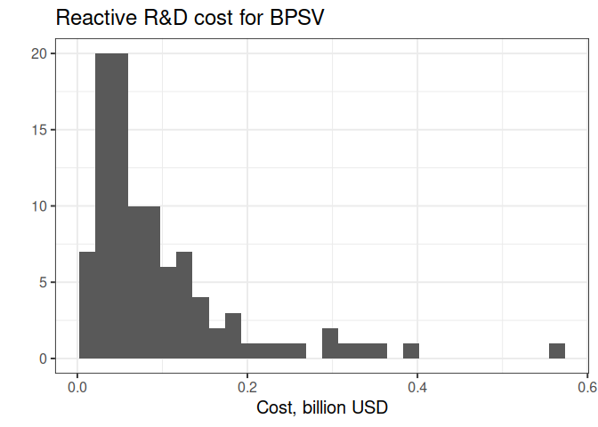
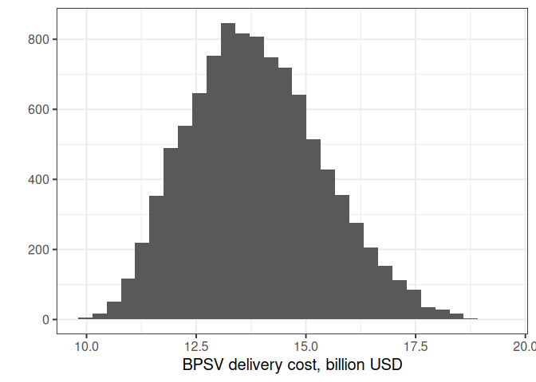

The Costing Model
================

- [1 Parameters](#1-parameters)
- [2 Preparedness cost equation](#2-preparedness-cost-equation)
  - [2.1 BPSV advanced R&D](#21-bpsv-advanced-rd)
  - [2.2 BPSV investigational reserve](#22-bpsv-investigational-reserve)
  - [2.3 SSV capacity reservation](#23-ssv-capacity-reservation)
  - [2.4 Enabling activities](#24-enabling-activities)
- [3 Response cost equation](#3-response-cost-equation)
  - [3.1 Risk-adjusted R&D cost per candidate
    calculation](#31-risk-adjusted-rd-cost-per-candidate-calculation)
    - [3.1.1 SSV](#311-ssv)
    - [3.1.2 BPSV](#312-bpsv)
  - [3.2 Procurement cost calculation](#32-procurement-cost-calculation)
    - [3.2.1 SSV](#321-ssv)
    - [3.2.2 BPSV](#322-bpsv)
  - [3.3 Delivery Cost Equation](#33-delivery-cost-equation)
    - [3.3.1 SSV](#331-ssv)
    - [3.3.2 BPSV](#332-bpsv)
- [4 SSV delivery](#4-ssv-delivery)
  - [4.1 Timing](#41-timing)
  - [4.2 Production](#42-production)
  - [4.3 Allocation](#43-allocation)
  - [4.4 Delivery](#44-delivery)
- [5 BPSV delivery](#5-bpsv-delivery)
  - [5.1 Timing](#51-timing)
- [6 Parameter samples](#6-parameter-samples)
- [7 Attributions / Authors](#7-attributions--authors)
- [8 References](#8-references)

<!-- # Figures (temporary) {.unlisted .unnumbered} -->

This document describes the costing model that is used in the CEPI
application.

# 1 Parameters

| Math notation | Code | Description | Distribution | Parameters | Bounds | Source |
|:--:|:--:|:--:|:--:|:--:|:--:|:--:|
| $W_{0; 365}^{(S)}$ | weeks_P0_365 | SSV preclinical duration (365); weeks | Constant | 14 |  |  |
| $W_{0; 200}^{(S)}$ | weeks_P0_200 | SSV preclinical duration (200DM); weeks | Constant | 5 |  |  |
| $W_{0; 100}^{(S)}$ | weeks_P0_100 | SSV preclinical duration (100DM); weeks | Constant | 5 |  |  |
| $W_{1; 365}^{(S)}$ | weeks_P1_365 | SSV phase I duration (365); weeks | Constant | 19 |  |  |
| $W_{1; 200}^{(S)}$ | weeks_P1_200 | SSV phase I duration (200DM); weeks | Constant | 7 |  |  |
| $W_{1; 100}^{(S)}$ | weeks_P1_100 | SSV phase I duration (100DM); weeks | Constant | 0 |  |  |
| $W_{2; 365}^{(S)}$ | weeks_P2_365 | SSV phase II duration (365); weeks | Constant | 19 |  |  |
| $W_{2; 200}^{(S)}$ | weeks_P2_200 | SSV phase II duration (200DM); weeks | Constant | 0 |  |  |
| $W_{2; 100}^{(S)}$ | weeks_P2_100 | SSV phase II duration (100DM); weeks | Constant | 0 |  |  |
| $W_{3; 365}^{(S)}$ | weeks_P3_365 | SSV phase III duration (365); weeks | Constant | 16 |  |  |
| $W_{3; 200}^{(S)}$ | weeks_P3_200 | SSV phase III duration (200DM); weeks | Constant | 15 |  |  |
| $W_{3; 100}^{(S)}$ | weeks_P3_100 | SSV phase III duration (100DM); weeks | Constant | 8 |  |  |
| $V_{L; 0}$ | cost_lic_0 | Cost of vaccine delivery at start up (0–10%) in LIC; USD per dose | Triangular | 1, 1.5, 2 |  | See Table <a href="#tab:delcosts">3.1</a> |
| $V_{L; 11}$ | cost_lic_11 | Cost of vaccine delivery during ramp up (11–30%) in LIC; USD per dose | Triangular | 0.75, 1, 1.5 |  | See Table <a href="#tab:delcosts">3.1</a> |
| $V_{L; 31}$ | cost_lic_31 | Cost of vaccine delivery getting to scale (31–80%) in LIC; USD per dose | Triangular | 1, 2, 4 |  | See Table <a href="#tab:delcosts">3.1</a> |
| $V_{LM; 0}$ | cost_lmic_0 | Cost of vaccine delivery at start up (0–10%) in LMIC; USD per dose | Triangular | 3, 4.5, 6 |  | See Table <a href="#tab:delcosts">3.1</a> |
| $V_{LM; 11}$ | cost_lmic_11 | Cost of vaccine delivery during ramp up (11–30%) in LMIC; USD per dose | Triangular | 2.25, 3, 4.5 |  | See Table <a href="#tab:delcosts">3.1</a> |
| $V_{LM; 31}$ | cost_lmic_31 | Cost of vaccine delivery getting to scale (31–80%) in LMIC; USD per dose | Triangular | 1.5, 2, 2.5 |  | See Table <a href="#tab:delcosts">3.1</a> |
| $V_{UM; 0}$ | cost_umic_0 | Cost of vaccine delivery at start up (0–10%) in UMIC; USD per dose | Triangular | 6, 9, 12 |  | See Table <a href="#tab:delcosts">3.1</a> |
| $V_{UM; 11}$ | cost_umic_11 | Cost of vaccine delivery during ramp up (11–30%) in UMIC; USD per dose | Triangular | 4.5, 6, 9 |  | See Table <a href="#tab:delcosts">3.1</a> |
| $V_{UM; 31}$ | cost_umic_31 | Cost of vaccine delivery getting to scale (31–80%) in UMIC; USD per dose | Triangular | 3, 4, 5 |  | See Table <a href="#tab:delcosts">3.1</a> |
| $V_{H; 0}$ | cost_hic_0 | Cost of vaccine delivery at start up (0–10%) in HIC; USD per dose | Triangular | 30, 40, 75 |  | See Table <a href="#tab:delcosts">3.1</a> |
| $V_{H; 11}$ | cost_hic_11 | Cost of vaccine delivery during ramp up (11–30%) in HIC; USD per dose | Triangular | 30, 40, 75 |  | See Table <a href="#tab:delcosts">3.1</a> |
| $V_{H; 31}$ | cost_hic_31 | Cost of vaccine delivery getting to scale (31–80%) in HIC; USD per dose | Triangular | 30, 40, 75 |  | See Table <a href="#tab:delcosts">3.1</a> |
| $M_G$ | man_glo | Global annual manufacturing volume; billion doses | Constant | 15 |  | Linksbridge SPC (2025) |
| $M_C$ | man_curr | Current annual manufacturing volume; billion doses | Constant | 6.6 |  | Linksbridge SPC (2025) |
| $F$ | week_trans_start | Facility transition start; weeks before vaccine approval | Constant | 7 |  |  |
| $I_R$ | weeks_init_res | Weeks to initial manufacturing, reserved infrastructure | Constant | 12 |  | Vaccines Europe (2023) |
| $I_E$ | weeks_init_ex | Weeks to initial manufacturing, existing and unreserved infrastructure | Constant | 30 |  | Vaccines Europe (2023) |
| $I_B$ | weeks_init_bui | Weeks to initial manufacturing, built and unreserved infrastructure | Constant | 48 |  |  |
| $C_R$ | weeks_scale_res | Weeks to scale up to full capacity, reserved infrastructure | Constant | 10 |  | Vaccines Europe (2023) |
| $C_E$ | weeks_scale_ex | Weeks to scale up to full capacity, existing and unreserved infrastructure | Constant | 16 |  |  |
| $C_B$ | weeks_scale_bui | Weeks to scale up to full capacity, built and unreserved infrastructure | Constant | 16 |  |  |
| $P_0$ | pos_0 | Probability of success; preclinical | Multinomial | 0.40, 0.41, 0.41, 0.42, 0.48, 0.57 |  | Gouglas et al. (2018) |
| $P_1$ | pos_1 | Probability of success; Phase I | Multinomial | 0.33, 0.40, 0.50, 0.68, 0.70, 0.72, 0.74, 0.77, 0.81, 0.90 |  | Gouglas et al. (2018) |
| $P_2$ | pos_2 | Probability of success; Phase II | Multinomial | 0.22, 0.31, 0.33, 0.43, 0.46, 0.54, 0.58, 0.58, 0.74, 0.79 |  | Gouglas et al. (2018) |
| $P_3$ | pos_3 | Probability of success; Phase III | Uniform | 0.4, 0.8 |  | Wong, Siah, and Lo (2019) |
| $T_0^{(e)}$ | cost_0_ex | Cost, preclinical, experienced manufacturer; USD | Exponential | 24213683 | 1700000, 140000000 | Gouglas et al. (2018) |
| $T_0^{(n)}$ | cost_0_inex | Cost, preclinical, inexperienced manufacturer; USD | Inverse Gaussian | 7882792, 13455907 | 1700000, 37000000 | Gouglas et al. (2018) |
| $T_1^{(e)}$ | cost_1_ex | Cost, Phase I, experienced manufacturer; USD | Inverse Gaussian | 15339198, 8076755 | 1900000, 70000000 | Gouglas et al. (2018) |
| $T_1^{(n)}$ | cost_1_inex | Cost, Phase I, inexperienced manufacturer; USD | Inverse Gamma | 2.2774, 9799081 | 1000000, 30000000 | Gouglas et al. (2018) |
| $T_2^{(e)}$ | cost_2_ex | Cost, Phase II, experienced manufacturer; USD | Log normal | 28297339, 24061641 | 3800000, 140000000 | Gouglas et al. (2018) |
| $T_2^{(n)}$ | cost_2_inex | Cost, Phase II, inexperienced manufacturer; USD | Inverse Gaussian | 17124622, 35918793 | 4400000, 54000000 | Gouglas et al. (2018) |
| $T_3^{(e)}$ | cost_3_ex | Cost, Phase III, experienced manufacturer; USD | Inverse Gamma | 1.3147, 51397313 | 15000000, 910000000 | Gouglas et al. (2018) |
| $T_3^{(n)}$ | cost_3_inex | Cost, Phase III, inexperienced manufacturer; USD | Beta prime | 4.8928, 1.6933, 11400026 | 2500000, 400000000 | Gouglas et al. (2018) |
| $\omega$ | inex_weight | Share of manufacturers that are inexperienced | Constant | 0.9 |  |  |
| $L$ | cost_lic | Licensure; USD | Constant | 287750 |  | Gouglas et al. (2018) |
| $Y_0^{(B)}$ | duration_0 | BPSV preclinical duration; years | Multinomial | 1, 2 |  | CEPI (2022) |
| $Y_1^{(B)}$ | duration_1 | BPSV Phase I duration; years | Multinomial | 1, 2 |  | CEPI (2022) |
| $Y_2^{(B)}$ | duration_2 | BPSV Phase II duration; years | Constant | 2 |  | CEPI (2022) |
| $Y_3^{(B)}$ | duration_3 | BPSV Phase III duration; weeks | Constant | 18 |  |  |
| $L^{(B)}$ | years_lic | Licensure duration; years | Constant | 2 |  | CEPI (2022) |
| $G$ | cost_bpsv | BPSV cost of goods supplied; USD per dose | Constant | 4.68 |  | Kazaz (2021) |
| $A_2$ | cost_capres | Advanced capacity reservation fee; USD per dose per year | Constant | 0.53 |  | Pfizer (2023) |
| $A_1$ | cost_bpsvinv | Stockpiling fee; USD per dose per year | Constant | 2 |  |  |
| $S_R$ | cost_res | SSV procurement price, reserved capacity; USD per dose | Constant | 6.29 |  | Kazaz (2021) |
| $S_U$ | cost_un | SSV procurement price, reactive capacity; USD per dose | Constant | 18.94 |  | Linksbridge SPC (2025) |
| $E$ | cost_enab | Enabling activities; million USD per year | Constant | 700 |  | CEPI (2021) |
| $I$ | inflation | Inflation (2018–2025) | Constant | 0.28 |  | U.S. Bureau of Labor Statistics (n.d.) |
| $r$ | discount | Discount rate | Uniform | 0.02, 0.06 |  | Glennerster, Snyder, and Tan (2023) |
| $M_p$ | profit | Profit margin | Constant | 0.2 |  |  |
| $M_f$ | cost_ff | Fill/finish cost | Constant | 0.14 |  |  |
| $N_{HIC}^{(15)}$ | pop_hic_15 | Population aged 15 and older, HIC | Constant | 1062903718 |  | OWID (2024) |
| $N_{UMIC}^{(15)}$ | pop_umic_15 | Population aged 15 and older, UMIC | Constant | 2258682374 |  | OWID (2024) |
| $N_{LMIC}^{(15)}$ | pop_lmic_15 | Population aged 15 and older, LMIC | Constant | 2292686818 |  | OWID (2024) |
| $N_{LIC}^{(15)}$ | pop_lic_15 | Population aged 15 and older, LIC | Constant | 431149981 |  | OWID (2024) |
| $N_{HIC}^{(65)}$ | pop_hic_65 | Population aged 65 and older, HIC | Constant | 245880785 |  | OWID (2024) |
| $N_{UMIC}^{(65)}$ | pop_umic_65 | Population aged 65 and older, UMIC | Constant | 340100977 |  | OWID (2024) |
| $N_{LMIC}^{(65)}$ | pop_lmic_65 | Population aged 65 and older, LMIC | Constant | 196323876 |  | OWID (2024) |
| $N_{LIC}^{(65)}$ | pop_lic_65 | Population aged 65 and older, LIC | Constant | 23832449 |  | OWID (2024) |
| $N^{\text{(SSV)}}$ | n_ssv_candidates | Number of SSV candidates | Constant | 18 |  |  |
| $N^{\text{(BPSV)}}$ | n_bpsv_candidates | Number of BPSV candidates | Constant | 8 |  | CEPI (2025) |
| $A_3$ | hic_cap_res | Reserved capacity for HIC, billions | Constant | 0.5 |  |  |
| $\lambda$ | final_vaccine_coverage | Final vaccine coverage, proportion of population | Constant | 0.8 |  | Model choice |

Notation and parametric assumptions for inputs to the costing model.
Parameters are used as follows: uniform distributions go from Parameter
1 to Parameter 2. Triangular distributions go from Parameter 1 to
Parameter 3 with a peak at Parameter 2. Multinomial distributions have
equally probable values listed individually. Exponential distributions
have as a mean Parameter 1. Inverse Gaussian distributions have as a
mean Parameter 1, and as a shape Parameter 2. Log normal distributions
have as a mean Parameter 1, and as a standard deviation Parameter 2.
Inverse Gamma distributions have shape Parameter 1 and scale Parameter
2. Beta Prime distributions have shape Parameters 1 and 2, and scale
Parameter 3. Where given, distributions are truncated at bounds.

# 2 Preparedness cost equation

<span style="color:red;">(BPSV R&D + BPSV Stockpile + SARS-X Reserved
capacity + Enabling activities) / (1 + discount rate) ^ (year –
2025)</span>

$$D_y^{\text{(prep)}} = \frac{1}{(1+r)^y}\left(D_s^{\text{(BP-adRD)}} + D_{s,y}^{\text{(BP-inv)}} + D_s^{\text{(S-cap)}} + D_{s,y}^{\\text{(en)}}\right)$$

- $D_s^{\text{(BP-adRD)}}$ is the R&D cost of BPSV prior to an outbreak;
  see Equation (2.1)
- $D_{s,y}^{\text{(BP-inv)}}$ is the cost of maintaining an
  investigational reserve of 100,000 BPSV doses; see Equation (2.2)
- $D_s^{\text{(S-cap)}}$ is the cost of reserved capacity for SSV; see
  Equation (2.3)
- $D_{s,y}^{\\text{(en)}}$ is the annual cost of enabling activities;
  see Equation (2.4).

## 2.1 BPSV advanced R&D

**I have set the weight of inexperienced manufacturer to 0.9**

Probabilities of success for preclinical, Phase I, Phase II, and Phase
III are $P_0$, $P_1$, $P_2$ and $P_3$. Then probabilities of occurrence
are:

``` math
\hat{P}_i = \left\{\begin{array}{lr}1 & i=0 \\ \prod_{j=0}^{i-1}P_j & i\in\{1,2,3\} \\ \prod_{j=0}^{3}P_j & i=L \end{array}\right.
```

and the cost of each phase is $T_i$, a weighted average of experienced
and inexperienced manufacturers (assuming $\omega=0.9$):

$$T_{i} = \omega T_i^{(n)} + (1-\omega)T_i^{(e)}.$$ Then the total
weighted cost for phases 0 through 2 for $N^{\text{(BPSV)}} = 8$
candidates is

$$\begin{equation}
D_s^{\text{(BP-adRD)}} = \left\\{\begin{array}{lr}
 N^{\text{(BPSV)}}\sum_{i=0}^2 \hat{P}_iT_{i} \\; & \\; s\in\\{1,2,3\\} \\\\
0  \\; & \\; s\notin\\{1,2,3\\}
\end{array}\right.
\qquad(2.1)
\end{equation}$$

<div class="figure">


<p class="caption">
<span id="fig:posbpsv"></span>Figure 2.1: Risk-adjusted R&D cost for 8
BPSV candidates
</p>

</div>

## 2.2 BPSV investigational reserve

The cost per dose per year is 2 USD, denoted $A_1$. Then the cost to
maintain the reserve of 100,000 doses is

$$\begin{equation}
D_{s,y}^{\text{(BP-inv)}} = \left\\{\begin{array}{lr}
100000 A_1
\\; & \\; s\in\\{1,2,3\\} \\;\\&\\;y>5\\\\
0  \\; & \\; s\notin\\{1,2,3\\}\\;\\|\\;y\leq 5
\end{array}\right.
\qquad(2.2)
\end{equation}$$

<div class="figure">


<p class="caption">
<span id="fig:bpsvinv"></span>Figure 2.2: BPSV investigational reserve
costs accumulated from year 6 to year 15 with uniformly distributed
discount rate.
</p>

</div>

## 2.3 SSV capacity reservation

The cost per dose reservation per year is 0.53 USD, denoted $A_2$.
Reservation sizes, in billions, depend on scenarios, including the
$A_3=0.5$ billion doses reserved for HIC, as follows:

$$\begin{equation}
M_{R,s} = \left\\{\begin{array}{lr}A_3 & s\in\\{0, 1, 6, 9, 12\\} \\\\ 
A_3+0.7 & s\in\\{2, 4, 7, 10\\} \\\\ 
A_3+2 & s\in\\{3, 5, 8, 11\\} \end{array}\right.
\end{equation}$$

Then the total cost per year is

$$\begin{equation}
D_s^{\text{(S-cap)}} =  M_{R,s} A_2
\qquad(2.3)
\end{equation}$$

The annual costs in billion USD are 0.265, 0.636, and 1.325,
respectively.

<div class="figure">


<p class="caption">
<span id="fig:capres"></span>Figure 2.3: Capacity reservation costs
accumulated over 15 years with uniformly distributed discount rate.
</p>

</div>

## 2.4 Enabling activities

Denote the “Days Mission” by $\zeta$, so that
$\zeta\in\{365, 200, 100\}$. Then annual costs, $E=700$ million,
accumulate depending on the year and the mission:

$$\begin{equation}
D_{s,y}^{\text{(en)}} = \left\\{\begin{array}{lr}E & \zeta(s)=200 \\;\\&\\; y\leq 5 \\; |\\; \zeta(s)=100\\; \\& \\;y\leq 15 \\\\ 
0 & \zeta(s)=365 \\;|\\; y > 15 \\;|\\; \zeta(s)=200 \\;\\&\\; y \\;>\\; 5  \end{array}\right.
\qquad(2.4)
\end{equation}$$

For our scenarios, we have

$$\begin{equation}
\zeta(s) = \left\\{\begin{array}{lr} 365 & s\in\\{0, 1, 2, 3, 4, 5, 12\\} \\\\ 
200 & s\in\\{6, 7, 8\\} \\\\ 
100 & s\in\\{9, 10, 11\\} \end{array}\right.
\end{equation}$$

<div class="figure">


<p class="caption">
<span id="fig:en"></span>Figure 2.4: Enabling costs accumulated over 15
years with uniformly distributed discount rate.
</p>

</div>

# 3 Response cost equation

<span style="color:red;">(BPSV R&D + SARS-X R&D + BPSV Procurement +
SARS-X Procurement + BPSV Delivery + SARS-X Delivery) / (1 + discount
rate) ^ (year – 2025)</span>

$$D_y^{\text{(res)}} = \frac{1}{(1+r)^y}\left(D_s^{\text{(BP-resRD)}} + D_s^{\text{(S-RD)}} + D_s^{\text{(BP-proc)}} + D_{s}^{\text{(S-proc)}} + D_s^{\text{(BP-del)}} + D^{\text{(S-del)}}\right)$$

- $D_s^{\text{(BP-resRD)}}$ is the R&D cost of BPSV after an outbreak;
  see Equation (3.2)
- $D_s^{\text{(S-RD)}}$ is the R&D cost for SSV; see Equation (3.1)
- $D_s^{\text{(BP-proc)}}$ is the cost of procuring BPSV; see Equation
  (3.4)
- $D_{s}^{\text{(S-proc)}}$ is the cost of procuring SSV; see Equation
  (3.3)
- $D_s^{\text{(BP-del)}}$ is the cost of delivering BPSV; see Equation
  (3.6)
- $D^{\text{(S-del)}}$ is the cost of delivering SSV; see Equation (3.5)

## 3.1 Risk-adjusted R&D cost per candidate calculation

<span style="color:red;">Sum of the cost of each phase multiplied by the
likelihood of phase occurrence (probability of success for previous
phases)</span>

<span style="color:red;">Probability of Occurrence (PoO) = 1 \* PoS
(PhaseN-1) …</span>

<span style="color:red;">\$ (Preclin) \* PoO (Preclin) + \$ (Ph1) \* PoO
(Ph1) + \$ (Ph2) \* PoO (Ph2) + \$ (Ph3) \* PoO (Ph3) + \$ (License) \*
PoO (License)</span>

### 3.1.1 SSV

Trial costs are adjusted for the duration of the trial, which depend on
the R&D investment, denoted $\zeta\in\{365, 200, 100\}$:
$$T_{\zeta,i} = \frac{W_{i;\zeta}^{(S)}}{W_{i;365}^{(S)}}T_i.$$ Then the
total cost is

$$\begin{equation}
D_s^{\text{(S-RD)}} = N^{\text{(SSV)}}\left(\sum_{i=0}^3 \hat{P}_iT_{\zeta(s),i} + (1+I) \hat{P}_LL\right)
\qquad(3.1)
\end{equation}$$

where $I$ is inflation from 2018 to 2025.

We multiply by the number of candidates, $N^{\text{(SSV)}}=18$, to get
the total cost from the weighted average per candidate.

<div class="figure">


<p class="caption">
<span id="fig:posssv"></span>Figure 3.1: Risk-adjusted R&D cost for 18
SSV candidates
</p>

</div>

365 Days Mission Min. 1st Qu. Median Mean 3rd Qu. Max. 0.05 0.19 0.25
0.28 0.34 1.65

200 Days Mission Min. 1st Qu. Median Mean 3rd Qu. Max. 0.02 0.07 0.11
0.14 0.16 1.39

100 Days Mission Min. 1st Qu. Median Mean 3rd Qu. Max. 0.01 0.05 0.07
0.08 0.10 0.76

### 3.1.2 BPSV

**I have basically assumed the same as SSV except for the numbers given
(8 candidates and 18 weeks)**

The BPSV has $N^{\text{(BPSV)}}=8$ candidates. Those that have passed
through Phases 0 to 2 prior to the outbreak go through Phase 3 during
the response. The duration is $Y_3^{(B)}=18$ weeks. Thus we write the
BPSV R&D response cost

$$\begin{equation}
D_s^{\text{(BP-resRD)}} = \left\\{\begin{array}{lr}N^{\text{(BPSV)}}\hat{P}_3\left(\frac{18}{W_{3;365}^{(S)}}\left(\omega T_3^{(n)} + (1-\omega)T_3^{(e)}\right) + (1+I) P_3L\right) \\; & \\; s\in\\{1,2,3\\} \\\\
0  \\; & \\; s\notin\\{1,2,3\\}
\end{array}\right.
\qquad(3.2)
\end{equation}$$

<div class="figure">


<p class="caption">
<span id="fig:bpsvrd"></span>Figure 3.2: Reactive R&D cost for BPSV
</p>

</div>

Min. 1st Qu. Median Mean 3rd Qu. Max. 1 16 30 48 57 700

## 3.2 Procurement cost calculation

<span style="color:red;">Scenario 1: Annual demand under 6.6B</span>

<span style="color:red;">Annual demand \* \$6.29 \* 1.14 \* 1.2</span>

<span style="color:red;">Scenario 2: Annual demand over 6.6B</span>

<span style="color:red;">Annual demand \* \$18.94</span>

### 3.2.1 SSV

If we write annual demand in billions as $A_{\cdot,s,y}$, then we would
have costs, in billion USD, of:

$$\begin{equation}
D_{s}^{\text{(S-proc)}} = \min\\{A_{SSV,s,y},M_C\\}\cdot S_R\cdot(1+M_p)\cdot(1+M_f)  + \max\\{A_{SSV,s,y}-M_C,0\\}\cdot S_U
\qquad(3.3)
\end{equation}$$

Here, $S_R$ is the cost per reserved dose and $S_U$ the cost per
unreserved dose. Reserved doses are marked up by $M_p$ and $M_f$.

The total number of doses produced in week $w$ in scenario $s$ is
$Z_{T,s,w}$ (see Equation (4.1)). The total in a one-year period is

$$A_{SSV,s,y} = \sum_{w\in y}Z_{T,s,w}.$$

<div class="figure">


<p class="caption">
<span id="fig:costperyear"></span>Figure 3.3: SSV procurement cost
</p>

</div>

### 3.2.2 BPSV

$$\begin{equation}
D_s^{\text{(BP-proc)}} = \left\\{\begin{array}{lr}
A_{BPSV,s}\cdot G\\; & \\; s\in\\{1,2,3\\} \\\\
0  \\; & \\; s\notin\\{1,2,3\\}
\end{array}\right.
\qquad(3.4)
\end{equation}$$

For a world population aged 65 and over of 0.8 billion, and a cost per
dose of 4.68 USD, and uptake of 80%, the procurement cost for BPSV is
3.02 billion USD.

Min. 1st Qu. Median Mean 3rd Qu. Max. 1.26 1.45 1.68 1.71 1.95 2.24

## 3.3 Delivery Cost Equation

<span style="color:red;">WB status demand/0.8 \* 0.1 \* (0-10% cost) +
WB status demand/0.8 \* 0.2 \* (11-30% cost) + WB status demand/0.8 \*
0.5 \* (30-80% cost)</span>

### 3.3.1 SSV

For populations aged 15 and above $N_i^{(15)}$ in income group
$i\in\{\text{LIC, LMIC, UMIC, HIC}\}$, and delivery cost $D$:

$$\begin{equation}
D^{\text{(S-del)}} = \sum_{i}N_i^{(15)}\left(\frac{1}{8}V_{i; 0} + \frac{2}{8}V_{i; 11} + \frac{5}{8}V_{i; 31}\right) 
\qquad(3.5)
\end{equation}$$

We set

$$V_{LLMIC; j} = \frac{1}{N_{LMIC}^{(15)} + N_{LIC}^{(15)}} \left(N_{LMIC}^{(15)}V_{LMIC; j} + N_{LIC}^{(15)}V_{LIC; j} \right)$$

<div class="figure">


<p class="caption">
<span id="fig:deliverycost"></span>Figure 3.4: SSV delivery cost
</p>

</div>

### 3.3.2 BPSV

For the BPSV, which goes only to people aged 65 or older, with
populations $N_i^{(65)}$, coverage is reached earlier in the process, so
the cost is weighted more heavily towards start up and ramp up:

$$\begin{equation}
D_s^{\text{(BP-del)}} = 
\left\\{\begin{array}{lr}
\sum_{i}D_{\text{BPSV},i}
\\; & \\; s\in\\{1,2,3\\} \\\\
0  \\; & \\; s\notin\\{1,2,3\\}
\end{array}\right.
\qquad(3.6)
\end{equation}$$

$$\begin{equation}
D_{\text{BPSV},i} = 
\left\\{\begin{array}{lr}
N_i^{(65)}V_{i; 0}  & N_i^{(65)}\leq \frac{1}{10}N_i^{(15)} \\\\
\frac{N_i^{(15)}}{10} V_{i; 0} + \left(N_i^{(65)}-\frac{N_i^{(15)}}{10} \right)V_{i; 11}  & \frac{1}{10}N_i^{(15)} \leq N_i^{(65)}\leq \frac{3}{10}N_i^{(15)} \\\\
\frac{N_i^{(15)}}{10} V_{i; 0} + \frac{2}{10}N_i^{(15)} V_{i; 11} + \left(N_i^{(65)}-\frac{3}{10}N_i^{(15)} \right)V_{i; 31} & N_i^{(65)}> \frac{3}{10} N_i^{(15)}
\end{array}\right.
\end{equation}$$

The logic of this is as follows:

- The increments in cost correspond to numbers of eligible people in the
  whole population, namely those aged 15 and above.
- If the number of people eligible for the BPSV is less than 10% of the
  population aged 15 and over, then all doses cost the “start up”
  amount.
- If the number of people eligible for the BPSV is more than 10% and
  less than 30% of the 15+ population, then cost of the first doses, a
  number equal to 10% of the 15+ population, is the “start up” amount.
  All remaining doses cost the “ramp up” amount.
- If the number of people eligible for the BPSV is more than 30% of the
  15+ population, then the cost of the first doses, a number equal to
  10% of the 15+ population, is the “start up” amount. The cost of the
  second tranche of doses, a number equal to 20% of the 15+ population,
  is the “ramp up” amount. All remaining doses cost the “getting to
  scale” amount.

<div class="figure">


<p class="caption">
<span id="fig:bpsvdelivery"></span>Figure 3.5: BPSV delivery cost
</p>

</div>

Min. 1st Qu. Median Mean 3rd Qu. Max. 4.02 5.99 6.95 7.08 8.05 12.27

| Country | Country status | Study type | Financial Cost per dose (USD) | Source |
|:---|----|:---|----|:---|
| WHO, Gavi, and UNICEF AMC Estimate | AMC | Top down | 1.66 | Griffiths et al. (2021) |
| UNICEF Global Estimate | All | Model | 0.73 | Oyatoye (2023) |
| DRC | LIC | Bottom up | 1.91 | Moi et al. (2024) |
| Malawi | LIC | Bottom up | 4.55 | Ruisch et al. (2025) |
| Mozambique | LIC | Bottom up | 0.5 | Namalela et al. (2025) |
| Uganda | LIC | Bottom up | 0.79 | Tumusiime et al. (2024) |
| Bangladesh | LMIC | Bottom up | 0.29 | Yesmin et al. (2024) |
| Cote d’Ivoire | LMIC | Bottom up | 0.67 | K. Vaughan et al. (2023) |
| Nigeria | LMIC | Bottom up | 0.84 | Noh et al. (2024) |
| Philippines | LMIC | Bottom up | 2.16 | Banks et al. (2023) |
| Vietnam | LMIC | Bottom up | 1.73 | Nguyen et al. (2024) |
| Ghana | LMIC | CVIC tool | 2.2–2.3 | Nonvignon et al. (2022) |
| Lao PDR | LMIC | CVIC tool | 0.79–0.81 | Yeung et al. (2023) |
| Kenya | LMIC | Top down | 3.29–4.28 | Orangi et al. (2022) |
| Botswana | UMIC | Mixed | 19 | Kelsey Vaughan et al. (2025) |
| South Africa | UMIC | Top down | 3.84 | Edoka et al. (2024) |

<span id="tab:delcosts"></span>Table 3.1: Literature review of global
and country-specific delivery costs

# 4 SSV delivery

| Category | Reserved capacity | Private response (existing capacity) | Private response (built capacity) |
|:---|----|:---|:---|
| Annual manufacturing volume | By scenario (0.5–2.5B) | 2.5B minus reserved volume | 6B |
| Facility transition start | 7 weeks before vaccine approval | 7 weeks before vaccine approval | 7 weeks before vaccine approval |
| Weeks to initial manufacturing | 12 | 30 | 48 |
| Scale-up weeks to full capacity | 10 | 16 | 16 |

Manufacturing response timeline assumptions

<!-- | Weeks from transition start | 0-11 | 12-21 | 22-29 | 30-45  | 46-47 | 48-63 | 64+ | -->
<!-- |---|---|---|---|---|---|---|---| -->
<!-- | Reserved Capacity (%)  || Scaling from 0-100 | 100 | 100 | 100 | 100 | 100 |  -->
<!-- | Private Capacity (Existing; %)  || | | Scaling from 0-100 | 100 | 100 | 100 |  -->
<!-- | Private Capacity (Response; %)  | | | |  | | Scaling from 0-100 | 100 | -->

| Weeks from transition start | Reserved Capacity (%) | Private Capacity (Existing; %) | Private Capacity (Response; %) |
|:---|:---|:---|:---|
| 0–11 |  |  |  |
| 12–21 | Scaling from 0-100 |  |  |
| 22–29 | 100 |  |  |
| 30–45 | 100 | Scaling from 0-100 |  |
| 46–47 | 100 | 100 |  |
| 48–63 | 100 | 100 | Scaling from 0-100 |
| 64+ | 100 | 100 | 100 |

Vaccine Production Timeline

## 4.1 Timing

Facility transition occurs $F=7$ weeks before vaccine approval, which in
turn depends on R&D investments. We have three levels in our scenarios,
corresponding to a 100 Days Mission, 200 days, and 365 days. The total
weeks taken for vaccine approval can be written as follows:

$$W_{j}^{(S)} = \sum_{i=0}^3 W_{i;j}^{(S)}$$

for $j\in\\{365, 200, 100\\}$. These work out as 68, 27, and 13 weeks,
respectively. Thus “week 0” for manufacturing occurs 61, 20, and 6
weeks, respectively, after the new pathogen has been sequenced. We
denote this variable $w_s^{(0)}$.

## 4.2 Production

The total global manufacturing volume is $M_G=15$ billion doses. The
amount that is reserved, in billion doses, including the HIC-specific
reservation of $A_3=0.5$ billion doses, depends on the scenarios as
follows:

$$\begin{equation}
M_{R,s} = \left\\{\begin{array}{lr}A_3 & s\in\\{0, 1, 6, 9, 12\\} \\\\ 
A_3 + 0.7 & s\in\\{2, 4, 7, 10\\} \\\\ 
A_3 + 2 & s\in\\{3, 5, 8, 11\\} \end{array}\right.
\end{equation}$$

where $s=0$ denotes the BAU scenario. By definition,
$M_{E,s} = M_C - M_{R,s}$, and $M_B=M_G-M_C$.

Then the number of doses, in billions, that are made from capacity
$x\in \\{R, E, B\\}$ in week $w$ of scenario $s$ is:

$$\begin{equation}
Z_{x,s,w} = \left\\{\begin{array}{lr}0 & w-w_s^{(0)} < I_x \\\\ 
\frac{1}{52}\frac{w-w_s^{(0)}-I_x+1}{C_x}M_{x,s} & w-w_s^{(0)}\in[I_x, I_x+C_x) \\\\ 
\frac{1}{52}M_{x,s}  & w-w_s^{(0)}\geq I_x+C_x
\end{array}\right.
\end{equation}$$

<!-- \frac{1}{52}M_{R,s}  & w\in[I_R+C_R, I_E)\\\\  -->
<!-- \frac{1}{52}\left(M_{R,s} + \frac{w-I_E+1}{C_E}M_{E,s}\right) & w\in[I_E, I_E+C_E)\\\\  -->
<!-- \frac{1}{52}\left(M_{R,s} + M_{E,s}\right)  & w\in[I_E+C_E, I_B)\\\\  -->
<!-- \frac{1}{52}\left(M_{R,s} + M_{E,s} + \frac{w-I_B+1}{C_B}M_{B}\right) & w\in[I_B, I_B+C_B)\\\\  -->

where $I_R=12$ is the number of weeks to initial manufacturing for
reserved capacity, $C_R=10$ is the number of weeks to scale up to full
capacity; $I_E=30$ is the number of weeks to initial manufacturing for
existing and unreserved capacity, $C_E=16$ is the number of weeks to
scale up to full capacity; $I_B=48$ is the number of weeks to initial
manufacturing for built and unreserved capacity, $C_B=16$ is the number
of weeks to scale up to full capacity.

Then the total number of doses produced in week $w$ is

$$\begin{equation}
Z_{T,s,w} = Z_{R,s,w}+Z_{E,s,w}+Z_{B,s,w}.
\qquad(4.1)
\end{equation}$$

<div class="figure">


<p class="caption">
<span id="fig:supply"></span>Figure 4.1: Doses made available from
manufacturing per scenario. Weeks are in reference to the sequencing of
the pathogen.
</p>

</div>

In Figure <a href="#fig:supply">4.1</a>, the following scenarios have
identical supply (because they have the same capacity reservations and
R&D investments): BAU & S01 & S12; S02 & S04; and S03 & S05.

## 4.3 Allocation

Denote the weekly allocated doses at week $w$ from capacity $x$ to
income level $k_{s,x,i,w}$, and the cumulative number $K_{s,i,w}$, such
that $$K_{s,i,w} = \sum_{x\in\\{R,E,B\\}}\sum_{j=0}^w k_{s,x,i,j}.$$ We
write $X_i = 2\cdot \lambda\cdot N_i^{(15)}$ as the maximum demand for
income group $i$, representing two doses each for $\lambda=80$% of the
population.

$$\begin{equation}
k_{s,R,i,w} = \left\\{ \begin{array}{lr}
Z_{R,s,w}             & K_{s,\text{HIC},w} < A_3 \\;\\&\\; i=\text{HIC} \\\\
0                     & K_{s,\text{HIC},w} < A_3 \\;\\&\\; i\neq\text{HIC} \\\\
\frac{N_{i}}{N_{HIC}+N_{UMIC}+N_{LLMIC}}Z_{R,s,w} & A_3 < K_{s,\text{HIC},w} < X_{\text{HIC}} \\\\
\frac{N_{i}}{N_{UMIC}+N_{LLMIC}}Z_{R,s,w} & K_{s,\text{HIC},w} \geq X_{\text{HIC}} \\;\\&\\;  K_{s,\text{UMIC},w} < X_{\text{HIC}} \\;\\&\\; i\neq\text{HIC}\\\\
Z_{R,s,w}             & K_{s,\text{UMIC},w} \geq X_{\text{UMIC}} \\;\\&\\; i=\text{LLMIC}
\end{array}\right.
\end{equation}$$

The logic of this reads as follows:

- The first $A_3=0.5$ billion doses from reserved capacity go
  exclusively to HIC
- None go to UMIC and LLMIC
- When HIC coverage is between 500 million and its total demand,
  reserved capacity doses are allocated according to population
- Once HIC reach their total demand, doses from reserved capacity are
  split proportional to population between UMIC and LLMIC
- Once UMIC reach their total demand, all doses from reserved capacity
  go to LLMIC

For $x\in\\{E,B\\}$,

$$\begin{equation}
k_{s,x,i,w} = \left\\{ \begin{array}{lr}
Z_{x,s,w}            & K_{s,\text{HIC},w} < X_{\text{HIC}} \\;\\&\\; i=\text{HIC} \\\\
0                     & K_{s,\text{HIC},w} < X_{\text{HIC}} \\;\\&\\; i\neq\text{HIC} \\\\
Z_{x,s,w}            & K_{s,\text{HIC},w} \geq X_{\text{HIC}} \\;\\&\\; K_{s,\text{UMIC},w} < X_{\text{UMIC}} \\;\\&\\; i=\text{UMIC} \\\\
0                     & K_{s,\text{HIC},w} \geq X_{\text{HIC}} \\;\\&\\; K_{s,\text{UMIC},w} < X_{\text{UMIC}} \\;\\&\\; i\neq\text{UMIC} \\\\
Z_{x,s,w}            & K_{s,\text{UMIC},w} \geq X_{\text{UMIC}} \\;\\&\\; i=\text{LLMIC} \\\\
0                     & K_{s,\text{UMIC},w} \geq X_{\text{UMIC}} \\;\\&\\; i\neq\text{LLMIC} 
\end{array}\right.
\end{equation}$$

The logic of this reads as follows:

- Until HIC demand is reached, all doses from unreserved capacity go to
  HIC
- None go to UMIC and LLMIC
- Once HIC demand has been met and until UMIC demand is reached, all
  doses from unreserved capacity go to UMIC
- None go to HIC and LLMIC
- Once HIC and UMIC demand have been met, all remaining doses from
  unreserved capacity go to LLMIC
- None go to UMIC and HIC

<div class="figure">


<p class="caption">
<span id="fig:procurement"></span>Figure 4.2: Doses procured by country
income level
</p>

</div>

## 4.4 Delivery

<div class="figure">


<p class="caption">
<span id="fig:scendelivery"></span>Figure 4.3: Cumulative vaccine
coverage (second SSV dose) by country income level
</p>

</div>

# 5 BPSV delivery

## 5.1 Timing

The duration of the Phase three trial is 18 weeks. **The time to
manufacturing transition is 12 weeks, and the time to manufacturing
scale-up 10 weeks; these are the same as the reserved-capacity times for
SSV. Are these reservations included in the preparedness cost?**

# 6 Parameter samples

<!-- --><!-- --><!-- --><!-- --><!-- --><!-- --><!-- --><!-- --><!-- --><!-- --><!-- --><!-- --><!-- --><!-- --><!-- --><!-- --><!-- --><!-- --><!-- --><!-- --><!-- --><!-- --><!-- --><!-- --><!-- --><!-- --><!-- -->

# 7 Attributions / Authors

# 8 References

<div id="refs" class="references csl-bib-body hanging-indent"
entry-spacing="0">

<div id="ref-Banks2023" class="csl-entry">

Banks, C, RD Estanislao, SJ De los Reyes, JE De Guzman, LB
Sumpaico-Tanchanco, B Makani-Lim, R Archer, and L Boonstoppel. 2023.
“The Cost of Delivering COVID-19 Vaccines in the Philippines.” Geneva:
ThinkWell.
<https://thinkwell.global/wp-content/uploads/2024/03/Cost-of-delivering-COVID19-vaccines-in-the-Philippines_final-report_19-Dec-2023.pdf>.

</div>

<div id="ref-CEPI2021" class="csl-entry">

CEPI. 2021. “CEPI 2022–2026 Strategy.”
<https://static.cepi.net/downloads/2023-12/CEPI-2022-2026-Strategy-v3-Jan21_0.pdf>.

</div>

<div id="ref-CEPI2022" class="csl-entry">

———. 2022. “Delivering Pandemic Vaccines in 100 Days.”
<https://static.cepi.net/downloads/2024-02/CEPI-100-Days-Report-Digital-Version_29-11-22.pdf>.

</div>

<div id="ref-CEPI2025" class="csl-entry">

———. 2025. “Active <span class="nocase">CEPI-funded</span> Vaccine
Candidate Portfolio by Phase.” CEPI. <https://cepi.net/our-portfolio>.

</div>

<div id="ref-Edoka2024" class="csl-entry">

Edoka, Ijeoma, Lineo Marie Matsela, Khumo Modiba, Yolandie Luther,
Sharlene Govender, Thapelo Maotoe, Heena Brahmbhatt, Pedro T. Pisa,
Gesine Meyer-Rath, and Jacqui Miot. 2024. “Costs of the COVID-19
Vaccination Programme: Estimates from the West Rand District of South
Africa, 2021/2022.” *BMC Health Services Research* 24 (1): 857.
<https://doi.org/10.1186/s12913-024-11251-1>.

</div>

<div id="ref-Glennerster2023" class="csl-entry">

Glennerster, Rachel, Christopher M. Snyder, and Brandon Joel Tan. 2023.
*Calculating the Costs and Benefits of Advance Preparations for Future
Pandemics*. *IMF Economic Review*. Vol. 71. Palgrave Macmillan UK.
<https://doi.org/10.1057/s41308-023-00212-z>.

</div>

<div id="ref-Gouglas2018" class="csl-entry">

Gouglas, Dimitrios, Tung Thanh Le, Klara Henderson, Aristidis Kaloudis,
Trygve Danielsen, Nicholas Caspersen Hammersland, James M Robinson,
Penny M Heaton, and John-Arne Røttingen. 2018. “Estimating the Cost of
Vaccine Development Against Epidemic Infectious Diseases: A Cost
Minimisation Study.” *The Lancet Global Health* 6 (12): e1386–96.
<https://doi.org/10.1016/S2214-109X(18)30346-2>.

</div>

<div id="ref-Griffiths2021" class="csl-entry">

Griffiths, Ulla, Alex Adjagba, Marcia Attaran, Raymond Hutubessy,
Nathalie Van De Maele, Karene Yeung, Wei Aun, et al. 2021. “Costs of
Delivering COVID-19 Vaccine in 92 AMC Countries.” February. COVAX
Working Group. <https://www.who.int/publications/i/item/10665337553>.

</div>

<div id="ref-Kazaz2021" class="csl-entry">

Kazaz, Burak. 2021. “Incentivizing COVID-19 Vaccine Developers to Expand
Manufacturing Capacity.” Center for Global Development.
<https://www.cgdev.org/sites/default/files/incentivizing-covid-19-vaccine-developers-expand-manufacturing-capacity.pdf>.

</div>

<div id="ref-LinksbridgeSPC2025" class="csl-entry">

Linksbridge SPC. 2025. “Global Vaccine Market Model.”
<https://4550bf57-cdn.agilitycms.cloud/help-guides/Introduction%20to%20GVMM%20v6.1.pdf>.

</div>

<div id="ref-Moi2024" class="csl-entry">

Moi, Flavia, Laura Boonstoppel, Rachel Archer, and Pierre Akilimali.
2024. “The Cost of Delivering COVID-19 Vaccines in the Democratic
Republic of the Congo.” Geneva: ThinkWell.
<https://thinkwell.global/wp-content/uploads/2024/04/DRC-C19-costing-study-report_final.pdf>.

</div>

<div id="ref-Namalela2025" class="csl-entry">

Namalela, Tozé, Flavia Moi, Amélia Dipuve, Pedro Marizane Pota, José
Guambe, Maria Tereza Couto, and Laura Boonstoppel. 2025. “The Cost of
Delivering COVID-19 Vaccines in Mozambique: A Bottom-up Costing Study.”
*BMC Health Services Research* 25 (1): 521.
<https://doi.org/10.1186/s12913-025-12671-3>.

</div>

<div id="ref-Nguyen2024" class="csl-entry">

Nguyen, Van Minh, Flavia Moi, Laura Boonstoppel, Hong Thi Duong, Chien
Chinh Vien, and Minh Van Hoang. 2024. “The Cost of Delivering COVID-19
Vaccines in Vietnam.” *BMC Health Services Research* 24 (1): 779.
<https://doi.org/10.1186/s12913-024-11202-w>.

</div>

<div id="ref-Noh2024" class="csl-entry">

Noh, Dave Haeyun, Roopa Darwar, Belinda V. Uba, Shiva Gab-deedam, Stella
Yani, Akolade Jimoh, Ndadilnasiya Waziri, et al. 2024. “Cost of COVID-19
Vaccine Delivery in Nine States in Nigeria via the U.S. Government
Initiative for Global Vaccine Access.” *BMC Health Services Research* 24
(1): 1232. <https://doi.org/10.1186/s12913-024-11645-1>.

</div>

<div id="ref-Nonvignon2022" class="csl-entry">

Nonvignon, Justice, Richmond Owusu, Brian Asare, Alex Adjagba, Yap Wei
Aun, Karene Hoi Ting Yeung, Joycelyn Naa Korkoi Azeez, et al. 2022.
“Estimating the Cost of COVID-19 Vaccine Deployment and Introduction in
Ghana Using the CVIC Tool.” *Vaccine* 40 (12): 1879–87.
<https://doi.org/10.1016/j.vaccine.2022.01.036>.

</div>

<div id="ref-Orangi2022" class="csl-entry">

Orangi, Stacey, Angela Kairu, Anthony Ngatia, John Ojal, and Edwine
Barasa. 2022. “Examining the Unit Costs of COVID-19 Vaccine Delivery in
Kenya.” *BMC Health Services Research* 22 (1): 439.
<https://doi.org/10.1186/s12913-022-07864-z>.

</div>

<div id="ref-OWID2024" class="csl-entry">

OWID. 2024. “UN, World Population Prospects (2024) – Processed by Our
World in Data. ‘Population, in Five-Year Age Groups – UN WPP’
\[Dataset\]. United Nations, ‘World Population Prospects’ \[Original
Data\].” <https://ourworldindata.org/grapher/population-by-age-group>.

</div>

<div id="ref-Oyatoye2023" class="csl-entry">

Oyatoye, I. 2023. “Costs and Financing Gap of Delivering COVID-19
Vaccine to 133 Low- and Middle-Income Countries.” Cape Town, South
Africa.
<https://immunizationeconomics.org/wp-content/uploads/2024/01/Ibironke-Oyatoye-Costs-and-financing-gap-of-C19v-delivery-in-LMICS_Final.pdf>.

</div>

<div id="ref-Pfizer2023" class="csl-entry">

Pfizer. 2023. “Pfizer and the European Commission Enter into
Manufacturing Reservation Agreement for <span class="nocase">mRNA-based
Vaccines</span> to Help Protect Against Future Pandemics.”
<https://www.pfizer.com/news/announcements/pfizer-and-european-commission-enter-manufacturing-reservation-agreement-mrna>.

</div>

<div id="ref-Ruisch2025" class="csl-entry">

Ruisch, Anika, Simon Ntopi, Ishani Mathur, Maeve Conlin, Anna McCaffrey,
Damian G. Walker, and Christian Suharlim. 2025. “The Cost of Delivering
COVID-19 Vaccines in Four Districts in Malawi.” *Cost Effectiveness and
Resource Allocation* 23 (1): 36.
<https://doi.org/10.1186/s12962-025-00610-2>.

</div>

<div id="ref-Tumusiime2024" class="csl-entry">

Tumusiime, Cathbert, Rachel Archer, Charlotte Muheki, Paul Kiggundu,
Richard Ssemujju, Angellah Nakyanzi, Prossy Kiddu Namyalo, et al. 2024.
“The Cost of Delivering COVID-19 Vaccines in Kampala, Uganda.” Uganda:
ThinkWell.
<https://immunizationeconomics.org/wp-content/uploads/2024/05/thinkwell-report-uganda-final.pdf>.

</div>

<div id="ref-U.S.BureauofLaborStatistics" class="csl-entry">

U.S. Bureau of Labor Statistics. n.d. “CPI Inflation Calculator.”
<https://www.bls.gov/data/inflation_calculator.htm>.

</div>

<div id="ref-VaccinesEurope2023" class="csl-entry">

Vaccines Europe. 2023. “Vaccines Europe Analysis of Vaccine Production
Lead Times.”
<https://www.cgdev.org/sites/default/files/incentivizing-covid-19-vaccine-developers-expand-manufacturing-capacity.pdf>.

</div>

<div id="ref-Vaughan2025" class="csl-entry">

Vaughan, Kelsey, Onalenna T. Mokena, Goabaone Rankgoane-Pono, Moses
Keetile, and Ulla Kou Griffiths. 2025. “Costs of Delivering COVID-19
Vaccine in Botswana During the Height of the Pandemic: A Retrospective
Study.” *BMC Health Services Research* 25 (1): 405.
<https://doi.org/10.1186/s12913-025-12455-9>.

</div>

<div id="ref-Vaughan2023" class="csl-entry">

Vaughan, K, E Smith, C Schütte, F Moi, and L Boonstoppel. 2023. “The
Cost of Delivering COVID-19 Vaccines in
<span class="nocase">C<span class="nocase">ô</span>te</span> d’Ivoire.”
ThinkWell & Genesis Analytics.
<https://thinkwell.global/wp-content/uploads/2023/09/Cote-dIvoire-final-report_FINAL.pdf>.

</div>

<div id="ref-Wong2019" class="csl-entry">

Wong, Chi Heem, Kien Wei Siah, and Andrew W Lo. 2019. “Estimation of
Clinical Trial Success Rates and Related Parameters.” *Biostatistics* 20
(2): 273–86. <https://doi.org/10.1093/biostatistics/kxx069>.

</div>

<div id="ref-Yesmin2024" class="csl-entry">

Yesmin, Afroja, Flavia Moi, Tarek Hossain, Rachel A. Archer, Monjurul
Islam, and Laura Boonstoppel. 2024. “The Cost of COVID-19 Vaccine
Delivery in Bangladesh.” *Human Vaccines & Immunotherapeutics* 20 (1):
2411820. <https://doi.org/10.1080/21645515.2024.2411820>.

</div>

<div id="ref-Yeung2023" class="csl-entry">

Yeung, Karene Hoi Ting, Eunkyoung Kim, Wei Aun Yap, Chansay
Pathammavong, Lauren Franzel, Yu Lee Park, Peter Cowley, Ulla Kou
Griffiths, and Raymond Christiaan W. Hutubessy. 2023. “Estimating the
Delivery Costs of COVID-19 Vaccination Using the COVID-19 Vaccine
Introduction and Deployment Costing (CVIC) Tool: The Lao People’s
Democratic Republic Experience.” *BMC Medicine* 21 (1): 248.
<https://doi.org/10.1186/s12916-023-02944-1>.

</div>

</div>
