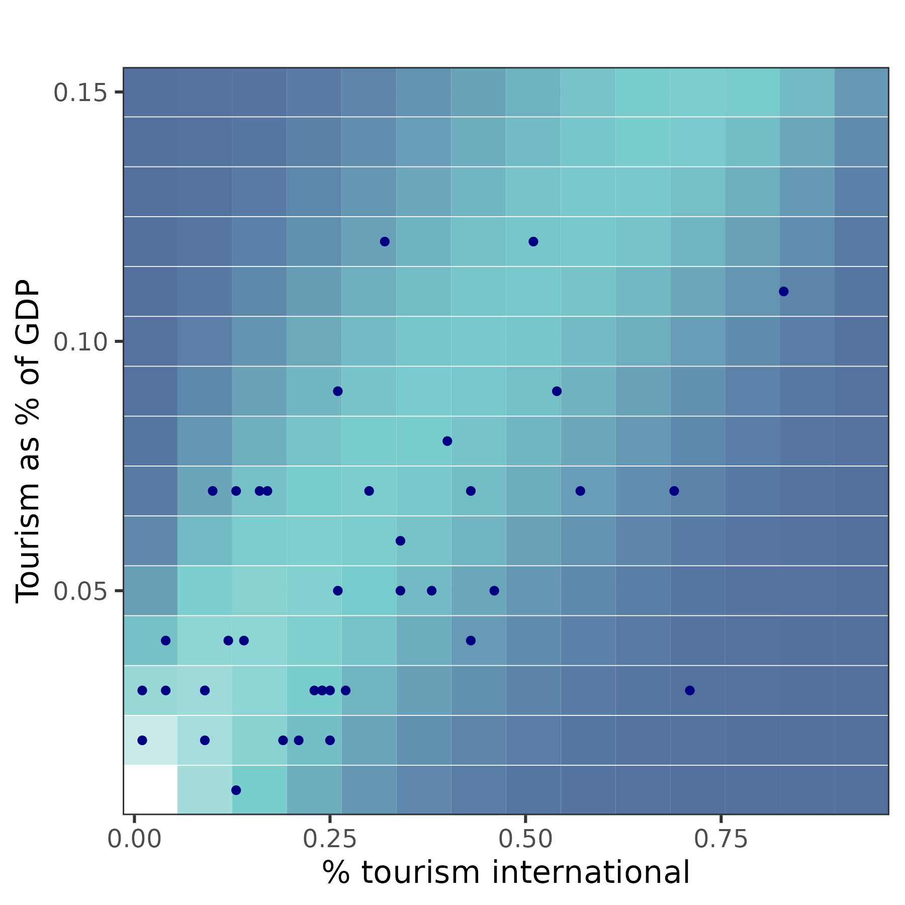
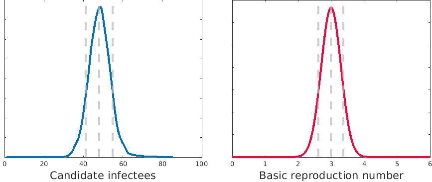

DAEDALUS: economic variables
================
23 May, 2023

-   [1 Introduction](#1-introduction)
-   [2 Methods](#2-methods)
    -   [2.1 Impact of tourism](#21-impact-of-tourism)
        -   [2.1.1 Food and accommodation services
            sector](#211-food-and-accommodation-services-sector)
        -   [2.1.2 Sector shrinkage as a result of the
            pandemic](#212-sector-shrinkage-as-a-result-of-the-pandemic)
        -   [2.1.3 Loss of international
            tourists](#213-loss-of-international-tourists)
        -   [2.1.4 Dependence on international
            tourism](#214-dependence-on-international-tourism)
    -   [2.2 Sampling sector sizes](#22-sampling-sector-sizes)
    -   [2.3 Impact of sector sizes](#23-impact-of-sector-sizes)
    -   [2.4 Internet infrastructure](#24-internet-infrastructure)
        -   [2.4.1 Remote teaching](#241-remote-teaching)
-   [3 Results](#3-results)
-   [4 Compare to data](#4-compare-to-data)
    -   [4.1 GDP loss](#41-gdp-loss)
    -   [4.2 School closure](#42-school-closure)
    -   [4.3 Value of lives lost](#43-value-of-lives-lost)
-   [5 References](#5-references)

# 1 Introduction

We use the integrated epi-econ model developed in the group for
estimating the benefit of pandemic preparedness (P2).

The scenarios we consider include seven pathogen profiles (influenza and
coronaviruses, based on past epidemics); representing all countries
(from LIC to HIC); and four mitigation strategies (“unmitigated,”
“adaptive economic closures,” “school closures,” and “elimination”),
which are based on economic configurations observed in 2020.

We consider a one-year time horizon. Longer-term impact is a different
question and would require more sophisticated economic modelling,
e.g. time dynamic, borrowing capability etc.

Due to the time horizon, we do not model vaccination, assuming its
impact in the first year would be negligible.

The outcomes of the model are:

1.  Number of deaths (by four age groups)
2.  GDP
3.  Total education delivered

We assess the impacts of three parameters that relate to economic
indicators:

1.  Agricultural GVA as a proportion of GDP
2.  Tourism GVA as a proportion of GDP
3.  Proportion of the population who can work/learn remotely

We assess the impacts of the parameters on the outcomes using
value-of-information methods.

We include uncertainty in as many parameters as possible. Parameter
distributions are based on data and independent of each other (with the
exception of loss in tourism, which is related to the size of the
relevant sector). This means that any relationships we uncover between
input and output in the model will be causal, and we will not discover
any factors that are “indicative” by association.

The only way in which country interdependencies are taken into account
is via changes to tourism which manifest in the “food and accommodation
services” sector.

The results are simulations of hypothetical epidemics and do not use or
correspond to any observed economic indicators or outcomes, nor to any
specific country. We consider three stylised “countries”:

-   LLMIC, using inputs from LICs and LMICs
-   MIC, using inputs from LMICs and UMICs
-   HIC, using inputs from HICs

# 2 Methods

## 2.1 Impact of tourism

### 2.1.1 Food and accommodation services sector

To model the impact of changes to tourism, we identify the “Food and
accommodation services” sector with tourism. This is imperfect. Their
correlation is 0.64 and the order of magnitude is similar (1 to 7% vs 2
to 10% of GDP). The other two sectors considered (Air transport and
Arts, entertainment and recreation) have little correlation with tourism
in terms of % of GDP. (See Figure <a href="#fig:pairs">2.1</a>.)

Figure 2.1: Correlations between tourism-related data.

### 2.1.2 Sector shrinkage as a result of the pandemic

The maximum openness of the food and accommodation services sector is
limited by international tourism as:

\}")

where

is the openness of the sector according to the schedule (i.e. the
mitigation strategy), 
is the proportion of tourism that is international, and
 is the fraction
international tourism reduces to as a consequence of the pandemic. I.e.
the tourism remaining is the domestic
() plus that that
comes in from abroad
().

### 2.1.3 Loss of international tourists

We model the distribution of
 using data from 2020
(Figure <a href="#fig:tourismhist">2.2</a>, bottom-right plot). We fit
to it a log-normal distribution, and find mean value -1.39 and standard
deviation 0.39 (Figure <a href="#fig:ytd">2.3</a>). We use these values
as inputs for all country models.

Figure 2.2: Distributions of tourism-related data from
<https://www.unwto.org/tourism-data/international-tourism-and-covid-19>.
In grey are the subset of countries for which we have GVA data by
sector.

Figure 2.3: Fit of log-normal distribution to loss-of-tourism data.

### 2.1.4 Dependence on international tourism

We model  as a function
of the share of GDP that comes from the sector. Note that the data we
have for this are biased towards high-income countries.

We write

,\beta(u))")

where  is the fraction
of GDP coming from the Food and accommodation sector. We learn three
parameters ,
 and
 to best fit the
relationship between 
and  in countries we
have observations for:

+\beta(u)")

}{\alpha(u)+\beta(u)}")

Here,  controls
the variance of the distribution and
 and
 the linear
relationship between 
and . Using an
optimisation routine in R we find
,

and
.
Results are shown in Figure <a href="#fig:sectortourism">2.4</a>. We use
these values as inputs for all country models.

<figure>
<figcaption aria-hidden="true">Figure 2.4: Predicting the percentage of tourism that comes from abroad as a function of the size of the sector. Each row represents a beta distribution whose mean is determined by the size of the sector (u). Blue points show the data we have available (grey bars in Figure <a href="#fig:tourismhist">2.2</a>).</figcaption>
</figure>

## 2.2 Sampling sector sizes

To learn about the impacts of changes to sector sizes, we use the
following process to sample a baseline economic configuration.

1.  Sample a population distribution from all countries (within income
    group)
2.  Sample new values for the population proportions of the Food and
    accommodation services and Agricultural workforces from uniform
    distributions bounded by the limits of the dataset
3.  Scale the remaining sectors up or down proportionally to match the
    original total population size.

## 2.3 Impact of sector sizes

The distribution of people among sectors of the workforce impacts the
numbers of contacts made. In order to propagate these influences through
the model, we sample a null distribution of contacts from the generating
model and save the corresponding average number of candidate infectees
(CI, where CI
).
Separately, we define a distribution over
R, e.g. a normal
distribution with its stated mean value and a coefficient of variation
of 0.1. (E.g. for H1N1, with mean 1.58, the standard deviation given 95%
interval {1.34, 2.04} is 0.18 which is a coefficient of variation of
0.11 (Fraser et al. 2009).) Then, for each simulation, we compute the
quantile of the CI distribution corresponding to the contacts generated,
and select the corresponding quantile from the
R distribution.
Shown illustratively in Figure
<a href="#fig:candidateinfectees">2.5</a>.

<figure>
<figcaption aria-hidden="true">Figure 2.5: The number of candidate infectees is mapped to the basic reproduction number  via matching quantiles from the simulated null distribution (left) to the parametric distribution (right). 10, 50 and 90% quantiles shown.</figcaption>
</figure>

## 2.4 Internet infrastructure

For each sector in each country, we have the 90% interval for the
proportion of people who can work from home. We:

-   Take the subset of countries in the income group (LLMIC / MIC / HIC)
-   Take the minimum of the lower bounds by sector (5%)
-   Take the maximum of the upper bounds by sector (95%)
-   Sample from a uniform distribution between these bounds, taking the
    same quantile for each sector
-   Use the same quantile again for internet coverage in computing the
    effectiveness of remote learning

### 2.4.1 Remote teaching

For the value of a year of education, we use the method of
(Psacharopoulos, Collis, and Patrinos 2021). The loss due to school
closure is

where PV is the present value of lost earnings:

^{-n}}{d}")

for discount rate
 and
expected number of years of work
.
 is mean annual
earnings,
 is
the fraction of the year schools are closed:

 is the
rate of return for one year,
 is the total number of
students, and
 is the
proportion of students affected. We take

to be the complement fraction of internet coverage
 (Figure
<a href="#fig:internet">2.6</a>) multiplied by 0.86, to match values for
the Philippines: it has 43% internet coverage and effectiveness of
remote education was estimated to be 37% (National Economic and
Development Authority 2021).

Figure 2.6: Internet access by income level. World Bank data for 2019.

We model the Figure <a href="#fig:internet">2.6</a> values with Beta
distributions. For LLMICs, we have parameters 1.78 and 3.11. For MICs,
we have parameters 3.77 and 2.91. For HICs, we have parameters 9.57 and
1.39.

We estimate the average annual income per working-age adult as the total
GVA multiplied by the fraction of GVA that goes to labour divided by the
number of working-age adults. For the fraction of GVA that goes to
labour we use PWT estimates from 2011 (Figure
<a href="#fig:labsh">2.7</a>). (This correction might lead us to
underestimate the impact of education: perhaps GNI per working-age adult
is better than average income among working-age adults. E.g. suppose
Country A and Country B have the same GVA and the same number of
workers, where GVA = labour compensation + capital. And suppose Country
A splits its GVA between labour and capital with ratio 1:2, and Country
B with ratio 2:1. Then the value of education in Country B is twice that
in Country A, because we are only counting the income contribution to
the economy. If we wanted to estimate the impact on the economy, we
should use the whole GVA, not just the labour share.)

<!-- For the value of a year of education, we use results from [@Psacharopoulos2021a]. For an LIC, the cost of a lost school year is 207% of GDP. For a MIC, the cost of a lost school year is 73% of GDP. For an HIC, the cost of a lost school year is 30% of GDP. -->

Figure 2.7: Fraction of GVA that goes to labour (PWT, 2011).

We model these values with Beta distributions. For LLMICs, we have
parameters 5.09 and 4.51. For MICs, we have parameters 6.29 and 6.54.
For HICs, we have parameters 7.97 and 6.87.

# 3 Results

Distributions over costs associated with the first year of an outbreak
of SARS-CoV-2 (with parameters corresponding to variants arising before
alpha) are shown in Figure <a href="#fig:prealpha">3.1</a> for three
income levels and four mitigation strategies. The distributions show,
for example, that the elimination strategy is achievable and desirable
for HICs and not for LLMICs or MICs.

The value of information associated with a number of parameters for all
costs considered is shown in Figure <a href="#fig:voi">3.2</a>. The
costs are listed down the y axis. Parameters and parameter groups are
along the x axis. The first four are not our “independent variables” but
might be expected to influence outcomes: GDP, GDP per capita,
 and maximum
hospital capacity.
 in particular
drives a lot of uncertainty in costs, primarily through YLLs.

The next four items are the four independent variables: size of the
agriculture sector, size of the food and accommodation services sector,
fraction of tourism coming from abroad, and internet coverage. While the
two parameters driving tourism are impactful on GDP loss, particularly
for strategies light on economic closures, they have little impact on
total costs. (This relationship is also driven by the distribution of
the food and accommodation sector contribution to GVA: the mutual
information appears a more balanced metric (Figure
<a href="#fig:mi">3.3</a>).) Meanwhile, internet coverage impacts
education loss considerably, and overall costs only for strategies that
employ school closures.

The final three items on the x axis are parameter groups. First, both
sectors. Second, both tourism parameters. Third, all four parameters.
The grouping of parameters shows their combined impact on outcomes,
which can be greater than the sum of their individual impacts.

Figure 3.1: Model results for pre-alpha variants of SARS-CoV-2.

Figure 3.2: Value of information for pre-alpha variants of SARS-CoV-2.

Figure 3.3: Because of the very heavily skewed distribution of the food
and accommodation services sector as a share of GDP, mutual information
(MI) might be better.

# 4 Compare to data

## 4.1 GDP loss

Figure 4.1: GDP loss: loss in 2020 as a percentage of 2019 GDP (IMF).
NB: data are annual, so the loss is for the year starting January 2020.
We would prefer to present data for April 2020 to March 2021 but these
data are unavailable for most countries. The outlier is Guyana.

Figure 4.2: GDP loss: loss in 2020 as a percentage of 2019 GDP (IMF) for
low- and lower-middle-income countries with densities from the model
shown by strategy. NB: data are annual, so the loss is for the year
starting January 2020. We would prefer to present data for April 2020 to
March 2021 but these data are unavailable for most countries.

Figure 4.3: GDP loss: loss in 2020 as a percentage of 2019 GDP (IMF) for
upper- and lower-middle-income countries with densities from the model
shown by strategy. NB: data are annual, so the loss is for the year
starting January 2020. We would prefer to present data for April 2020 to
March 2021 but these data are unavailable for most countries. The
outlier is Guyana.

Figure 4.4: GDP loss: loss in 2020 as a percentage of 2019 GDP (IMF) for
high-income countries with densities from the model shown by strategy.
NB: data are annual, so the loss is for the year starting January 2020.
We would prefer to present data for April 2020 to March 2021 but these
data are unavailable for most countries.

Figure 4.5: GDP loss and recovery. On the x axis is the GDP of 2020
relative to its 2019 projected value (IMF). On the y axis is 2021 GDP
relative to its 2019 projected value relative to the same value for 2020
(ratio of ratios). x values below 100 represent a loss in the year 2020.
y values above 0 represent recovery (i.e. growth exceeded what was
expected in 2019); y values equal to zero represent a fixed level of
loss; y values less than zero represent increasing loss.

## 4.2 School closure

Figure 4.6: Extent of school closure. Horizontal lines (one per country)
show the duration of the first year spent with schools partially closed.
The space to the left of the line represents the duration schools were
open. The space to the right of the line represents the duration schools
were closed. (UNESCO)

## 4.3 Value of lives lost

Figure 4.7: Valued loss of life, using IHME estimates (“cumulative
deaths”) for the first year of accumulated deaths. The value of a
statistical life used is 160 times GDP per capita. (This means that a
0.625% mortality rate is worth 100% of GDP.)

# 5 References

Fraser, Christophe, Christl A Donnelly, Simon Cauchemez, William P
Hanage, Maria D Van Kerkhove, T Déirdre Hollingsworth, Jamie Griffin, et
al. 2009. “Pandemic potential of a strain of
Influenza A (H1N1): Early findings.” *Science* 324: 1557–62.

National Economic and Development Authority. 2021. “COVID-19 pandemic to cost PHP 41.4 T for the next 40
years.” National Economic; Development Authority.
<https://neda.gov.ph/covid-19-pandemic-to-cost-php-41-4-t-for-the-next-40-years-neda/>.

Psacharopoulos, George, Victoria; Collis, and Patrinos. 2021. “The COVID-19 Cost of School Closures in Earnings and
Income across the World.” *Comparative Education Review* 65 (2).

